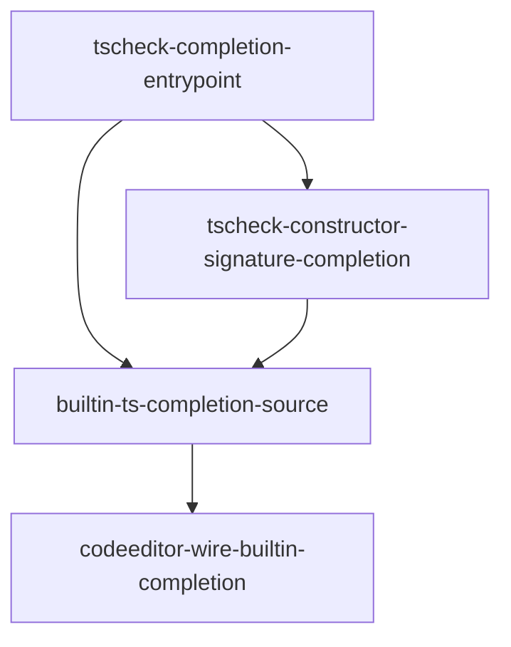

# Roadmap — CodeEditor built-in JS/TS type autocomplete

**Task:** The CodeMirror CodeEditor is missing type-aware autocomplete for built-in JS/TS standard-library types: (1) typing `const reader: ReadableStream = new ReadableStream();` gives the user no idea what arguments the constructor takes — how many, and what types; (2) typing `reader.` produces no autocomplete of that type's properties/methods.

---

## Task & Analysis

- **Objective:** Make the CodeMirror editor complete built-in JS/TS standard-library types: typing a constructor call like `new ReadableStream(` surfaces its parameter signatures (count + types) and typing `reader.` on a value of a built-in type surfaces that type's public members.
- **Success definition:** In TS-mode CodeEditor: (1) `new ReadableStream()` (and representative built-ins Promise, Map, Set, Array, Date, JSON, Math, console) shows a completion whose detail/apply text spells out the constructor's parameters — names, types, and arity; (2) after `const reader: ReadableStream = new ReadableStream();`, `reader.` lists ReadableStream's public members (getReader, cancel, pipeTo) filtered to member context, not global scope; (3) existing service-handle completions (`redis.` etc.) and global-name completions still work and win where they overlap; (4) offline/CDN-unavailable fallback behaves exactly like tsLint — degrades to the current scope+service sources rather than hanging; (5) `npm run build`, `npm run lint`, `npm run test` all stay green with new tests covering the two cases.
- **domainShape:** `technical`
- **domainShapeReason:** The objective is editor/tooling machinery — wiring type-aware autocomplete into a CodeMirror editor — not a business entity, rule, or workflow a domain expert would recognize.

### Ubiquitous / subsystem language

| Term | Meaning |
|---|---|
| CompletionSource | A CodeMirror autocomplete extension function returning candidate completions at a cursor position; the existing two are `scopeCompletionSource(globalThis)` and `sandboxServiceCompletions`. |
| LanguageService host | The TypeScript compiler service host `tsCheck.ts` already builds, which serves lib.d.ts and the sandboxAmbient declarations and is the engine for type-aware completion. |
| constructor signature completion | Completions shown while typing `new Type(` that spell out the constructor's parameters — count, names, and types. |
| member completion | Completions shown after `expr.` that list the resolved type's public properties and methods. |
| lib.d.ts seeding | The fetched declaration libraries (lib.es2021.d.ts, lib.dom.d.ts) the LanguageService resolves types against; ReadableStream comes from the dom lib. |
| sandbox ambient declarations | The synthetic .d.ts (`sandboxAmbient.ts`) declaring the 5 service globals with real types. |
| offline degradation | The fallback path, identical to tsLint's, where the editor returns to scope+service completions when the CDN TypeScript compiler or libs are unavailable. |
| CodeMirror completion source composition | How the new async `builtInTsCompletion` composes beside the two existing sync sources via separate `javascriptLanguage.data.of({ autocomplete })` facet entries. |
| CodeEditor editor wiring | The `CodeEditor.tsx` `extensionsFor(lang)` facet assembly where completion sources are registered, conditioned on `lang` (`'js'` \| `'ts'`). |

### Assumptions

- The right mechanism is a third **async** CompletionSource backed by the existing TS LanguageService host in `tsCheck.ts`, which already seeds lib.es2021 + lib.dom — so `ReadableStream` is already in scope with no new CDN dependency.
- The runtime TS compiler (5.4.5 from CDN via `tsCompiler`) is the completion engine; the ~6.0.2 devDependency is not the runtime engine.
- Existing `scopeCompletionSource(globalThis)` and `sandboxServiceCompletions` are left intact; the new source composes alongside them.
- A unit test driving the LanguageService completion directly (via the existing tsCheck harness) is the measurable check; a full CodeMirror DOM e2e is not required.
- Curated, hand-written built-in type tables are **not** the target mechanism — LS inference from annotations/expressions drives completion.

### Risks

- **Cold-start latency:** lib.d.ts is fetched lazily from jsDelivr; the first completion on an uncached run may be slow or empty until libs are fetched/cached.
- **Async-vs-sync composition:** the new source is the repo's first async CompletionSource; ordering vs the sync `redis.` service completions needs explicit care.
- **Inference fragility:** `reader.` completion depends on the LS resolving the declared type; unrelated type errors in the doc can thin out completions.
- **Offline behavior:** must degrade to current sources and never leave a pending/empty completion — mirroring the tsLint fallback.
- **TS version drift:** runtime 5.4.5 vs test 6.0.2 — tests must pin conservative facts.
- **Runtime/declaration divergence:** if sandbox globals diverge from lib.dom.d.ts, completions may advertise members that fail at runtime.

---

## Discovery Findings

Grounding from an actual repo read (Stage 1.5) — the highest-leverage stage of this run.

| Area | Finding | File path | Implication |
|---|---|---|---|
| tsCheck completion API | tsCheck exposes only `checkCode(code, ts)`; **no completion API exists** (zero hits for getCompletionsAtPosition etc.). Host/service/currentCode/version are module-private. | `src/infrastructure/tsCheck.ts` | Must **add** `getCompletions(code, pos, ts)` inside tsCheck.ts, mutating the same `currentCode`/`version` state so the LS parses the live doc. |
| lib seeding | Seeds lib.es2021 + lib.dom; ReadableStream (DOM lib) already in scope. | `src/infrastructure/tsCheck.ts` | No lib-seed change; the source must await the same `ensureLibs([...])` warm-up. |
| Cold-start / offline | Libs fetched lazily on first checkCode; offline → checkCode rejects → tsLint falls back to `syntaxDiag`. No local bundle fallback. | `src/infrastructure/tsCheck.ts` | New source must mirror tsLint: await ensureLibs, throw → return null. |
| Runtime vs test TS | Runtime is `window.ts` 5.4.5 (CDN); tests pass local ~6.0.2 with stubbed fetch. Version-drift risk confirmed. | `src/infrastructure/sandboxAmbient.test.ts` | Tests: stub fetch to serve node_modules/typescript/lib, assert conservative facts. |
| Source sync/async | Both existing sources are **sync**; no async source exists yet. | `src/infrastructure/serviceCompletions.ts` | New async source must not shadow the sync service source for the 5 handles. |
| Service data source | Service completions introspect **live prototypes**, not sandboxAmbient text. | `src/infrastructure/sandboxAmbient.ts` | New source will also resolve `redis`/`pg` via the LS — explicitly prefer the sync source for the 5 handle names. |
| CodeEditor wiring | Completions wired as **two separate** `javascriptLanguage.data.of({ autocomplete })` entries; an array would be read as a static list. TS mode = `javascript({typescript: true})`. | `src/components/CodeEditor.tsx` | Add a **third** `.of()` entry, TS-mode-only. |
| Why cases fail today | scopeCompletionSource is not type-aware; `reader.` yields nothing, `new ReadableStream(` has no parameter info. | `src/components/CodeEditor.tsx` | Mechanism genuinely needs `getCompletionsAtPosition` + `getCompletionEntryDetails`. Additive work. |
| Monaco | `@monaco-editor/react` present but **unused**. | `package.json` | Confirms Monaco out-of-scope. |
| Test harness | `serviceCompletions.test.ts` builds a fake `CompletionContext` (works for awaited async sources); `sandboxAmbient.test.ts` stubs fetch + local ts. Node env, no DOM. | `src/infrastructure/serviceCompletions.test.ts` | New tests can drive both the LS API and the source — no CodeMirror DOM e2e needed. |
| Rendering precedent | Service source renders `detail` from params, `validFor /^[\w$]*$/`, hand-computed offsets. | `src/infrastructure/serviceCompletions.ts` | New source writes its own displayParts→detail rendering; follow the '('...')' convention. |
| tsStatus gate | Store tracks tsStatus; tsLint guards on `(window as {ts?}).ts`; no completion gating today. | `src/infrastructure/store.ts` | Source should return null while TS unavailable, mirroring tsLint; no extra store gating needed. |

---

## Out of Scope (`deferred`)

| Item | Reason |
|---|---|
| Monaco editor migration or parity | Repo ships monaco but it is unused; this is CodeMirror-only built-in completion. |
| Full IDE IntelliSense (go-to-definition, hover, rename, separate signature-help popup) | Only completion list + parameter detail/apply text is required. |
| Completion for user-defined types, imported modules, or cross-file symbols | Scoped strictly to built-in JS/TS standard-library globals. |
| Adding service-handle completions or editing sandboxAmbient service declarations | Owned by prior roadmap phases; only reused here as an existing pattern. |
| Changing the tsCheck/tsCompiler lib seed set | Current es2021+dom is sufficient for the requested built-ins. |
| Non-JS/TS completion (CSS/JSON/HTML) | The editor targets js/ts modes only. |
| Curated hand-written built-in type tables | Contradicts the confirmed mechanism (LS inference from lib.d.ts); YAGNI gate 3. |
| Local/offline lib bundle fallback | Success criterion (4) only requires tsLint-style degradation; YAGNI gate 2. |
| Pre-warm lib.d.ts at editor mount | The source already degrades gracefully while libs load; YAGNI gate 2. |

---

## Phases

### Phase 0 — `tscheck-completion-entrypoint`
- **Order 0 · bounded context:** tsCheck LanguageService host · **layer:** infrastructure · **blast radius:** medium
- **Goal:** Add the missing type-aware completion entrypoint in tsCheck.ts — `getCompletions(code, pos, ts)` — that bumps the same module-private `currentCode`/`version` `checkCode` uses, awaits the same `ensureLibs(['lib.es2021.d.ts','lib.dom.d.ts'])` warm-up, and returns `getCompletionsAtPosition` entries with kind/detail.
- **Inputs:** tsCheck module-private host; `sandboxAmbient.test.ts` stubLibFetch harness; local typescript devDependency (~6.0.2) as test engine.
- **Expected result:** Exported `getCompletions(code, pos, ts)` in tsCheck.ts returning completion entries (name, kind, sortText) with `getCompletionEntryDetails`-backed detail, plus a unit test proving `reader.` on `const reader: ReadableStream = new ReadableStream();` yields getReader/cancel/pipeTo, not global scope.
- **Depends on:** —
- **Compensation:** none (module-local additive export).

| Rubric dimension | Score bar | What's checked |
|---|---|---|
| exported-entrypoint | 8 | Named `getCompletions(code, pos, ts)` export; no caller-built host; signature correct. |
| live-document-freshness | 8 | Bumps `currentCode`/`version` like `checkCode`; behavioral fresh-doc test; no stale snapshots. |
| lib-seeding-warmup | 7 | Awaits ensureLibs covering both libs; offline via stubbed fetch; no divergent fetch path. |
| member-completion-correctness | 9 | `reader.` yields ReadableStream members (getReader, cancel, pipeTo); a global-scope-only name is asserted absent. |
| editor-render-payload | 7 | Entries carry name/kind/sortText; detail from getCompletionEntryDetails, not a stub. |
| repeatability-no-host-corruption | 7 | Identical calls same result; interleaved checkCode unaffected; mixed sequence doesn't throw. |

**healerHint:** Most likely failure is global-scope/empty results from not bumping `currentCode`/`version` or skipping the dom lib — reuse checkCode's exact bump lines and await `ensureLibs([...])`, then confirm the stubbed-fetch test surfaces getReader/cancel/pipeTo.

### Phase 1 — `tscheck-constructor-signature-completion`
- **Order 1 · bounded context:** tsCheck LanguageService host · **layer:** infrastructure · **blast radius:** medium
- **Goal:** Detect the `new Identifier(` cursor context and render the constructor's parameters — names, types, optionality, count — from `getCompletionEntryDetails` displayParts into the '('...')' style `sandboxServiceCompletions` uses (e.g. `new ReadableStream(underlyingSource?: ReadableStreamUnderlyingSource, strategy?: QueuingStrategy)`).
- **Inputs:** Phase 0 entrypoint + module-state pattern; TS getCompletionEntryDetails/displayParts API; stubLibFetch harness; '('...')' rendering convention.
- **Expected result:** A constructor-signature path returning the rendered parameter detail for `new ReadableStream(` and representative built-ins (Promise, Map, Set, Array, Date, JSON, Math, console), plus a unit test asserting the rendered signature.
- **Depends on:** `tscheck-completion-entrypoint`
- **Compensation:** none.

| Rubric dimension | Score bar | What's checked |
|---|---|---|
| signature-fidelity | 8 | ReadableStream renders 2 optional params with correct types; Map/Set/Array/Date arities from the seeded lib; displayParts-driven (no hardcoded map); JSON/Math/console never fabricate a signature. |
| context-triggering | 7 | Fires only at `new Identifier(`; no leak into member/bare-identifier contexts; delivered via the phase-0 entrypoint, not a parallel path. |
| offline-degradation | 7 | Fails soft offline; matches tsLint fallback; no second host/divergent ensureLibs copy; deterministic. |
| signature-unit-test | 7 | Drives the real entrypoint via stubLibFetch; asserts exact signature (names/types/optionality/count); a second built-in asserted so rendering isn't hardcoded to ReadableStream. |

**healerHint:** Most likely failure is hardcoding/special-casing ReadableStream or parsing displayParts too narrowly — delete per-type special cases, render all representative built-ins through one shared displayParts formatter, assert each signature in the unit test.

### Phase 2 — `builtin-ts-completion-source`
- **Order 2 · bounded context:** CodeMirror completion source composition · **layer:** application · **blast radius:** medium
- **Goal:** Compose the repo's first **async** CompletionSource that calls the phase 0/1 tsCheck APIs: member completions for `expr.`, constructor signature as detail for `new Type(`. Returns null for the 5 sandbox service handles so `sandboxServiceCompletions` wins, and returns null whenever `window.ts` is absent or the tsCheck call throws (tsLint-identical degradation). Follows the serviceCompletions rendering convention.
- **Inputs:** Phase 0/1 tsCheck APIs; existing sync sources; `SANDBOX_SERVICE_CONSTRUCTORS` handle names (redis, pg, rabbitmq, kafka, queue); tsLint offline-guard pattern; fake-CompletionContext test harness.
- **Expected result:** The async `builtInTsCompletion` CompletionSource module with unit tests covering: (a) `reader.` member list; (b) `new ReadableStream(` signature detail; (c) null for the 5 service handles; (d) null when `window.ts` absent or the call throws.
- **Depends on:** `tscheck-completion-entrypoint`, `tscheck-constructor-signature-completion`
- **Compensation:** none.

| Rubric dimension | Score bar | What's checked |
|---|---|---|
| member-context-completion | 8 | `reader.` yields ReadableStream members scoped to member context; no global/scope names; fake-Context test asserts presence. |
| constructor-signature-detail | 8 | `new ReadableStream(` completion detail spells out params+types matching the dom-lib declaration; non-empty detail asserted. |
| service-handle-abstention | 7 | Returns null for exactly the 5 handles (bare, `handle.`, `new handle(`); matches `SANDBOX_SERVICE_CONSTRUCTORS`; non-service identifiers still complete. |
| offline-error-degradation | 8 | `(window as {ts?}).ts` guard; catch-and-return-null on throw; no `[]`/pending state; tests for both absent-ts and throwing cases. |
| rendering-convention | 7 | detail text, `validFor /^[\w$]*$/`, hand-computed from/to offsets matching sandboxServiceCompletions. |
| repeatable-safe-completion | 7 | Concurrent cold-start invocations don't double-seed/throw; post-failure calls work; cheap null paths short-circuit before any await. |

**healerHint:** Most likely failure is the offline/cold-start path returning `[]` or throwing instead of null — guard `(window as {ts?}).ts` first and wrap the ensureLibs/getCompletions call in a try/catch returning null before any await touches the libs.

### Phase 3 — `codeeditor-wire-builtin-completion`
- **Order 3 · bounded context:** CodeEditor editor wiring · **layer:** interface · **blast radius:** small
- **Goal:** Register the new source as a **third** `javascriptLanguage.data.of({ autocomplete: builtInTsCompletion })` facet entry, included only when `lang === 'ts'`, mirroring the deliberate two-entry `.of()` pattern. JS mode and existing sources untouched; no extra store gating (the source's own window.ts guard handles the cold-start window).
- **Inputs:** `CodeEditor.tsx` extensionsFor(lang) wiring + autocompletion(); `lang` from useAppStore; `builtInTsCompletion` source.
- **Expected result:** A third `.of()` facet entry in CodeEditor for TS mode only; build/lint/test green; `redis.` service completions still win.
- **Depends on:** `builtin-ts-completion-source`
- **Compensation:** none.

| Rubric dimension | Score bar | What's checked |
|---|---|---|
| builtin-source-wired-ts-only | 8 | extensionsFor('ts') includes the source, extensionsFor('js') does not; real import, no local stub. |
| existing-sources-preserved | 8 | Two existing `.of()` entries unchanged; new source is a separate `.of()`, never an array item. |
| sandbox-precedence-preserved | 7 | Builtin entry ordered after sandboxServiceCompletions; `redis.` still lists service members. |
| reconfigure-repeatable | 7 | extensionsFor pure of lang; ts→js→ts round-trip yields exactly one builtin source; no accumulation. |
| no-store-gating-added | 7 | Presence depends only on `lang`; wiring identical across tsStatus states; no tsStatus-keyed effect. |
| gates-green | 7 | `npm run build`, `npm run lint`, `npm run test` all exit 0; no regressions. |

**healerHint:** Most likely failure is the source landing as an array item inside an existing `.of()` (read as a static list) or outside the `lang === 'ts'` conditional — add a distinct `.of()` entry after sandboxServiceCompletions gated to TS mode, then re-run the three gates.

---

## Dependency map

---

## Success Criteria

1. In TS-mode CodeEditor: typing `new ReadableStream()` (and Promise, Map, Set, Array, Date, JSON, Math, console) shows a completion whose detail/apply text spells out the constructor's parameters — names, types, and arity.
2. After `const reader: ReadableStream = new ReadableStream();`, typing `reader.` lists ReadableStream's public members (getReader, cancel, pipeTo) filtered to member context, not global scope.
3. Existing service-handle completions (`redis.` etc.) and global-name completions still work and win over generic member completions where they overlap.
4. Offline/CDN-unavailable fallback behaves exactly like tsLint — degrades to the current scope+service sources rather than hanging.
5. `npm run build`, `npm run lint`, and `npm run test` all stay green with new tests covering the two cases.
6. Phase-by-phase: `tscheck-completion-entrypoint: Exported getCompletions(code, pos, ts)` + member unit test.
7. Phase-by-phase: `tscheck-constructor-signature-completion: rendered constructor signature` for built-ins + signature unit test.
8. Phase-by-phase: `builtin-ts-completion-source: async source` with tests (a)–(d).
9. Phase-by-phase: `codeeditor-wire-builtin-completion: third facet entry` TS-only + green gates.

---

## Quality Gate

- **Path:** Lite (technical shape, code-local, single subsystem, ≲3–4 phases). Materials stage skipped; `requiredMaterials: []`.
- **Iterations:** 1.
- **Issues raised:** 10 (one per rubric dimension), all `pass: true`, all scores ≥ minScore.
- **Verified (blockers only):** 0 (no blockers raised; `domain-shape-fit` passed, so no force-escalation).
- **Healed:** 0 (no surviving blocker/major; a healer round-trip was not warranted).
- **Orchestrator consistency fix (post-gate):** removed `tsStatus readiness signal pattern from store.ts` from `phases[3].inputs` — the phase's own `no-store-gating-added` rubric forbids consuming it (critic advisory `resources-gathered`).
- **Accepted debt:** 0.
- **Verdict:** **PASSED.** The roadmap is structurally sound and survived one grounded semantic review. This is not a formal proof the architecture is correct — notably, the runtime 5.4.5 vs test 6.0.2 TS-version drift and the first-run CDN cold start remain the two live risks an executor must watch (both are explicit in the analysis).
