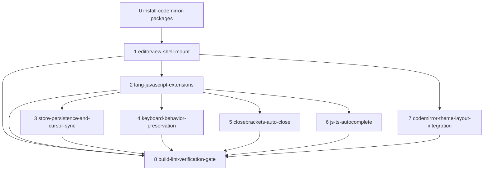

# Roadmap: Make CodeEditor.tsx usable via CodeMirror 6

Slug: `codeeditor-codemirror-usable` · Generated by `dima-plan-roadmap-ddd-v2` · 2026-08-09

## Task & Analysis

**Objective** — Swap `src/components/CodeEditor.tsx` from the hand-rolled regex-highlighted `<textarea>/<pre>` overlay to a CodeMirror 6-based editor that provides working JS/TS autocomplete, automatic bracket/quote closing, and correct cursor placement while preserving the existing zustand store contract.

**Success definition** — CodeEditor.tsx mounts a CodeMirror 6 EditorView (no `<textarea>/<pre>` overlay, no Monaco code path) built from `@codemirror/view`, `@codemirror/state`, `@codemirror/lang-javascript` (`javascript()` + `typescript()`), `@codemirror/autocomplete`, and `@codemirror/commands`. Typing `{`, `(`, `[`, or `"` inserts the closing partner and leaves the caret between them; typing the closing char over the auto-inserted partner does not duplicate it. The caret and selection remain exactly where expected after plain typing, bracket auto-close, and selection replacement, and `setCursorPos` reports the correct line/column. Autocomplete triggers and inserts completions in both JS and TS. Every edit persists via `saveCode`, and switching lang or problem loads the correct `state[lang]`/starter value with no update loop. `npm run build` and `npm run lint` pass; the editor uses no web workers and only tree-shakeable per-package `@codemirror` dependencies (no Monaco bundle).

**Domain shape**: `technical` — the objective is entirely editor machinery (engine swap, extension wiring, caret placement), with no business entities, rules, or workflows a domain expert would recognize. DDD is therefore applied lightly: subsystem-scoped phases, no ports-for-domain-concepts, correctness properties (idempotent mount, no update loop, repeatable keybindings) checked over layer purity.

**Caller acceptance criteria** (authoritative for scope):
1. Editor provides autocomplete for the language being edited (JS and TS).
2. Typing an opening `{` `(` `[` or `"` auto-inserts the closing partner and leaves the cursor between them; typing the closing char over it does not duplicate.
3. Cursor stays correctly placed after typing, bracket auto-close, and selection replacement — no misplacement bugs remain.
4. The chosen editor package must be suitable for this project (client-side only, no backend, Vite, no web workers required, reasonable bundle size).

### Ubiquitous language

| Term | Meaning in this task |
|---|---|
| CodeMirror 6 | The editor engine chosen by the caller to replace the hand-rolled textarea+pre overlay; Monaco is rejected. |
| extension | CodeMirror's composable units (language support, autocomplete, closeBrackets, keymaps) composed into the EditorView. |
| autocomplete | The completion popup for JS/TS identifiers and keywords provided by `@codemirror/autocomplete`. |
| closebrackets | Auto-insertion of the closing `)`, `]`, `}`, and quote when the opening partner is typed. |
| cursor/selection | Caret position and selection ranges that must stay correct after typing, bracket closing, and selection replacement. |
| lang-javascript | The `@codemirror/lang-javascript` package supplying `javascript()`/`typescript()` syntax highlighting and completion. |
| store contract | The zustand integration points the editor must keep wired: `lang`, `state[lang]` value, `saveCode`, `setCursorPos`. |
| keymap | CodeMirror keybinding extensions (`indentWithTab`, `toggleComment`, `defaultKeymap`, `historyKeymap`, `completionKeymap`, `closeBracketsKeymap`). |
| theme | `EditorView.theme()` rules carrying the old editor metrics (var(--mono), 13px, line-height 1.62, 14px padding, tab-size 2) and the gutter replacement. |

### Assumptions

1. The five `@codemirror/*` packages will be installed via npm with registry access; none are in package.json today and node_modules is empty.
2. The zustand store contract is fixed: CodeEditor stays a self-contained zero-prop component driven by `lang`, `state[lang] || starter[lang]`, writing back via `saveCode(code)` and `setCursorPos(line, col)`.
3. Both languages share one editor instance; switching lang swaps the language extension and document rather than mounting a second editor.
4. Existing editor behaviors (Tab indent, Enter indent continuation, Cmd/Ctrl+/ comment toggle) must be preserved in the swap — discovery confirmed they exist today.
5. The regex highlighter, `.tk-*` classes, and `<pre>` overlay are removed; the EditorPane layout remains and CodeMirror must fit it.
6. Autocomplete scope is package-provided syntax/identifier completion; no language server or harness-aware completion.
7. Empty input renders an empty document via the existing `getProblemState` fallback.

### Risks

- **Store/editor update loop**: `onUpdate → saveCode → store → update` can ping-pong; an external-vs-internal change guard is required (getProblemState re-renders on every store write).
- **CSS clash**: CodeMirror's default CSS vs. the fixed 52px gutter and overlay alignment; a matching theme is needed.
- **Quote auto-close context sensitivity**: must not auto-close inside an existing string literal.
- **TS autocomplete**: `typescript()` completion source must be wired and verified for both lang values.
- **tsc strict + React 19** against CodeMirror 6 generics can block `npm run build`.
- **Partial install failure** could tempt a regression to the hand-rolled editor or Monaco, contradicting the caller's explicit CodeMirror 6 choice.

## Discovery Findings

Discovery ran against the live repo (Stage 1.5). All findings are grounded facts; each implication is reflected in a phase, a material, or `deferred`.

| Area | Finding | File path | Implication |
|---|---|---|---|
| CodeEditor component | Hand-rolled regex-highlighted `<textarea>` overlaid on `<pre id="hl">` with `.nums` gutter, giant `HL_RE` (10 groups) → `.tk-*` classes. Zero props; self-reads store; derives `value = state[lang] \|\| starter[lang] \|\| ""` in render. | `src/components/CodeEditor.tsx` | Keep zero-prop contract; delete HL_RE/HL_CLS/tk/textarea/pre/gutter (phase 1). |
| CodeEditor component | Tab/Shift-Tab/Enter-continuation/Cmd+/ already implemented in an `onKeyDown` handler; `saveCode` on every `onInput`. | `src/components/CodeEditor.tsx` | Keyboard parity is real, not hypothetical — phase 4 must reproduce it. |
| CodeEditor component | Caret tracking: 1-based `line`, 1-based `col` (`selectionStart - lastIndexOf("\n")`), via `trackCaret` → `setCursorPos`. | `src/components/CodeEditor.tsx` | CodeMirror `posToLineColumn` is 1-based line / 0-based column → add 1 to column (phase 3). |
| Store contract | `lang`, per-problem `{js,ts,...}`, `saveCode(code)`, `setCursorPos(line,col)` (defaults 1/1), `getProblemState` lazy-mutates; persisted under `leetlab.v2`. | `src/infrastructure/store.ts` | No store changes; update-loop guard mandatory (phase 3). |
| EditorPane wiring | `<CodeEditor />` mounted zero-prop; Run/Submit read the store (not editor DOM) as source of truth; `setLang` drives the JS/TS seg. | `src/components/EditorPane.tsx` | Swap is isolated to CodeEditor.tsx; keep saveCode on every change. |
| App import chain | Triple-nested `.editor-pane` (App section → EditorPane div → CodeEditor div); roadmap deferred it as cosmetic. | `src/App.tsx` | Safe to drop CodeEditor's redundant wrapper (phase 7). |
| CSS/layout | `.editor-pane{flex:1;min-width:380px}`, `.editor-body` flex row, `.gutter{flex:0 0 52px}`, `.code-area pre/textarea` 13px/1.62/14px padding/tab-size 2; `.tk-*` only for the regex highlighter. | `src/styles/globals.css` | Carry metrics into `EditorView.theme`; replace `.gutter` with CodeMirror's gutter; prune orphans (phase 7). |
| package.json deps | Only @monaco-editor/react, clsx, lucide-react, react, react-dom, zustand. No CodeMirror. No lockfile; node_modules empty. | `package.json` | Install all five packages fresh; registry access required (phase 0). |
| vite/tsconfig | Aliases `@`/`@domain`/`@infra`/`@components`; strict + noUnusedLocals + noUnusedParameters; `npm run build` = `tsc -b && vite build`; ESLint flat config with react-hooks; React 19 StrictMode. | `vite.config.ts` | StrictMode-safe mount/destroy in effect cleanup; no unused imports; eslint must pass (phases 1, 8). |
| Roadmap doc location | The cited `docs/roadmaps/src-vs-prototype-refactor-roadmap.md` does not exist; real doc is `docs/done/src-vs-prototype-refactor-roadmap.md`. | `docs/done/src-vs-prototype-refactor-roadmap.md` | Plan does not claim to consult it; deferred as a doc-cleanup non-goal. |
| Roadmap editor findings | Stale vs. current code: Tab/Enter/Cmd+/ and line numbers/caret status are already implemented; roadmap phases 6–11 overlap the swap's free wins. | `docs/done/src-vs-prototype-refactor-roadmap.md` | Do not queue phases 6–11; the swap subsumes them (deferred). |
| Monaco usage | `@monaco-editor/react` imported nowhere; AGENTS.md flags it unused. | — | No de-registration risk; leaving the dep is safe and consistent (deferred). |

## Out of Scope (deferred)

| Deferred item | Reason |
|---|---|
| Removing `@monaco-editor/react`/monaco from package.json | Not required by acceptance criteria; only "not used" is required. |
| Real-time TS diagnostics/lint in the gutter | Needs an LSP or web-worker compiler — violates client-side, no-worker constraint. |
| Editor theming prefs, vim/emacs keymaps, find/replace panels | Beyond the four stated criteria. |
| Refactoring the store or `cursorLine`/`cursorCol` consumers | The editor must fit the existing contract, not change it. |
| Harness-aware autocomplete | YAGNI gate 3 — speculative abstraction; scope is package-provided completion. |
| Test-case editors / filter input touch-ups | Only `src/components/CodeEditor.tsx` is in scope. |
| Stale roadmap phases 6–11 reimplementation | Already satisfied today; CodeMirror delivers line numbers, scroll sync, caret status natively. |
| index.css / App.css leftover cleanup | Not asked; unused leftovers per AGENTS.md. |

## Required Materials

| Name | Kind | Why needed | Acquisition |
|---|---|---|---|
| `@codemirror/view` | tool | EditorView/EditorState mount, gutter, scroll sync, native caret/selection. | `npm install @codemirror/view` in repo root. |
| `@codemirror/state` | tool | Transaction/StateEffect types for the update-loop guard. | `npm install @codemirror/state` (direct dep). |
| `@codemirror/lang-javascript` | tool | `javascript()`/`typescript()` languages + completion sources. | `npm install @codemirror/lang-javascript`. |
| `@codemirror/autocomplete` | tool | `autocompletion()` popup, `completionKeymap`, `closeBrackets`. | `npm install @codemirror/autocomplete`. |
| `@codemirror/commands` | tool | `defaultKeymap`, `historyKeymap`, `indentWithTab`, `toggleComment`. | `npm install @codemirror/commands`. |
| npm registry access | credential | Hard external prerequisite — nothing builds until the packages are fetched (empty node_modules). | `npm ping`; default public-registry read auth. |
| CodeMirror 6 API knowledge | knowledge | posToLineColumn +1 conversion, StrictMode-safe mount, dispatch-vs-external guard. | https://codemirror.net/docs/ref/ + installed package READMEs/.d.ts. |

## Phases

### Phase 0 — Install CodeMirror 6 packages
`install-codemirror-packages` · bounded context: dependencies · layer: infrastructure · blast radius: small · depends on: —

**Goal**: Install the five `@codemirror/*` packages so the swap has its engine available (none exist today; node_modules empty).

**Inputs**: package.json (no @codemirror deps), npm registry access. **Expected result**: package.json lists the five deps, `npm install` completes, `npm run build`/`npm run lint` still pass with zero src changes. **Compensation**: `npm uninstall` the five (or `git checkout package.json`).

| Rubric dimension | minScore | Key checks |
|---|---|---|
| dependency-declaration | 7 | Five packages under `dependencies` (not dev), valid semver, nothing extra in the scope. |
| install-integrity | 8 | `npm install` exits 0; `npm ls` clean; second install is lockfile-idempotent. |
| build-lint-gate | 8 | `npm run build` and `npm run lint` pass; `git diff --stat -- src` empty. |
| caller-vite-suitability | 7 | AC4 verbatim: pure client-side, no `new Worker`, Vite-compatible, < 1.5 MB installed. |
| rollback-reversibility | 7 | Diff confined to package.json/package-lock.json; compensation restores repo. |

**healerHint**: npm ls exiting non-zero from a peer conflict — uninstall all five and reinstall together in one `npm i` so peer versions resolve coherently.

### Phase 1 — Mount CodeMirror 6 EditorView shell
`editorview-shell-mount` · bounded context: editor shell · layer: infrastructure · blast radius: medium · depends on: phase 0

**Goal**: Replace the regex-highlighted `<textarea>/<pre>` overlay with a single EditorView created in a `useEffect` into a ref'd container and destroyed in cleanup (StrictMode-safe); load `state[lang] || starter[lang] || ""`.

**Inputs**: current CodeEditor.tsx, `@codemirror/view`, `@codemirror/state`, store read contract. **Expected result**: exactly one editable `.cm-editor`, no `<textarea>`/`#hl`/`.nums`/HL_RE/`.tk-*`, StrictMode-idempotent mount/destroy. **Compensation**: `git checkout -- src/components/CodeEditor.tsx`.

| Rubric dimension | minScore | Key checks |
|---|---|---|
| single-editorview-construction | 7 | Exactly one `new EditorView` inside an effect with destroy cleanup. |
| strictmode-double-mount | 7 | One `.cm-editor` in dev; mount→destroy→mount works; no leaked editors. |
| initial-document-source | 8 | Doc = `state[lang] \|\| starter[lang] \|\| ""` read inside the mount effect. |
| legacy-overlay-removed | 7 | No HL_RE/HL_CLS/`tk`/`<textarea>`/`#hl`/`.nums` remain. |
| client-side-bundle-suitability | 8 | AC4: @codemirror not Monaco, no workers, Vite build unchanged, reasonable chunk. |

**healerHint**: duplicate/leaked editors under StrictMode — construct in the effect whose cleanup returns `() => view.destroy()`, reading the doc inside that same effect.

### Phase 2 — Wire javascript()/typescript() language extensions
`lang-javascript-extensions` · bounded context: language configuration · layer: infrastructure · blast radius: small · depends on: phase 1

**Goal**: Add `javascript()`/`typescript()` highlighting and swap the language extension live when `lang` changes via the JS/TS seg buttons, keeping one shared EditorView.

**Inputs**: EditorView from phase 1, `@codemirror/lang-javascript`, store `lang`. **Expected result**: highlighting for both languages; live swap without recreating the view.

| Rubric dimension | minScore | Key checks |
|---|---|---|
| single-editor-instance | 8 | One view; lang swap via `StateEffect.reconfigure`, no remount; undo/scroll/selection survive. |
| live-swap-highlight-follows-lang | 8 | `view.state.facet(language)` matches store `lang`; doc text never rewritten. |
| language-accurate-autocomplete | 8 | AC1: completions per active language; TS symbols in TS mode. |
| swap-repeatability | 7 | 10 rapid toggles → one language facet, no duplicates, undo intact. |

**healerHint**: append-not-replace or remount on lang change — rebuild the extension array fresh each toggle and apply with a single `StateEffect.reconfigure.of([...])`.

### Phase 3 — Wire the zustand store contract: saveCode, setCursorPos, doc sync with update-loop guard
`store-persistence-and-cursor-sync` · bounded context: store contract bridge · layer: application · blast radius: medium · depends on: phase 2

**Goal**: `saveCode(doc)` on user changes; `replaceDocument(state[lang] || starter[lang])` on lang/problem switch; `setCursorPos(line, col+1)` on selection updates; external-vs-internal guard against ping-pong.

**Inputs**: phase 2 view, `saveCode`/`setCursorPos`, `getProblemState`, `posToLineColumn`. **Expected result**: every edit persists with no update loop; lang switch loads the right doc; StatusBar/store 1-based line and column match old semantics.

| Rubric dimension | minScore | Key checks |
|---|---|---|
| savecode-persistence | 8 | Store `problems[currentSlug][lang]` === doc at every read; survives problem switch. |
| no-update-ping-pong | 7 | Idle dispatch count constant; lang switch writes once; no infinite render cycle. |
| lang-switch-doc-load | 7 | JS→TS→JS restores exact docs; untouched language loads starter; per-language extension matches. |
| cursor-position-correct | 8 | AC3: caret after char, between pair, after selection replacement; undo restores sane caret. |
| setcursorpos-1based-sync | 7 | Cursor on line 2/col 1 → store (2,1) and StatusBar 'Ln 2, Col 1'; no 0 values. |

**healerHint**: onUpdate fires for programmatic changes too — no-op saveCode when the incoming doc equals the last stored value and skip setCursorPos for non-user transactions.

### Phase 4 — Preserve Tab/Enter/Cmd+Ctrl+// keybindings
`keyboard-behavior-preservation` · bounded context: keymap configuration · layer: application · blast radius: small · depends on: phase 2

**Goal**: Reproduce existing Tab (2-space indent), Shift-Tab (dedent, multi-line), Enter (indent continuation), Cmd/Ctrl+/ (toggleComment) plus undo/redo/select-all via `indentWithTab` and a composed keymap.

**Inputs**: phase 2 view, `@codemirror/commands`, existing onKeyDown behavior. **Expected result**: keystroke parity with the hand-rolled editor; no keyboard regressions.

| Rubric dimension | minScore | Key checks |
|---|---|---|
| tab-indent-dedent | 8 | Tab = 2 spaces (no literal \t/focus loss); multi-line Shift-Tab/Tab applies to every line. |
| enter-indent-continuation | 7 | Enter carries leading indent; mid-line split keeps indent; no drift over 5 presses. |
| comment-toggle | 7 | Cmd+/ toggles `//` at indentation depth, single- and multi-line; no browser find dialog. |
| keymap-composition | 8 | Custom bindings first in `[indentWithTab, toggleComment, defaultKeymap, historyKeymap]`; no DOM onKeyDown. |
| repeatability | 7 | Tab×2 = +4 spaces; Cmd+/×2 restores byte-identical doc; no per-press drift. |

**healerHint**: wrong composed keymap (Tab moves focus because `indentWithTab` is missing, or Cmd+/ swallowed by defaultKeymap) — set the keymap array to `[indentWithTab, toggleComment, defaultKeymap, historyKeymap]` and rerun parity keystrokes.

### Phase 5 — Add closebrackets bracket/quote auto-close
`closebrackets-auto-close` · bounded context: bracket auto-close · layer: application · blast radius: small · depends on: phase 2

**Goal**: `closeBrackets()` + `closeBracketsKeymap`: typing `{`/`(`/`[`/`"` inserts the closing partner with the caret between; typing the closer over the partner does not duplicate; no auto-close inside strings/comments.

**Inputs**: phase 2 view, `@codemirror/autocomplete` (closeBrackets). **Expected result**: auto-insertion of `()`, `[]`, `{}`, `""` with caret between; no duplicated closer; string-context safe in js and ts.

| Rubric dimension | minScore | Key checks |
|---|---|---|
| auto-close-insertion | 8 | AC2: every opener produces a pair with caret between; N openers → N pairs. |
| no-duplicate-on-typed-closer | 8 | AC2: typing the closer advances past it; N closers → exactly one closing char. |
| string-context-safety | 7 | No auto-close inside strings or comments (js and ts). |
| store-contract-sync | 7 | Auto-close propagates to store; setCursorPos after the edit. |
| pair-deletion-rollback | 6 | Backspace/Delete removes both halves of a pair; store matches buffer. |

**healerHint**: dangling closing char after Backspace/Delete because `closeBracketsKeymap` was never composed — add `keymap.of(closeBracketsKeymap)` next to `closeBrackets()`.

### Phase 6 — Enable JS/TS identifier autocomplete
`js-ts-autocomplete` · bounded context: autocomplete · layer: application · blast radius: small · depends on: phase 2

**Goal**: `autocompletion()` + javascript()/typescript() completion source; Enter accepts a completion while the popup is open, plain Enter still produces newline+indent.

**Inputs**: phase 2 view, `@codemirror/autocomplete`, lang-javascript completion source. **Expected result**: popup triggers and inserts in both js and ts; no LSP or worker.

| Rubric dimension | minScore | Key checks |
|---|---|---|
| language-aware-completion | 8 | AC1: `fun`/`ret` in JS → JS keywords; TS-only symbols in TS; switching lang changes the list. |
| correct-insertion | 7 | Accept replaces exactly the prefix (`fu`+`function` → `function`); caret at end; undo repeatable. |
| enter-accept-vs-newline | 8 | Enter accepts when popup open; newline+indent when closed. |
| store-contract-preserved | 8 | Every completion insertion persists; cursor tracked; per-language buffers intact. |
| no-external-deps | 6 | Same-frame completions; no Worker/fetch/WebSocket/LSP; works offline. |

**healerHint**: popup never triggers or Enter only newlines — `autocompletion()`/`completionKeymap` (or the matching language source) isn't composed into the extension array; add it and re-test both Enter paths.

### Phase 7 — Integrate CodeMirror theme with editor layout CSS
`codemirror-theme-layout-integration` · bounded context: editor styling/layout · layer: interface · blast radius: medium · depends on: phase 1

**Goal**: `EditorView.theme` matching var(--mono), 13px, line-height 1.62, 14px padding, tab-size 2; style the built-in gutter; prune orphaned `.tk-*`/`#hl`/`.gutter`/`.code-area` CSS; drop the redundant third `.editor-pane` wrapper.

**Inputs**: phase 1 view, globals.css editor rules, EditorPane layout, theme API. **Expected result**: visual parity, editor fills `.editor-body`, orphan CSS removed, no clash. **Compensation**: `git checkout` globals.css + CodeEditor.tsx.

| Rubric dimension | minScore | Key checks |
|---|---|---|
| theme-metrics-parity | 7 | fontSize 13px, lineHeight 1.62, fontFamily var(--mono), tabSize 2, padding 14px 16px. |
| gutter-parity | 7 | `.cm-gutters` with var(--panel2) bg + border; right-aligned 13px numbers; amber active line. |
| orphan-css-pruned | 7 | No `.tk-*`, `#hl`, `.gutter`, `.code-area` selectors left; `--mono` kept. |
| prune-scope-safety | 7 | `git diff globals.css` removes only the four orphaned groups; EditorPane rules untouched. |
| editor-fills-body-no-clash | 7 | Exactly `.editor-pane > .editor-body > .cm-editor`; no content-height collapse, no double scrollbars. |
| package-suitability | 8 | AC4: vite build clean, no workers, @codemirror-only deps, ~100KB gzip editor chunk. |

**healerHint**: leftover orphan rules or `.cm-editor` collapsing to content height — grep for `\.tk-\|#hl\|\.gutter\|\.code-area` expecting zero matches, add `'&':{height:'100%'}` + `.cm-scroller:{overflow:'auto'}`, and verify via `git diff` that only the four orphaned groups were touched.

### Phase 8 — Verification gate: build, lint, and acceptance checklist
`build-lint-verification-gate` · bounded context: verification · layer: cross-cutting · blast radius: small · depends on: phases 1–7

**Goal**: `npm run build` + `npm run lint` green under strict/noUnusedLocals/react-hooks; walk the full acceptance checklist.

**Inputs**: all prior phases, tsconfig, eslint config, acceptance checklist. **Expected result**: both gates pass and every acceptance criterion is checked and green.

| Rubric dimension | minScore | Key checks |
|---|---|---|
| verification-commands-pass | 10 | `npm run build`/`npm run lint` exit 0; no unused imports; no hooks violations. |
| autocomplete-active-js-ts | 8 | AC1: `cons` in JS and `inter` in TS open language-appropriate popups; insert works. |
| bracket-quote-close-no-duplicate | 9 | AC2: `(`→`()` caret between; closer advances without `())`/`]]`/`""` duplicates; both languages. |
| cursor-selection-correct | 9 | AC3: caret advances per char; pair caret; selection replacement caret; setCursorPos lands; lang-switch caret restore. |
| store-contract-preserved | 8 | saveCode on every edit; lang switch loads once with no loop; no direct state mutation. |
| editor-suitability-no-monaco-no-workers | 8 | AC4: zero monaco references, no `new Worker`, no node-only imports, single CM6 engine. |

**healerHint**: `npm run build` tripping noUnusedLocals on leftover overlay imports/helpers — delete every dead import and the old highlight function; if autocomplete then fails, confirm javascript()/typescript() plus autocompletion() are composed into the EditorView extensions.

## Dependency map

All `dependsOn` ids exist, there are no cycles, and `order` is consistent with dependencies (mechanically checked by the orchestrator; layer-direction check N/A for `technical` shape). Phase 8 waits on every producer; phases 3–6 fan out from phase 2 (the language-configured view they all need).

## Success Criteria

1. The analysis `successDefinition` (full text above): CodeMirror 6 EditorView replacing the overlay, autocomplete in both languages, bracket/quote auto-close with caret between and no duplication, correct cursor/selection after typing/auto-close/replacement, correct `setCursorPos` semantics, saveCode persistence with no update loop on lang/problem switch, green build + lint, no workers, no Monaco bundle.
2. Phase 0: package.json lists the five `@codemirror/*` deps; install completes; build/lint pass with no src changes.
3. Phase 1: exactly one editable EditorView, no textarea/#hl/.nums/HL_RE/tk; StrictMode-idempotent mount/destroy.
4. Phase 2: syntax highlighting for js and ts; live lang swap without recreating the view.
5. Phase 3: every edit persists via saveCode with no update loop; lang switch loads the right doc; 1-based line/column semantics preserved.
6. Phase 4: Tab/Shift-Tab/Enter/Cmd+/ behave exactly as before; undo/redo/select-all work.
7. Phase 5: `()`, `[]`, `{}`, `""` auto-close with caret between; no duplicated closer; string-context safe.
8. Phase 6: autocomplete triggers and inserts in both js and ts; Enter accepts when open, newlines otherwise; no LSP/worker.
9. Phase 7: visual parity (font/size/line-height/padding/gutter), editor fills `.editor-body`, orphan CSS removed.
10. Phase 8: `npm run build` and `npm run lint` pass; every acceptance criterion checked green.

## Quality Gate

- **Path**: full (9 phases exceeded the lite threshold of ≲3).
- **Iterations**: 1 of 3.
- **Critic verdict**: `pass: true` — all 10 rubric dimensions scored 8–9/10 (minScores: blast-radius 7, measurable-result 7, valid-dependencies 8, ddd-boundaries 5 (technical), domain-shape-fit 7, yagni-scope 7, testable-rubrics 7, resources-gathered 6, grounded-in-discovery 6, success-coverage 7).
- **Issues raised → verified → healed**: 10 issues raised, all `minor` (score polish / confirmations, no field wrong). Zero blockers (nothing adversarially verified), zero majors (nothing healed). `domain-shape-fit` independently re-checked by the critic against phase content: genuinely editor machinery, `technical` correct.
- **Accepted debt**: 10 minor notes (e.g., phase 3 bundles four concerns under one coherent store-bridge deliverable; keyboard preservation is regression-guard, not scope creep).
- **Final verdict**: gate passed, roadmap structurally sound after one grounded semantic review. Not a formal proof — executing phases 0–8 in order with their rubrics as the done-bar is the intended use.

## Tone notes

This roadmap deliberately does **not**: remove Monaco/clsx/lucide-react from package.json, add LSP/worker-based diagnostics, build harness-aware completions, or touch anything outside `src/components/CodeEditor.tsx` (+ the shared globals.css prune and package.json). All of that is in `deferred` with reasons. The swap is fully reversible per phase (git checkout / npm uninstall). The gate's limit: passing means the plan is structurally sound and survived one grounded review — executor still validates each rubric against the real deliverable.
