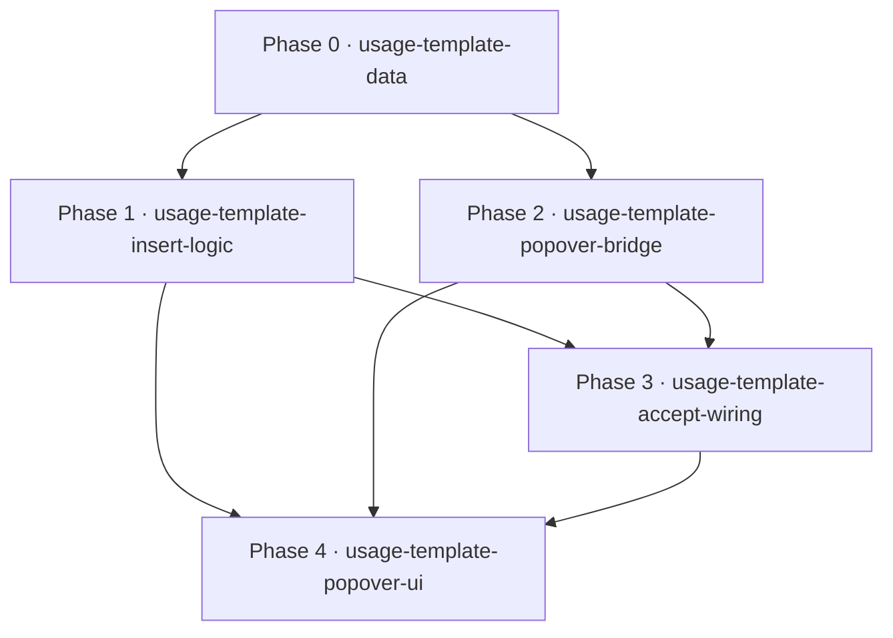

# CodeEditor usage templates — roadmap

Add a generic, data-driven **usage-template** mechanism to the CodeMirror editor so that accepting a built-in TS **completion item** that carries templates opens a **template popover** the user picks from — or declines to insert the **bare identifier**.

## Task & Analysis

- **Objective:** Add a generic, data-driven 'usage template' mechanism to the CodeMirror-based code editor so that accepting a built-in TS completion item that carries usage templates shows a popover picker the user can choose from (or decline to insert just the bare identifier), seeded with a small curated set (TransformStream, ReadableStream, and a few other web platform types).
- **Success definition:** (1) generic data-only mechanism — adding a new type's templates requires no edits to the completion source or editor wiring; (2) on accept of a template-bearing item a popover appears; choosing one inserts the full template indentation-aware; declining/dismissing inserts only the bare identifier; nothing auto-inserts; (3) byte-identical behavior when an item has no templates; (4) curated data covers at least TransformStream + ReadableStream plus a small set; (5) inserted template is syntactically valid JS/TS and indentation-correct at non-zero indent; (6) new unit tests + build (tsc -b) and lint green, existing completion tests stay green.
- **domainShape:** `technical` — the objective is about editor machinery (completion item data, a popover picker UI, template insertion inside a CodeMirror editor), with no business entities, rules, or workflows.
- **Ubiquitous language:**

| term | meaning |
|---|---|
| completion item | a single suggestion in the editor's autocomplete list |
| usage template | static code snippet attached to a completion item showing how to construct/use the symbol |
| template popover | the in-editor overlay listing available usage templates on accept |
| accept | the editor action confirming a highlighted completion item |
| bare identifier | the plain symbol name inserted when the user declines templates |
| curated template set | the hand-written first collection of templates (streams + a few) |
| completion source | a CodeMirror autocomplete source that produces completion items |

- **Assumptions**
  - Target editor is CodeMirror 6 (`editorCompletions.ts` composes `@codemirror/autocomplete` sources); the Monaco dependency is not the sandbox editor's completion path.
  - CodeMirror 6 has no built-in 'popover on accept' primitive → hand-built overlay bridged to a React component.
  - Usage templates are static, hand-curated text (concrete generics), not LanguageService-inferred.
  - Constructor entries already carry `apply: ''`; template insertion must compute its own replacement range including the trailing `(`.
  - `editorCompletions.ts` stays component-free (react-refresh convention); the React popover lives in a separate component behind a non-component bridge.
  - A template referencing an undefined symbol (e.g. `nums`) may trigger tsLint after insertion — tolerated as illustrative, not a gate.
- **Risks**
  - Post-accept popover placement & focus management (no CodeMirror primitive).
  - Replacement-range correctness (malformed `TransformStream(TransformStream<…` or `new new TransformStream(`).
  - Indentation of multi-line templates at nested cursor positions.
  - React/CodeMirror bridge violating the react-refresh component-free convention / breaking DOM-free tests.
  - Regression on the common path (items without templates must keep current accept behavior).
  - Templates referencing undefined locals may read as broken.

## Discovery Findings

| area | finding | file path | implication |
|---|---|---|---|
| Completion accept wiring | `apply` supports a function form `(view, completion, from, to) => void`; constructor entries currently use `apply: ''` | `src/infrastructure/builtInTsCompletion.ts` | Use function-form `apply` on curated items as the popover trigger; non-curated keep existing apply |
| Two accept paths | Curated type accepted via bare-identifier (label replaces partial) OR constructor context (`from=to=pos`, empty range) | `src/infrastructure/builtInTsCompletion.ts` | Decline must reproduce each path separately; template insertion must compute the replacement span (walk back over `new Name(`) |
| Overlay infra | No existing tooltip/popover anywhere in `src/`; `@codemirror/view` exports `showTooltip`/`TooltipView`/`ViewPlugin` | `src/components/CodeEditor.tsx` | Popover built from scratch on `@codemirror/view` |
| react-refresh convention | `editorCompletions.ts` is component-free by design; eslint enforces only-export-components | `src/infrastructure/editorCompletions.ts` | Popover `.tsx` under `src/components/`, logic in `.ts` under `src/infrastructure/`, bridged by non-component state |
| Per-item metadata | CodeMirror `Completion` has no free-form data field (excess-property checked) | `src/infrastructure/tsCheck.ts` | Attach templates via a curated side-map keyed on label, consumed in `toCompletion`/`apply` |
| Test env | Vitest, Node-only, no jsdom; no e2e harness | `src/infrastructure/builtInTsCompletion.test.ts` | Split mechanism into pure Node-testable logic + thin DOM shell; no DOM-level tests promised |
| Build/lint | `tsc -b` strict + `eslint .` (react-refresh); TS devDep 6.0.3 vs runtime LS 5.4.5 | `package.json` | New code must survive strict tsc + react-refresh lint; tests tolerate version drift |
| Curated-data precedent | `SERVICE_INTERNAL_METHODS` `Record<string, readonly string[]>`; `sandboxAmbient` `DOM_AUGMENT_TEXT` | `src/infrastructure/serviceCompletions.ts` | New `typeUsageTemplates.ts` mirrors the curated-record convention |
| Snippet primitives | `snippetCompletion` + `snippetKeymap` available but unwired | `src/components/CodeEditor.tsx` | Plain function-form apply for static templates; tab-stops deferred |

## Out of Scope

- **Auto-insertion of templates on accept** — the user explicitly scoped the UX to a popover picker; nothing auto-inserts.
- **Templates for arbitrary/future types** — mechanism is data-driven; later additions are data-only.
- **Full `lib.dom.d.ts` coverage** — only 'streams + a few' types curated.
- **AI/ML-generated or LS-inferred templates** — hand-curated static data only.
- **User-authored / persisted custom templates** — not requested.
- **Changes to the tsCheck LanguageService entrypoint or signature-help** — existing pipeline stays as-is.
- **Sandbox service handles (`sandboxServiceCompletions`)** — never receive usage templates.
- **JS-mode templates** — TS-mode only; the carrying source is TS-only.
- **Snippet tab-stops (`${}`-fields + `snippetKeymap`)** — YAGNI gate 2; revisit only if templates gain tab-stop fields.
- **DOM-level popover e2e tests** — YAGNI gate 2; no jsdom/playwright in the repo; the DOM shell is code-reviewed instead.

## Required Materials

None — lite path. Every phase input is an in-repo file or convention already established by Discovery; there is no external acquisition.

## Phases

### Phase 0 — Curated usage-template data module (typeUsageTemplates)

- **Bounded context:** curated template data (editor completion mechanism) · **Layer:** infrastructure · **Blast radius:** small
- **Goal:** introduce the data-driven foundation — a `UsageTemplate` type and `USAGE_TEMPLATES: Record<string, UsageTemplate[]>` keyed by completion label, covering TransformStream, ReadableStream, WritableStream, AbortController.
- **Inputs:** `SERVICE_INTERNAL_METHODS` convention; `DOM_AUGMENT_TEXT` precedent; the user's two template examples.
- **Expected result:** new `src/infrastructure/typeUsageTemplates.ts` + Node unit test asserting every entry's invariants.
- **Depends on:** —
- **Compensation:** none (additive data module).

Rubric: `type-and-record-shape` (7) · `curated-coverage` (8) · `template-text-validity` (8) · `test-guards-invariants` (7) · `data-only-footprint` (7).
**healerHint:** Most likely an incomplete curated set or placeholder text — diff the record keys against the four required types and make each `text` a real constructor-call snippet.

### Phase 1 — Pure usage-template lookup, replacement-range, and insert logic

- **Bounded context:** editor completion mechanism (attach/insert engine) · **Layer:** infrastructure · **Blast radius:** small
- **Goal:** build the pure, Node-testable core — label lookup, exact replacement ranges for both accept paths, the bare-identifier insert, and indentation-aware re-indent of multi-line template bodies.
- **Inputs:** data shape from phase 0; discovery on the two accept paths / `from==to==pos`.
- **Expected result:** new zero-DOM `src/infrastructure/usageTemplateInsert.ts` + tests for constructor walk-back, bare-identifier partial replacement, nested-indent body.
- **Depends on:** phase 0.
- **Compensation:** none (pure functions, additive).

Rubric: `label-lookup-resolution` (7) · `bare-identifier-insert-parity` (8) · `constructor-walkback-range` (8) · `template-body-reindent` (7) · `node-testable-purity` (7).
**healerHint:** The constructor path is where this dies — make the walk-back its own pure `(source, pos)` function and write the `new `-prefix-preservation test first.

### Phase 2 — Popover state bridge between completion logic and React UI

- **Bounded context:** popover state bridge (completion mechanism ↔ editor UI) · **Layer:** application · **Blast radius:** small
- **Goal:** a non-component state carrier so the `.ts` apply hook can open the popover and the `.tsx` component can render/close it, keeping wiring component-free and Node-testable.
- **Inputs:** `UsageTemplate` type from phase 0; react-refresh only-export-components convention.
- **Expected result:** new `src/infrastructure/popoverBridge.ts` (no React imports) with open/close/update/clear + subscribe, Node-tested; eslint react-refresh passes.
- **Depends on:** phase 0.
- **Compensation:** none (additive module).

Rubric: `component-free-wiring` (9) · `lifecycle-state-machine` (7) · `accept-anchor-payload` (7) · `subscribe-api` (7) · `usage-template-type-contract` (7).
**healerHint:** Most likely it gets written as a React hook / imports React and trips react-refresh — strip to a plain store exporting only open/close/update/clear + subscribe.

### Phase 3 — Wire usage-template accept behavior into builtInTsCompletion

- **Bounded context:** built-in TS completion source · **Layer:** infrastructure · **Blast radius:** medium
- **Goal:** function-form `apply` on curated items so accepting a template-bearing item opens the popover (no doc mutation); non-curated items keep byte-identical accept behavior.
- **Inputs:** insert-logic lookup/decision (phase 1); bridge open API (phase 2); current `toCompletion`/`apply` semantics + test pins.
- **Expected result:** `builtInTsCompletion.ts` modified; extended tests prove curated items trigger the bridge and non-curated keep current behavior; existing suite stays green.
- **Depends on:** phases 1, 2.
- **Compensation:** restore the previous `toCompletion`; the side-map and bridge go unused; existing tests pin old apply values → clean revert.

Rubric: `curated-function-form-apply` (8) · `accept-no-doc-mutation` (9) · `bridge-open-call` (8) · `non-curated-bytes-identical` (9) · `empty-template-fallback` (7).
**healerHint:** Most likely the curated apply returns the bare label/undefined instead of delegating to `bridge.open` — resolve templates through the insert logic, call `bridge.open`, return nothing, keep non-curated apply strings byte-for-byte.

### Phase 4 — Template popover overlay and React picker in CodeEditor

- **Bounded context:** editor UI integration (overlay + React picker) · **Layer:** interface · **Blast radius:** medium
- **Goal:** render the popover end-to-end — a CodeMirror overlay positioned from accepted-cursor viewport coordinates hosting a React picker; choose inserts the template (with `pickedCompletion` annotation); decline/dismiss (Escape/click-outside/blur) inserts the bare identifier; template-less items never show it.
- **Inputs:** bridge subscription (phase 2); choose/decline (phase 1); CodeEditor.tsx keymap/mount; `@codemirror/view` primitives.
- **Expected result:** accepting a template-bearing completion shows the positioned popover; choose/decline behave per spec; picker in its own `src/components/*.tsx`; `tsc -b` + lint pass.
- **Depends on:** phases 3, 2, 1.
- **Compensation:** remove overlay registration + picker mount; drop the `bridge.open` call from phase 3 → pre-popover accept behavior.

Rubric: `template-gating-no-auto-insert` (9) · `choose-inserts-full-template` (8) · `decline-and-dismiss-insert-bare-identifier` (9) · `overlay-positioned-from-viewport-coords` (7) · `react-picker-file-structure` (7) · `build-green-and-revert-safety` (8).
**healerHint:** Most likely the overlay appears at a hardcoded/zero position or for every completion — add a render-time guard asserting non-empty templates and finite coordinates, then trace `bridge.open` so it fires only for template-bearing items.

## Dependency map

## Success Criteria

1. Mechanism is generic (data-only additions); on accept of a template-bearing item a popover appears; choose inserts the full template indentation-aware; decline/dismiss inserts the bare identifier; nothing auto-inserts; byte-identical behavior with no templates; curated set covers streams + a few; inserted template syntactically valid + indentation-correct; unit tests + build/lint green with existing completion tests unchanged.
2. Phase 0 deliverable: `typeUsageTemplates.ts` + invariants test.
3. Phase 1 deliverable: zero-DOM `usageTemplateInsert.ts` + three named tested scenarios.
4. Phase 2 deliverable: component-free `popoverBridge.ts` + lifecycle tests + eslint react-refresh pass.
5. Phase 3 deliverable: curated items get function-form apply → `bridge.open` with no doc mutation; non-curated byte-identical; existing suite green.
6. Phase 4 deliverable: positioned popover with choose/decline insert; picker `.tsx` under `src/components/`; build + lint pass.

## Quality Gate

- **Path:** lite (technical, code-local, single subsystem). **Discovery:** ran (Explore agent, 9 findings). **Iterations:** 1.
- **Issues raised → verified → healed:** 10 dimensions scored, all `pass: true`, 8–9/10 (≥ every minScore). 0 blockers, 0 majors.
- **Accepted debt (6 minors):** all "no change needed" verdicts; one optional improvement noted — a tsc-parse-level check on inserted template text to directly satisfy success criterion 5 (the exact-content + build-green gates already bound the risk).
- **Final verdict:** ✅ **PASS** — structurally sound, grounded in the actual repo, survived one semantic review. Not a formal proof of architecture correctness.
