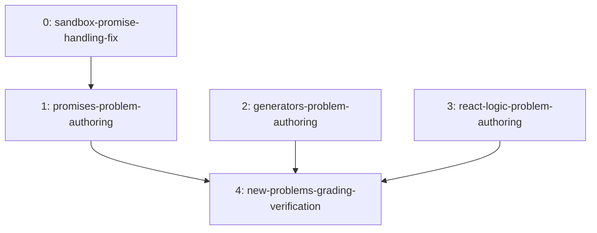

# Extend problem bank: Promises, Generator Functions, React — roadmap

## Task & Analysis

**Objective:** Add three new topic areas to LeetLab's problem bank (Promises, Generator Functions, React-themed logic) with 3-5 production-quality problems each, matching the polish of the existing 6 problems, after investigating whether the execution sandbox needs new capability for async/generator support.

**Success definition:** `src/infrastructure/problemBank.ts` gains 9-15 new `Problem` entries (3-5 each for Promises, Generator Functions, React-themed logic), each conforming to the existing `Problem` interface with JS+TS starter code, visible+hidden `ProblemTest`s, non-empty hints, and an HTML `desc`. All new problems execute correctly end-to-end through the sandbox pipeline as verified by actually running them, not just code review. React-themed problems are pure JS/TS logic — no DOM, no JSX, no component rendering. The app's real build/typecheck passes with the new content included.

**Domain shape:** `technical` — extending a static content bank and a code-execution sandbox (worker, TS compiler, test runner), not business entities like orders or accounts.

### Ubiquitous language

| Term | Meaning |
|---|---|
| Problem | One practice item: slug, num, title, difficulty, tags, fnName, mode, starter, tests, hints, desc |
| ProblemTest | One test case: `{in,out}` for fn mode or `{calls,out}` for class mode |
| starter (js/ts) | The unimplemented stub shown to the solver, in both JS and TS |
| sandbox worker | `sandbox.worker.ts` — compiles and executes submitted code against ProblemTests |
| hidden/visible test | Whether a test's input/output is shown to the solver or only used for grading |
| fn/class mode | Whether a Problem's entry point is a plain function or a class with methods |
| hint | A progressively-revealing nudge, not the answer |
| tsCompiler | `tsCompiler.ts` — compiles TS starter/solution code before it runs in the worker |

### Assumptions

- The existing 6 problems are the quality/polish template to imitate, not just a schema to satisfy
- "3-5" per topic means each topic independently gets 3-5 problems, not 3-5 total
- No new Problem/ProblemTest fields unless investigation proved the shape can't express the new problem types (it didn't)
- Hidden tests must actually distinguish correct from naive/incorrect solutions
- Slug/tag/numbering conventions follow the existing 6 entries, inspected not invented
- No UI changes needed — the app renders whatever is in the problem bank generically

### Risks

- Sandbox might lack real Promise/microtask support, silently producing wrong/hanging results for async problems
- Generator syntax might not survive TS compilation or the worker's execution boundary
- Sandbox extension could balloon scope from "add problems" into "rework the execution engine"
- Async tests need a completion signal inside a worker possibly designed only for sync calls
- React-themed problems risk scope creep toward real hook semantics without a real React runtime
- No caller-supplied acceptance criteria — "production quality" is judged subjectively against the existing 6

## Discovery Findings

| area | finding | file | implication |
|---|---|---|---|
| async/await support | `runFn`/`runClass` call the tested function and immediately `deepEq` the result — no `await`, no async branch | sandbox.worker.ts | Async is **not** supported end-to-end; a real code change is required before Promise problems can grade correctly |
| generator support | No special-casing for generator functions; a raw Generator object can't be meaningfully diffed/serialized | sandbox.worker.ts | Generator syntax is fine, but problems must be authored so the tested fn wraps and drains the generator internally — an authoring constraint, not a code change |
| TS compilation | `tsCompiler.ts` targets ES2021 (native async/generator support); regex fallback also passes these keywords through | tsCompiler.ts | Compilation is not the blocker; the gap is purely at the execution/comparison layer |
| worker execution mechanism | Promise is a native Worker-global; async/await/.then() work as language features | sandbox.worker.ts | No environment gap — the fix is purely "await before comparing" |
| fn vs class mode | fn mode diffs one return value; class mode instantiates + applies method calls in order; no DOM/React runtime available | sandbox.worker.ts | Generators fit fn mode; React problems must be algorithmic simulations, no real React import possible |
| timeout | Hardcoded 6000ms total run timeout, not per-case | useRunCode.ts | New async problems must resolve via microtasks, not real timers, to fit the budget |
| Problem domain shape | Exactly slug/num/title/difficulty/tags/fnName/mode/starter/tests/hints/desc, no async/generator metadata fields | Problem.ts | New problems fit entirely within the existing shape — no schema change |
| existing conventions | Real LeetCode numbers/slugs; free-form Title Case tags; difficulty spread 2E/3M/1H; slug is the real lookup key, num is cosmetic | problemBank.ts | New problems need a non-colliding numbering scheme (ascend past 155), unique slugs, thematic Title Case tags, similar difficulty skew |

## Out of Scope

- Real React component rendering, JSX, or DOM assertions — React problems stay logic-only
- Building a React-capable rendering sandbox or DOM/jsdom environment
- Rewriting/generalizing the sandbox's execution model beyond the minimal Promise fix
- New topic areas beyond Promises, Generator Functions, and React
- UI/UX changes to problem display, filtering, or navigation
- Speculative Problem/TestCase schema changes
- Editing or re-polishing the existing 6 problems
- Backend/persistence changes — problemBank.ts remains the static source of truth
- Extending the 6000ms run timeout
- Validation tooling for the cosmetic `num` field

## Required Materials

None — Discovery already established every fact the plan needed; nothing external remained to gather.

## Phases

All phases are `technical`-shaped: layer is judged loosely (infrastructure / interface / cross-cutting), `domain` doesn't apply.

| order | id | layer | blastRadius | dependsOn | deliverable |
|---|---|---|---|---|---|
| 0 | sandbox-promise-handling-fix | infrastructure | small | — | `runFn`/`runClass` await Promise results before comparison |
| 1 | promises-problem-authoring | interface | medium | sandbox-promise-handling-fix | 3-5 Promises-topic Problem entries |
| 2 | generators-problem-authoring | interface | medium | — | 3-5 Generator Functions-topic Problem entries |
| 3 | react-logic-problem-authoring | interface | medium | — | 3-5 React-themed logic Problem entries |
| 4 | new-problems-grading-verification | cross-cutting | small | promises, generators, react-logic phases | All new Problems verified passing end-to-end, no collisions, real project build passes |

### Phase 0 — Fix sandbox worker Promise handling

**Goal:** Modify `runFn`/`runClass` in `sandbox.worker.ts` so Promise-returning results are awaited before the `deepEq` comparison.
**Inputs:** current runFn/runClass implementation; the 6000ms total timeout (must not be extended).
**Expected result:** runFn/runClass await any Promise before comparing; existing 6 (non-Promise) problems grade identically to before.
**Compensation:** revert the diff if grading of any existing problem regresses.
**Rubric:** promise-result-awaited-before-compare (9) · rejected-promise-becomes-failing-case (8) · existing-sync-problems-unchanged (9) · case-message-order-preserved (8) · run-timeout-untouched (8)
**Healer hint:** most likely failure is `runClass`'s per-call loop being left un-awaited while `runFn` is fixed — await inside that same loop before the undefined→null normalization.

### Phase 1 — Author Promises topic problems

**Goal:** Add 3-5 Promises-topic Problems with JS+TS starter, visible+hidden tests, hints, HTML description.
**Inputs:** the Phase 0 fix; existing slug/tag/difficulty/mode conventions.
**Expected result:** 3-5 Problem entries, microtask-resolving (no real timers) tests fitting the 6000ms budget, unique slugs, num past 155, Title Case tags, Easy/Medium-skewed difficulty.
**Rubric:** schema-identity-integrity (9) · deterministic-sandbox-execution (9) · test-coverage-quality (8) · starter-and-mode-completeness (9) · content-polish-parity (7)
**Healer hint:** watch for hidden tests relying on `setTimeout` delays pushing near the 6000ms budget or causing flaky repeat runs — use microtask chains only.

### Phase 2 — Author Generator Functions topic problems

**Goal:** Add 3-5 Generator Functions-topic Problems whose tested function is a plain fn/class entry point wrapping internal generator consumption.
**Inputs:** confirmation generator syntax already compiles/runs; existing conventions.
**Expected result:** 3-5 Problem entries returning JSON-serializable data (never a raw generator/IteratorResult).
**Rubric:** entry-point-contract (8) · json-serializable-output (8) · test-determinism-repeatability (8) · slug-and-metadata-conventions (7) · content-and-edge-case-coverage (7)
**Healer hint:** watch for a solution returning the raw generator/IteratorResult instead of draining it into a plain array/object.

### Phase 3 — Author React-themed logic topic problems

**Goal:** Add 3-5 pure JS/TS algorithmic simulations of React concepts (e.g. simplified `useState`/memoize), no DOM or React runtime.
**Inputs:** confirmation no DOM/React runtime is available or needed; existing conventions.
**Expected result:** 3-5 fn-mode Problem entries, pure-logic simulations, JSON-serializable tests.
**Rubric:** pure-logic-no-runtime-deps (9) · test-determinism-and-repeatability (8) · slug-mode-metadata-consistency (8) · starter-hint-description-completeness (7)
**Healer hint:** watch for flaky hidden tests from unresolved Promise/microtask timing now that Phase 0 changed sandbox behavior — always await/settle before asserting.

### Phase 4 — Verify new problems grade correctly end-to-end

**Goal:** Run every new Problem's tests through the (now Promise-aware) sandbox worker; confirm no slug/num collisions; confirm the real project build passes.
**Inputs:** outputs of Phases 1-3; the Phase 0 fix.
**Expected result:** all 9-15 new Problems pass their tests via actual sandbox execution within budget, zero collisions, any failure fixed upstream in its authoring phase, and `tsc -b` passes with the new content.
**Rubric:** real-sandbox-execution-evidence (8) · all-visible-hidden-tests-pass (10) · run-budget-compliance (8) · no-slug-num-collisions (10) · failures-fixed-upstream-not-patched-here (7) · **project-build-typecheck-passes (9)** *(added during healing)*
**Healer hint:** watch for Promise/generator hidden tests silently hanging until the 6000ms timeout is misread as a pass — assert explicit resolved/rejected values, never bare "did not throw."

## Dependency Map

## Success Criteria

- `problemBank.ts` gains 9-15 new Problem entries (3-5 each topic), conforming to the existing interface with full JS+TS starters, visible+hidden tests, hints, HTML description
- Sandbox worker Promise handling fixed: `runFn`/`runClass` await results before comparison; existing 6 problems grade identically to before
- Promises topic: 3-5 microtask-based, budget-safe Problem entries
- Generator Functions topic: 3-5 Problem entries wrapping generator consumption behind a plain fn/class entry point
- React-themed logic topic: 3-5 pure JS/TS simulations, no DOM/React runtime dependency
- All 9-15 new Problems verified passing end-to-end via real sandbox execution, no slug/num collisions
- The project's real build/typecheck (`tsc -b`, per `package.json`'s `tsc -b && vite build`) actually runs and passes with the new content; the repo has no separate test-runner script, so that part of the success definition is vacuously satisfied

## Deferred

- Real React component rendering, JSX, or DOM assertions — explicitly excluded by the user
- Building a React-capable rendering sandbox or DOM/jsdom environment
- Rewriting/generalizing the sandbox's execution model beyond the minimal Promise fix
- New topic areas beyond Promises, Generator Functions, and React
- UI/UX changes to problem display, filtering, or navigation
- Speculative Problem/TestCase schema changes
- Editing or re-polishing the existing 6 problems
- Backend/persistence changes
- Extending the 6000ms run timeout
- Validation tooling for the cosmetic `num` field

## Quality Gate

- **Path taken:** full (5 phases spanning multiple subsystems — a required infra fix plus three independent content topics plus verification — well past the lite-path ≲3-phase threshold)
- **Discovery:** ran (existing system) — 8 findings, all grounded the plan directly, replacing what would otherwise have been guesses about async/generator sandbox support
- **Iterations:** 1
- **Critic issues raised:** 10 (1 blocker, 9 passing/minor)
- **Blocker verification:** 1 blocker (`success-coverage` — missing whole-app build/typecheck check) sent to adversarial verification → **CONFIRMED**, but downgraded to **major** (real gap, narrow and mechanically cheap to close, not a structural flaw)
- **Healed:** 1 — added a `successCriteria` entry and a new `project-build-typecheck-passes` rubric dimension on `new-problems-grading-verification`, requiring `tsc -b` (the project's real build/typecheck) to actually run and pass with the new `problemBank.ts` content, distinct from the per-problem in-sandbox `tsCompiler` checks. Noted explicitly that the repo has no separate test-runner script, so that clause of the original success definition is vacuously satisfied rather than inventing a requirement that doesn't exist.
- **Accepted debt:** 0
- **Final verdict: PASSED** — roadmap is structurally sound and grounded in the actual sandbox/worker code after 1 healing iteration.
