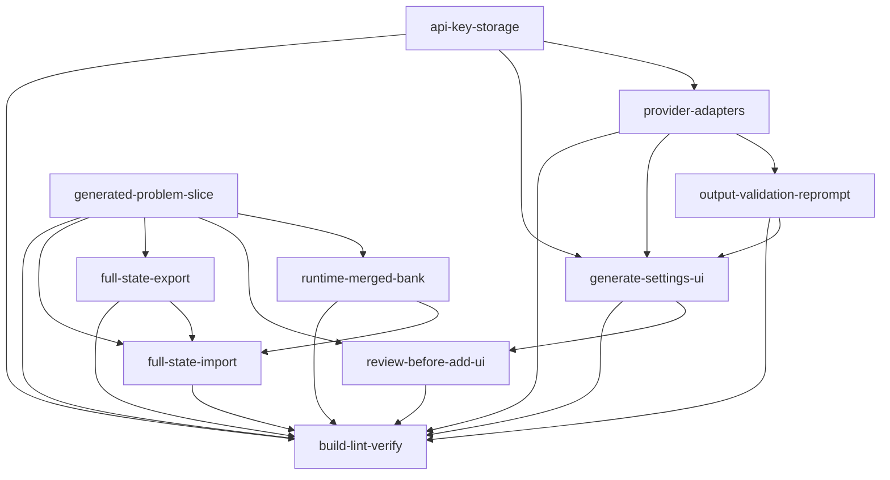

# Roadmap — LLM-generated problems (Anthropic / OpenAI / local) + import/export

> **Skill**: `dima-plan-roadmap-ddd-v2` (full path) · **Slug**: `llm-generated-problems-import-export`

## Task & Analysis

**Task.** leetlab is a client-side LeetCode-style practice app (React 19 + Vite + Zustand; no backend). Add a feature to generate new problems (not already in the problem bank) using an LLM — local or paid, supporting **both Anthropic and OpenAI APIs**. Calls are browser-direct; API keys are entered by the user and stored in-app (localStorage). Generated problems must be persistent in localStorage (merged with the built-in `PROBLEM_BANK` at runtime). A generated problem goes through a **review-before-add** workflow where the user accepts or discards it, and dedupe against existing problems is enforced. Also add **import/export**: full-state backup/restore covering progress (`solvedAt`), saved code, custom test cases, submissions, and the generated/custom problem bank.

**Scoping answers (Step 0).** LLM access = browser-direct, keys in-app (user-entered, stored in localStorage). Import/export = full-state backup/restore (one versioned JSON covering the persisted Zustand slice plus generated problems). Generation workflow = review-before-add (accept/discard, dedupe enforced at accept time).

**Objective.** Add a client-side "generate new problem" feature that produces problems via Anthropic, OpenAI, or OpenAI-compatible local endpoints using browser-direct calls with user-entered API keys stored in localStorage, routes each result through a review-before-add accept/discard gate with dedupe against the merged problem bank, persists accepted generated problems in localStorage, and adds full-state JSON backup/restore covering progress, saved code, custom test cases, submissions, and the generated problem bank.

**Success definition.** Done when (1) a user can pick a provider (Anthropic / OpenAI / OpenAI-compatible local), enter an API key persisted to localStorage, and generate a valid Problem (both `fn` and `class` modes) that appears in a review screen showing title, signature (`fnName` + mode), and test preview; (2) Accept enforces dedupe against `PROBLEM_BANK` and already-accepted generated problems — slug/title/signature collisions are rejected with a visible message, never silently added — and the accepted problem is persisted so it appears in the problem list and in `getProblem`/sidebar alongside built-ins across reloads; (3) Discard leaves the bank unchanged; (4) Export writes a single versioned JSON capturing the persisted Zustand slice (`lang`, `split`, `lastSlug`, `problems`: `solvedAt`, `js`/`ts`, `cases`, `subs`) plus generated problems, and Import validates and restores it so the app behaves identically, while malformed or wrong-version files fail with a clear error and leave the live store untouched; (5) malformed LLM output is re-prompted or rejected, never persisted; (6) `npm run build` (tsc + vite) and `npm run lint` pass.

**Domain shape.** `technical` — the work is machinery (provider adapters, browser-direct API calls, localStorage persistence, runtime bank merging, a versioned JSON backup format) over a data-shaped `Problem` artifact, not business entities/rules/workflows. Re-checked and confirmed by the critic's `domain-shape-fit` pass at the quality gate.

### Ubiquitous language

| Term | Meaning |
|---|---|
| problem bank | The runtime-merged set of built-in `PROBLEM_BANK` problems plus accepted generated problems; the set a user browses and solves. |
| generated problem | An LLM-produced payload parsed into the `Problem` shape (`slug`, `num`, `title`, `difficulty`, `tags`, `fnName`, `mode`, `starter`, `tests`, `hints`, `desc`), pending or accepted. |
| review-before-add | The accept/discard gate a generated problem passes through, showing title, signature, and test preview before it can enter the problem bank. |
| dedupe | Enforcement at accept time that a generated problem does not collide (by slug, title, or signature) with `PROBLEM_BANK` or already-accepted generated problems. |
| provider adapter | The abstraction over Anthropic Messages API, OpenAI Chat Completions, and OpenAI-compatible local `/v1/chat/completions` endpoints that returns a parsed generated problem. |
| full-state export/import | The versioned single-JSON backup and restore of the persisted Zustand slice (`lang`, `split`, `lastSlug`, `problems` with `solvedAt`/`js`/`ts`/`cases`/`subs`) plus the generated problem bank. |
| localStorage persistence | Browser storage holding app state under the `leetlab.v2` key and API keys under a separate key; the mechanism that makes generated problems survive reloads. |
| output validation | The gate that parses raw LLM text into the exact `Problem` shape and rejects or re-prompts malformed output before a generated problem can be accepted. |
| verification | The final cross-cutting check that the whole feature passes `npm run build` (tsc + vite) and `npm run lint`. |

### Assumptions

1. `PROBLEM_BANK` stays a static module constant in `src/infrastructure/problemBank.ts`; generated problems live in a new persisted slice (e.g. `generatedProblems` added to the Zustand store and its `partialize`) and are merged with `PROBLEM_BANK` at read time (`getProblem` and the sidebar list), rather than mutating the `PROBLEM_BANK` array.
2. API keys are stored in a separate localStorage key (e.g. `leetlab.apiKeys`), masked in the UI, and are excluded from full-state export/import to avoid spreading credentials in backup files.
3. The Zustand persist key `leetlab.v2` defines the persisted state boundary; full-state export covers that partialized slice (`lang`, `split`, `lastSlug`, `problems`) plus the generated problem bank — matching the user's listed fields (`solvedAt`, saved code `js`/`ts`, custom cases, `subs`).
4. Local providers (Ollama/LM Studio) are reachable via a user-configured base URL exposing an OpenAI-compatible `POST /v1/chat/completions`; CORS enablement on that endpoint is the provider's/user's responsibility.
5. LLM output is parsed into the existing `Problem` shape (`slug`, `num`, `title`, `difficulty`, `tags`, `fnName`, `mode`, `starter.js/ts`, `tests`, `hints`, `desc`); a failed parse triggers a re-prompt or rejection, never a silent accept.
6. Dedupe uniqueness is keyed primarily by slug, with additional title/signature collision checks, evaluated at accept time as specified.
7. Discarded problems are not persisted (no recycle bin / review history); the review queue is in-memory for the current session only.

### Risks

| Risk | Mitigation in plan |
|---|---|
| API keys in localStorage are readable by any script on the page (XSS exfiltration) and by anyone with device access | Inherent to the user-chosen browser-direct model; mitigated with masked inputs, never logging keys, and excluding keys from exports (`api-key-storage`, `api-keys-excluded` at minScore 10). Residual risk cannot be removed client-side — stated, not hidden. |
| Browser CORS: Anthropic requires `anthropic-dangerous-direct-browser-access`; OpenAI/Anthropic may reject browser-origin requests; local endpoints must enable CORS themselves | Provider adapters send the mandatory header and classify CORS/network failures distinctly from auth/4xx/5xx (`error-classification` dimension). |
| LLM output validity: wrong-arity tests, non-JSON-serializable tests, near-duplicate problems | `output-validation-reprompt` parses to the exact `Problem` shape, validates tests against the signature, and re-prompts (bounded) or rejects — never persists malformed output. |
| Dedupe enforced only at accept time, so generation can produce a duplicate | `review-before-add-ui` surfaces a distinct visible duplicate state naming the colliding property and problem; never silently adds or drops. |
| Import of malformed/truncated/wrong-version state corrupting the live store | `full-state-import` validates version + schema, restores atomically with a pre-import snapshot, and rejects without touching the live store. |
| "Full-state" export could creep into persisting intentionally ephemeral fields | Export is defined against the exact `partialize` boundary (`{lang, split, lastSlug, problems}`) plus the generated bank. |

## Discovery Findings

Discovery (Stage 1.5, `Explore` agent) read the actual repo before phases were cut. 14 findings:

| # | Area | Finding | File | Implication |
|---|---|---|---|---|
| 1 | PROBLEM_BANK consumption / runtime-merged bank | `PROBLEM_BANK` is a static `export const ... Problem[]` (30 entries); `getProblem` does `PROBLEM_BANK.find` only; Sidebar/Topbar import the bank directly; DescPane/EditorPane/CodeEditor/Drawer read via `getProblem`/`getProblemState`/`getCases`. | `src/infrastructure/store.ts` | A runtime-merged bank only needs a merge point in `getProblem` plus a merged list/count source for Sidebar and Topbar. |
| 2 | PROBLEM_BANK consumption / Topbar counts | Topbar derives segments and solved denominator from `PROBLEM_BANK.length` (not a hardcoded 6) — contradicts the stale AGENTS.md claim. | `src/components/Topbar.tsx` | Don't trust the stale AGENTS.md claim; Topbar already reacts to bank length but reads the static bank. |
| 3 | Persisted shape / partialize boundary | `leetlab.v2`; `partialize` persists exactly `{lang, split, lastSlug, problems}`; no `version`/`migrate`; ephemeral fields not persisted (`caseMarks`, `lastRuns`, `tsStatus`, `activeResultTab`, `currentSlug`, …). | `src/infrastructure/store.ts` | Full-state export/import must be defined against exactly `{lang, split, lastSlug, problems}` plus the new generated-problem slice. |
| 4 | Persisted shape / adding persisted fields | `getProblemState` lazily writes defaults during render; `subs` capped at 60; no version bump today. | `src/infrastructure/store.ts` | Adding a new persisted slice to `partialize` needs an explicit decide: additive default vs `leetlab.v3` bump/migrate. |
| 5 | Problem domain shape & judge contract | `Problem` = `{slug, num, title, difficulty, tags, fnName, mode: 'fn'\|'class', starter:{js,ts}, tests, hints, desc}`; `ProblemTest` = `{in?, calls?, out}`; sandbox call/compare semantics. | `src/domain/Problem.ts` | Generated problems must parse to exactly this shape; judge-ability can be pre-checked via `useRunCode`. |
| 6 | desc HTML contract | `DescPane` renders `p.desc` via `dangerouslySetInnerHTML`; bank uses a specific HTML vocabulary (`
`, `<code>`, `<h4>Examples</h4>`, `
`, `
`, `<ul>/<li>`, `/`). | `src/components/DescPane.tsx` | Generated `desc` must be emitted as sanitized-HTML-shaped markup matching this vocabulary or the pane renders broken. |
| 7 | Problem numbering / slug conventions | Sparse real LC numbers (1, 3, 9, 20, 21, 42, 56, 70, 104, 136, 155, 200, 206, 226, 232, 242, 322, 704) plus an 8000-series custom range (8001–8012); `slug` is the real lookup key. | `src/infrastructure/problemBank.ts` | Generated problems need a non-colliding numbering scheme and unique slugs. |
| 8 | `getDefaultCases` module cache | Builtin TestCase arrays cached in a module-level `Map<string, TestCase[]>` keyed by `slug`; `getCases()` returns `ps?.cases \|\| getDefaultCases(prob)`. | `src/infrastructure/store.ts` | Slug dedupe is not just cosmetic — it protects the case cache and per-slug state. |
| 9 | In-browser TS compilation & sandbox protocol | TS loaded from jsDelivr at runtime with a regex fallback; worker protocol `{code, name, mode, cases}` → `compile`/`case`/`console`/`done`, 6s timeout in `useRunCode`. | `src/infrastructure/sandbox.worker.ts` | The "does this generated problem judge correctly" gate can be validated in-browser via `useRunCode` — no new execution engine needed. |
| 10 | Existing LLM/API/fetch/localStorage/settings code | No OpenAI/Anthropic/Ollama code, no external `fetch` except tsCheck.ts→jsDelivr, no `localStorage` outside zustand persist, no settings UI, no import/export. | — | Provider adapters, the API-key storage key, and the versioned export/import format are all net-new. |
| 11 | UI patterns & entry point for Generate/Import/Export | Topbar has no action buttons; no modal/dialog component exists; DescPane tab buttons have no `onClick` (Submissions tab unreachable — known regression). | `src/components/Topbar.tsx` | Generate/Import/Export entry points are new Topbar buttons; the review flow + key form is net-new modal/drawer UI. |
| 12 | State management conventions | Single zustand store `useAppStore` with `persist`; helpers are store actions; mixed `@`-alias vs relative import style. | `src/infrastructure/store.ts` | New store fields/actions should follow the existing interface + implementation pattern in store.ts. |
| 13 | Known regressions / roadmap state | `docs/done/src-vs-prototype-refactor-roadmap.md` is partly stale (run/submit handler fixed, TLE-drops-results fixed, Topbar uses `PROBLEM_BANK.length`); live: DescPane unwired tabs. | — | Don't treat stale findings as pending work; the live regression that affects new UI placement is DescPane's unwired tabs. |
| 14 | Bootstrap / initial state assumptions | Initial state sets `lastSlug`/`currentSlug` to `PROBLEM_BANK[0].slug`; Topbar/Sidebar assume a non-empty bank. | `src/infrastructure/store.ts` | Import validation must reject/repair a file whose `lastSlug`/`currentSlug` does not resolve in the merged bank. |

## Out of Scope (`deferred`)

| Item | Reason |
|---|---|
| No backend/proxy for LLM calls — browser-direct only | User's access model; no server to hold keys or relay requests. |
| No authentication, authorization, or multi-user sync | Single-browser local app, no user accounts. |
| No editing/management of generated problems after acceptance | Not asked for. |
| No persistence or review history for discarded problems | YAGNI gate 1 (not asked for); review queue is session-only. |
| No cost/rate-limit management or streaming/abort UX | Not asked for; the review screen shows the final result. |
| No new problem kinds or runner changes | Generated problems constrained to what the existing sandbox/judge executes (`fn` and `class`). |
| No key-encryption/key-migration machinery beyond enter/update/delete | Not asked for. |
| Provider plugin system / dynamic adapter registry | YAGNI gate 3 — only three concrete adapters exist; a registry is speculative abstraction. |
| Persisting ephemeral store fields (`caseMarks`, `lastRuns`, `tsStatus`, `activeResultTab`, selection) | YAGNI gates 1/2 — requested field list is `solvedAt`/`js`/`ts`/`cases`/`subs` only; expanding the persist boundary is scope creep. |
| Token streaming of generation output | YAGNI gate 1 — not asked for. |
| Prompt/parameter customization UI (temperature, system-prompt editor) | YAGNI gates 1/3 — not asked for, speculative. |
| Complex zustand migrate/version-bump migration | YAGNI gates 2/3 — an additive `generatedProblems` field with a safe default rehydrates without a key bump; a migration is only warranted if the slice phase lands on `leetlab.v3`. |
| Exporting/importing API keys as part of full-state backup | YAGNI gate 1 — spec explicitly excludes keys to avoid spreading credentials. |

## Required Materials

| Material | Kind | Needed for | How to acquire |
|---|---|---|---|
| Anthropic API key (development/test) | credential | End-to-end verification of the Anthropic adapter (browser-direct fetch, auth header, error classification, review-gate flow). | console.anthropic.com. Dev-testing only; runtime auth reads the user's own `leetlab.apiKeys` entry. |
| OpenAI API key (development/test) | credential | Validation of the Chat Completions adapter incl. the malformed-output re-prompt path. | platform.openai.com/api-keys. Dev only; runtime auth comes from the user's localStorage key. |
| Anthropic Messages API contract (browser-direct) | knowledge | Exact request schema, response content-block shape, current model IDs, mandatory `anthropic-dangerous-direct-browser-access` header. | docs.anthropic.com reference + the claude-api skill in this environment. |
| OpenAI Chat Completions API contract (browser-direct) | knowledge | Exact schema for `POST /v1/chat/completions`; whether browser-origin CORS calls are permitted; a JSON-capable default model. | platform.openai.com/docs/api-reference/chat. |
| Running OpenAI-compatible local endpoint (Ollama or LM Studio) | tool | Validating the local provider branch (model name, CORS for the dev origin). | Install Ollama/LM Studio, pull a small model (e.g. `llama3.2` or `qwen2.5-coder`), enable CORS for `http://localhost:*`. |

## Phases

All 10 phases are `small`/`medium` blast radius with exactly one deliverable each. Order 0→9; layer direction not mechanically checked for this `technical`-shaped roadmap, but dependencies are all load-bearing.

---

### Phase 0 — API key storage (`api-key-storage`)

- **Bounded context:** localStorage persistence · **Layer:** infrastructure · **Blast radius:** small
- **Goal:** Create the localStorage-backed module holding user-entered provider API keys under the dedicated `leetlab.apiKeys` key, with masked reads and a single import point so keys stay out of full-state export.
- **Inputs:** Discovery (no existing settings/localStorage code outside zustand persist) · Assumption (keys under `leetlab.apiKeys`, masked, excluded from export/import) · Required material (dev-held test keys).
- **Expected result:** A single module `src/infrastructure/apiKeys.ts` (`getKey`/`setKey`/`clearKey` under the `leetlab.apiKeys` key plus a `redact` helper) that provider adapters and the settings UI consume and that full-state export explicitly omits.
- **Depends on:** — · **Compensation:** Delete the module and clear the `leetlab.apiKeys` entry; no other subsystem holds key state.

| Rubric dimension | Min | Pass criteria (abridged) |
|---|---|---|
| `key-namespace-isolation` — All key state scoped to `leetlab.apiKeys` | 7 | One storage-key constant `leetlab.apiKeys`; grep shows key writes only there; `leetlab.v2` JSON contains no key field. |
| `masked-reads-redaction` — Keys redacted for display, never logged | 7 | `redact()` masks the body; short/empty safe; no `console.log(key)`; UI readback from `redact` only. |
| `excluded-from-full-state` — Key material excluded from export/import | 8 | Module imports no store/persist; persist config has no apiKeys field; export has no import of the module; serialized state contains no key values. |
| `single-import-point` — Adapters/UI read keys only through the module | 7 | No `localStorage` key material outside the module; adapters import `getKey`; settings use `setKey`/`redact`. |
| `provider-lifecycle-and-compensation` — Per-provider round-trip, reload safety, full clear | 7 | Per-provider keys don't clobber; `clearKey` removes the entry; survives reloads; corrupt JSON returns null; no real secrets committed. |

**Healer hint:** Most likely failure is key material leaking into the `leetlab.v2` slice or a consumer writing localStorage directly — centralize every key read/write in `src/infrastructure/apiKeys.ts`, strip any `apiKeys` field from `partialize`, and re-grep.

---

### Phase 1 — Provider adapters (`provider-adapters`)

- **Bounded context:** LLM provider adapters · **Layer:** infrastructure · **Blast radius:** medium
- **Goal:** Implement browser-direct provider adapters that POST the generation prompt to Anthropic Messages, OpenAI Chat Completions, or a user-configured OpenAI-compatible local `/v1/chat/completions` endpoint and return raw model text, with the mandatory Anthropic browser-access header, correct auth, current model constants, and CORS/network error classification.
- **Inputs:** `api-key-storage` · Anthropic contract (header + model ID) · OpenAI contract (`choices[0].message.content`) · running local endpoint · CORS risk.
- **Expected result:** `generateProblemText({provider, apiKey, baseUrl?, model, prompt}) -> raw text` for anthropic/openai/local, a shared classified error result (auth vs 4xx vs CORS/network vs 5xx), and a provider+model picker constant list. No Problem parsing yet.
- **Depends on:** `api-key-storage` · **Compensation:** none declared (pure infra).

| Rubric dimension | Min | Pass criteria (abridged) |
|---|---|---|
| `error-classification` — Classified error result across providers | 8 | 401/403→auth; `TypeError`/`Failed to fetch`→cors-network; 5xx→server; machine-readable category; no string-matching at call sites. |
| `provider-auth-and-headers` — Correct per-provider auth + mandatory headers | 8 | Anthropic sends `x-api-key`/`anthropic-version`/`anthropic-dangerous-direct-browser-access: true`; OpenAI/local send `Authorization: Bearer`; key never in URL/body/logs. |
| `raw-text-extraction` — Correct response-shape extraction | 7 | `choices[0].message.content` (OpenAI/local), `content[0].text` (Anthropic); missing/empty content → explicit error; raw text only, no Problem parsing. |
| `unified-contract-and-routing` — Single entry point + endpoint routing + current models | 7 | `generateProblemText` dispatches; local honors `baseUrl` + `/v1/chat/completions`; non-deprecated model IDs; wire format knowledge confined to adapters. |
| `repeatability-and-scope-purity` — Deterministic, side-effect-light | 7 | Identical args → identical request shape; no module-level mutable state; key passed per call, not captured. |

**Healer hint:** Likely failure is CORS and auth both surfacing as one opaque "Failed to fetch" — extract a `classifyError` helper mapping `TypeError`→cors-network distinct from 401/403, pin with a mocked-fetch test, and confirm the Anthropic browser-access header is actually set if Anthropic 403s.

---

### Phase 2 — Generated-problem persisted store slice (`generated-problem-slice`)

- **Bounded context:** Zustand store / localStorage persistence · **Layer:** application · **Blast radius:** medium
- **Goal:** Add a persisted `generatedProblems` slice, settle the persist-key/version strategy, and implement `acceptGeneratedProblem` (dedupe by slug/title/signature + non-colliding `num`) and `discardGeneratedProblem`.
- **Inputs:** Discovery findings 3, 4, 7, 8 · `Problem` shape.
- **Expected result:** Store exposes persisted `generatedProblems`, `acceptGeneratedProblem` returning `{ok:true}` or `{ok:false, reason, collidingWith}`, `discardGeneratedProblem`, and a documented additive-default-vs-`leetlab.v3`-bump decision with non-colliding `num` assignment.
- **Depends on:** — · **Compensation:** If a key bump/migrate was introduced, revert to `leetlab.v2` and drop `generatedProblems` from `partialize`; built-in data untouched, previously accepted problems simply no longer read.

| Rubric dimension | Min | Pass criteria (abridged) |
|---|---|---|
| `persisted-across-reloads` | 8 | Accept then reload → problem still present and browsable; serialized state contains it; removing from `partialize` demonstrably stops persistence. |
| `dedupe-against-bank` | 8 | Slug/title/signature collisions vs `PROBLEM_BANK` **and** accepted generated → `{ok:false, reason, collidingWith}`; double-accept is a no-op; non-colliding stored exactly once. |
| `non-colliding-num-assignment` | 7 | Distinct nums; never collides with built-in nums; deterministic under discard/re-accept. |
| `builtin-bank-immutable` | 7 | `PROBLEM_BANK` reference identity and length unchanged; merge is read-time only; no clobber of per-slug state or the `getDefaultCases` cache. |
| `persist-key-migration-rollback` | 7 | Decision documented; if bumped to `leetlab.v3`, a migrate preserves prior state; revert rehydrates defaults without throwing. |

**Healer hint:** Likely failure is the reload check — `generatedProblems` accepted into memory but left out of `partialize` (or dedupe checked only against the generated list). Add it to `partialize` and include `PROBLEM_BANK` in the dedupe source, then re-run the accept-then-reload test.

---

### Phase 3 — Output validation and re-prompt (`output-validation-reprompt`)

- **Bounded context:** LLM output validation · **Layer:** application · **Blast radius:** medium
- **Goal:** Parse raw model text into the exact `Problem` shape and validate it (tests match `fnName`+`mode` signature, JSON-serializable tests, desc HTML matching DescPane's vocabulary, hints as a string array), optionally pre-check judge-ability via `useRunCode`, and on failure re-prompt (bounded) or reject — never persist malformed output.
- **Inputs:** `provider-adapters` · Discovery findings 5, 6, 9.
- **Expected result:** `validateGeneratedProblem(rawText) -> {problem} | {errors}` plus a bounded re-prompt loop ending in a rejectable error.
- **Depends on:** `provider-adapters` · **Compensation:** none declared.

| Rubric dimension | Min | Pass criteria (abridged) |
|---|---|---|
| `complete-shape-contract` — Complete `Problem` shape or errors, never partial | 8 | Missing/mistyped field → `{errors}` naming the field; every accepted field defined+typed; deterministic; fixture suite covers valid + one-missing/mistyped per field. |
| `tests-signature-contract` — Tests match `fnName` + mode | 8 | `in` arity matches `fnName` params; class-mode `calls` starts with Ctor + real methods; wrong arity / unknown method rejected with a named error. |
| `json-serializability` — Tests serialize and round-trip | 8 | `JSON.stringify` never throws; round-trip deep-equals; non-serializable value rejected with location; persist→rehydrate cycle unchanged. |
| `desc-html-vocabulary` — Only DescPane-renderable HTML | 7 | Allowed vocabulary as one constant; disallowed tags (`<table>`, `<script>`, `<iframe>`), event-handler attributes, and `javascript:` URLs rejected (render-correctness + injection-safety). |
| `hints-array-contract` | 7 | `hints` always `string[]` (empty allowed); string/object/number-in-array fixtures rejected. |
| `bounded-reprompt-no-malformed-escape` | 8 | Loop terminates after max attempts on always-malformed stub; each retry embeds prior errors; success exits without further calls; terminal rejection writes nothing to localStorage/bank/store. |

**Healer hint:** Likely failure is the parser accepting a partial or signature-mismatched problem (or the re-prompt loop retrying without corrective feedback) — add a strict schema/type-guard that rejects on the first missing/mistyped field and thread the collected errors into each bounded re-prompt.

---

### Phase 4 — Runtime-merged problem bank read path (`runtime-merged-bank`)

- **Bounded context:** Problem bank / read path · **Layer:** application · **Blast radius:** medium
- **Goal:** Make the problem bank a runtime merge of `PROBLEM_BANK` plus accepted generated problems: `getProblem` falls back to `generatedProblems`, and a store-derived merged list/count source replaces the static `PROBLEM_BANK` imports in Sidebar and Topbar.
- **Inputs:** `generated-problem-slice` · Discovery findings 1, 2.
- **Expected result:** `getProblem` resolves accepted generated problems; Sidebar/Topbar derive lists/counts from the merged bank across reloads without mutating `PROBLEM_BANK`.
- **Depends on:** `generated-problem-slice` · **Compensation:** none declared.

| Rubric dimension | Min | Pass criteria (abridged) |
|---|---|---|
| `get-problem-generated-fallback` | 8 | `getProblem(genSlug)` returns the generated problem; built-in slug still returns the built-in even if a generated problem shares the slug; unknown slug → pre-phase miss value; calls identical. |
| `sidebar-counts-from-merged-bank` | 7 | No direct `PROBLEM_BANK.length/filter/find` in Sidebar; seeded generated problem listed with correct difficulty/status; filtering agrees with counts. |
| `topbar-denominator-and-segments` | 7 | Denominator = K+M (built-in + accepted generated); solving a generated problem moves progress; segments sum to merged count; reload restores identical numbers. |
| `problem-bank-immutability` | 8 | `PROBLEM_BANK.length` unchanged; no push/splice/sort/reverse/in-place assignment; deep-freeze test passes through the read path. |
| `merge-idempotent-and-stable` | 7 | Repeated reads equal length/order; no duplicate slugs; merged count = `PROBLEM_BANK.length + acceptedGenerated.length`. |
| `builtin-only-no-regression` | 7 | Empty generated slice → merged list equals `PROBLEM_BANK` exactly; built-in-only displays unchanged. |

**Healer hint:** Likely failure is a stray direct `PROBLEM_BANK.length`/`find` surviving in Sidebar or Topbar — grep every remaining reference, route them through one store-derived merged selector, and assert a seeded generated problem shows up in both `getProblem` and the sidebar count.

---

### Phase 5 — Generate entry, provider settings, generation flow (`generate-settings-ui`)

- **Bounded context:** Review-before-add UI / generation entry · **Layer:** interface · **Blast radius:** medium
- **Goal:** Add the Topbar Generate action and a modal with provider/model selection, API key entry persisted via the `apiKeys` module, a Generate trigger, in-progress and classified error/retry states, and wiring that lands a validated generated problem in an in-memory `pendingGenerated` state for review.
- **Inputs:** `api-key-storage` · `provider-adapters` · `output-validation-reprompt` · Discovery finding 11 (+ DescPane unwired-tabs executor note) · Assumption (session-only review queue).
- **Expected result:** A Topbar 'Generate' button opening a modal where the user picks a provider/model, enters and saves a masked API key, triggers generation, sees loading and classified errors, and on success has a validated generated problem held in an in-memory pending state ready for review.
- **Depends on:** `api-key-storage`, `provider-adapters`, `output-validation-reprompt` · **Compensation:** none declared.

| Rubric dimension | Min | Pass criteria (abridged) |
|---|---|---|
| `provider-selection-reaches-adapter` | 7 | Model list scoped to selected provider; selected provider+model passed exactly to the adapter; switching provider revalidates model. |
| `api-key-module-and-masking` | 8 | Masked input; prefill/save through the `apiKeys` module; no key in `pendingGenerated`/problem payload/logs. |
| `in-flight-guard` | 7 | Trigger disabled while in flight; no concurrent requests; `pendingGenerated` holds exactly the latest item. |
| `success-lands-in-memory-pending` | 8 | Success sets `pendingGenerated` only; writes nothing to localStorage/bank; pending item is the `Problem` shape. |
| `classified-errors-and-retry` | 7 | Auth vs network distinguished; retry re-runs without resetting provider/model/saved key. |

**Healer hint:** Likely failure is the success handler never populating `pendingGenerated` (or populating while also persisting) — make the success handler the single setter and keep it storage-write-free, then prove it with one test.

---

### Phase 6 — Review-before-add gate (`review-before-add-ui`)

- **Bounded context:** Review-before-add UI · **Layer:** interface · **Blast radius:** medium
- **Goal:** Render the review screen for the pending generated problem — title, signature (`fnName` + mode), test preview — with Accept calling `acceptGeneratedProblem` and surfacing the dedupe result visibly, and Discard calling `discardGeneratedProblem` leaving the problem bank unchanged.
- **Inputs:** `generate-settings-ui` (pending state) · `generated-problem-slice` (accept/discard + reasons) · Assumption (no discard history).
- **Expected result:** The accept/discard gate: Accept persists when dedupe passes and shows a visible duplicate-slug/title/signature message with the colliding problem when it fails; Discard leaves the bank unchanged and clears the review queue.
- **Depends on:** `generate-settings-ui`, `generated-problem-slice` · **Compensation:** none declared.

| Rubric dimension | Min | Pass criteria (abridged) |
|---|---|---|
| `rendered-content-fidelity` | 7 | Title/signature/test preview sourced from `pendingGenerated`; mounting doesn't re-generate; navigation round-trip identical. |
| `accept-clean-persists` | 8 | Non-colliding accept appears in the bank; visible confirmation; queue clears; double-click = +1; screen unreachable after accept. |
| `accept-dedupe-failure-never-silently-adds` | **9** | Collision → bank unchanged (count+content), visible duplicate message naming the colliding problem, pending problem stays; Discard still possible after. |
| `discard-leaves-bank-unchanged` | 8 | Discard clears queue + leaves bank identical before/after; no-op on empty queue; never accepts/persists. |
| `dedupe-reason-distinguished` | 6 | Message distinguishes slug vs title vs signature and names the colliding problem in all three scenarios. |

**Healer hint:** Likely failure is the Accept handler ignoring the dedupe result so a collision silently adds a duplicate or no-ops with no message — branch on the returned reason, render a distinct collider-naming message per property before clearing anything, and make Discard the only path that empties the queue.

---

### Phase 7 — Full-state versioned JSON export (`full-state-export`)

- **Bounded context:** Full-state backup/restore · **Layer:** application · **Blast radius:** medium
- **Goal:** Export the persisted Zustand slice (`lang`, `split`, `lastSlug`, `problems` with `solvedAt`/`js`/`ts`/`cases`/`subs`) plus the generated problem bank as a single versioned JSON document downloadable from the Topbar, explicitly excluding API keys.
- **Inputs:** `generated-problem-slice` · Discovery finding 3 · Risk (keys must never spread).
- **Expected result:** A Topbar 'Export' action serializing `{version, persisted:{lang, split, lastSlug, problems}, generatedProblems}` to one versioned JSON file and triggering a download; this format is the canonical spec import validates against.
- **Depends on:** `generated-problem-slice` · **Compensation:** none declared (pure read).

| Rubric dimension | Min | Pass criteria (abridged) |
|---|---|---|
| `persisted-state-completeness` | 8 | `persisted` has `lang`/`split`/`lastSlug`/`problems`; every problem retains `solvedAt`/`js`/`ts`/`cases`/`subs`; count matches live state. |
| `generated-bank-included` | 8 | `generatedProblems` matches accepted set; full `Problem` shape; empty bank still emits an array. |
| `api-keys-excluded` | **10** | No key-shaped field or `sk-...` value in the downloaded JSON; export reads only `leetlab.v2` + generated bank, never the keys key; recursive scan clean. |
| `versioned-canonical-schema` | 7 | Top-level `version` defined and changes with schema; exactly one `.json` download; top-level keys exactly `version`/`persisted`/`generatedProblems`. |
| `round-trip-fidelity` | 7 | File parses; re-parse diff matches live state; numeric types retained; `undefined` omitted consistently. |
| `repeatable-export` | 6 | Two exports data-identical; action mutates no state. |

**Healer hint:** Likely failure is building the payload by spreading a whole store or omitting a field — construct the JSON from an explicit allowlist and grep the downloaded file for `apiKey`/`sk-` before re-testing.

---

### Phase 8 — Validated full-state JSON import (`full-state-import`)

- **Bounded context:** Full-state backup/restore · **Layer:** application · **Blast radius:** medium
- **Goal:** Import the versioned JSON: validate version and schema, restore the persisted slice and generated problem bank atomically, fail with a clear error on malformed or wrong-version files without touching the live store, and reject files whose `lastSlug`/`currentSlug` do not resolve in the merged bank or whose generated problems collide with `PROBLEM_BANK`.
- **Inputs:** `full-state-export` (format + version constant) · `runtime-merged-bank` (merged lookup) · Discovery findings 3, 14.
- **Expected result:** A Topbar 'Import' action + file picker that validates version/schema, atomically restores the persisted slice and `generatedProblems` (or leaves the live store untouched with a visible error), and verifies slug uniqueness and `lastSlug`/`currentSlug` resolution.
- **Depends on:** `full-state-export`, `generated-problem-slice`, `runtime-merged-bank` · **Compensation:** Import writes persisted slice + `generatedProblems` into localStorage; rollback = re-importing a prior export. The action keeps a pre-import snapshot to restore on any validation failure.

| Rubric dimension | Min | Pass criteria (abridged) |
|---|---|---|
| `version-gate` | 7 | Wrong/missing/non-string version → visible error before any write; localStorage byte-identical to pre-import snapshot after each rejection. |
| `schema-validation` | 7 | Truncated/non-JSON/missing-root/missing-key/type-mismatch → visible error naming the field, no crash, no mutation. |
| `atomic-rollback-on-failure` | 8 | Pre-import snapshot of persisted slice + `generatedProblems`; every failure path restores it; injected mid-apply fault restores not half-applies. |
| `merged-bank-slug-resolution` | 7 | `lastSlug`/`currentSlug` must resolve in the **merged** bank (built-ins + imported generated); dangling slug → visible error naming it. |
| `generated-bank-dedupe` | 7 | Imported generated problems colliding with `PROBLEM_BANK` (slug/title/signature) rejected with visible error; bank unchanged; unique set imports. |
| `restore-fidelity-roundtrip` | 7 | Export→mutate→import reproduces exact slice + generated bank; reload keeps restored state. |

**Healer hint:** Likely miss is a validation path not actually wired to reject (version never compared, or slug/dedupe checked against `PROBLEM_BANK` only) — write four fixture-driven import tests (malformed, wrong-version, dangling slug, `PROBLEM_BANK` collision), each asserting the pre-import snapshot is restored byte-for-byte.

---

### Phase 9 — Build and lint verification (`build-lint-verify`)

- **Bounded context:** Verification · **Layer:** cross-cutting · **Blast radius:** small
- **Goal:** Verify the complete feature passes the project's static checks — `npm run build` (tsc + vite) and `npm run lint` — with all new modules, store wiring, and UI in place.
- **Inputs:** All prior phases.
- **Expected result:** `npm run build` and `npm run lint` both pass with all feature code landed.
- **Depends on:** all nine prior phases · **Compensation:** none declared.

| Rubric dimension | Min | Pass criteria (abridged) |
|---|---|---|
| `no-suppressed-errors` | 8 | tsc exits 0 with no `@ts-ignore`/`@ts-expect-error` in new modules; LLM payloads validated via type guards, not `as Problem`/`as any`; grep zero matches. |
| `deterministic-rebuild` | 7 | Two consecutive builds both exit 0; clean `dist/` rebuild succeeds; fresh checkout builds first try. |
| `zero-lint-violations-in-new-code` | 8 | Lint 0 errors/0 warnings in new modules; no unused imports/vars; `react-hooks/exhaustive-deps` passes in review + generate-settings UI. |
| `no-secrets-in-artifacts` | 7 | Scan of `src/`/`dist/`/fixtures for `sk-`/`sk-ant-`/`sk-proj-` → zero matches; no `.env` secret injection; export schema omits the keys key. |
| `built-in-bank-immutable` | 8 | `PROBLEM_BANK` frozen/never written to (no push/splice/sort/pop in the merged read path); generated bank in a separate localStorage slice; discarding all generated restores the built-in set. |

**Healer hint:** Likely failure is `@typescript-eslint/no-explicit-any` or a `@ts-ignore` where a provider response is forced into the `Problem` shape — replace with a field-level type-guard parser, which clears tsc and lint at the same site.

## Dependency map

Phase order (0–9) is consistent with `dependsOn`; no cycles; every `dependsOn` id exists and is load-bearing (each dependency appears in the dependent phase's `inputs`).

## Success Criteria

1. A user can pick a provider (Anthropic / OpenAI / OpenAI-compatible local), enter an API key persisted to localStorage, and generate a valid Problem (both `fn` and `class` modes) that appears in a review screen showing title, signature (`fnName` + mode), and test preview.
2. Accept enforces dedupe against `PROBLEM_BANK` and already-accepted generated problems — slug/title/signature collisions are rejected with a visible message, never silently added — and the accepted problem is persisted so it appears in the problem list and in `getProblem`/sidebar alongside built-ins across reloads.
3. Discard leaves the bank unchanged.
4. Export writes a single versioned JSON capturing the persisted Zustand slice (`lang`, `split`, `lastSlug`, `problems`: `solvedAt`, `js`/`ts`, `cases`, `subs`) plus generated problems, and Import validates and restores it so the app behaves identically, while malformed or wrong-version files fail with a clear error and leave the live store untouched.
5. Malformed LLM output is re-prompted or rejected, never persisted.
6. `npm run build` (tsc + vite) and `npm run lint` pass.

Per-phase criteria:
- **api-key-storage:** `src/infrastructure/apiKeys.ts` (`getKey`/`setKey`/`clearKey` + `redact`) consumed by adapters + settings UI, omitted from full-state export.
- **provider-adapters:** `generateProblemText(...) -> raw text` for anthropic/openai/local, classified errors, provider+model picker constants. No Problem parsing yet.
- **generated-problem-slice:** persisted `generatedProblems`, `acceptGeneratedProblem` → `{ok}` / `{ok:false, reason, collidingWith}`, `discardGeneratedProblem`, documented additive-default-vs-`leetlab.v3` decision, non-colliding `num`.
- **output-validation-reprompt:** `validateGeneratedProblem(rawText) -> {problem} | {errors}` + bounded re-prompt loop ending in a rejectable error.
- **runtime-merged-bank:** `getProblem` resolves accepted generated problems; Sidebar/Topbar derive lists/counts from the merged bank across reloads without mutating `PROBLEM_BANK`.
- **generate-settings-ui:** Topbar 'Generate' → modal (provider/model, masked key, generate, loading/classified errors) landing a validated problem in in-memory pending state.
- **review-before-add-ui:** Accept persists on dedupe-pass, shows visible duplicate message on dedupe-fail; Discard leaves bank unchanged and clears the queue.
- **full-state-export:** Topbar 'Export' serializing `{version, persisted:{lang, split, lastSlug, problems}, generatedProblems}` to one versioned JSON download.
- **full-state-import:** Topbar 'Import' + file picker validating version/schema, atomic restore (or untouched live store + visible error), slug uniqueness + `lastSlug`/`currentSlug` resolution.
- **build-lint-verify:** `npm run build` and `npm run lint` pass with all feature code landed.

## Quality Gate

- **Path:** Full (multi-context feature on an existing system, external materials) · **Iterations:** 1
- **Critic verdict:** `pass: true`, all 10 rubric dimensions above their minScore. No `domain-shape-fit` failure (the `technical` classification held — phases are machinery over a data-shaped `Problem` artifact).
- **Issues raised → verified → healed:** 10 issues raised, all `minor` (taste/wording, no action required). **0 blockers** to adversarially verify, **0 majors** to heal.
- **Accepted debt (minors):** 10, all `pass: true` at score 8–9. The single actionable suggestion — an executor-awareness note that DescPane's tab buttons are unwired — was folded into `generate-settings-ui`'s inputs (grounded in discovery finding 11).
- **Final verdict:** **Passed** on iteration 1. The roadmap is structurally sound and has survived one grounded semantic review. Passing the gate means the plan is consistent with the repo and the objective — not a formal proof the architecture is correct (see skill `CHANGELOG.md` for the reliability-by-check-type breakdown).

**Caveat for the executor:** this is a `technical` roadmap, so layer-direction was judged loosely rather than mechanically enforced. The hard invariants that must not be dropped during execution are: API keys never reach `leetlab.v2`/exports (`api-keys-excluded` minScore 10), accept-time dedupe against `PROBLEM_BANK` (never silent), atomic rollback on failed import, and `PROBLEM_BANK` immutability in the merged read path.

---

Generated by `dima-plan-roadmap-ddd-v2` (full path). Source of truth: `llm-generated-problems-import-export-roadmap.json`.
