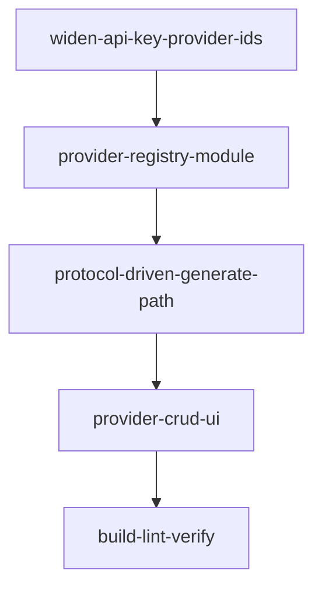

# LLM Provider CRUD — Roadmap

> Generated by `dima-plan-roadmap-ddd-v2`. Path: **full**. `domainShape`: **technical**. Discovery: **ran**.
> Gate verdict: **PASS** (1 critic iteration, 1 minor issue raised → resolved by editorial note; 0 blockers, 0 majors, 0 accepted debt).
> JSON twin: [`llm-provider-crud-roadmap.json`](./llm-provider-crud-roadmap.json)

## Task & Analysis

**Task.** The LLM provider dialog (`GenerateModal`) lacks required inputs — protocol (`anthropic` | `openai`), `baseUrl`, and `modelName`. The user wants CRUD for LLM providers so they can add custom providers like opencode (Go) and minimax. Today the provider set is a hardcoded static `PROVIDERS` array (Anthropic / OpenAI / Local), `baseUrl`/free-form model inputs appear only for the local provider, `ProviderId` is a closed union, and the adapter's wire-format dispatch is a closed switch.

**Objective.** Add full user-managed CRUD for LLM providers — a persistent provider registry (protocol, baseUrl origin, modelName) backed by its own localStorage key — and make generation dispatch on the provider's **protocol** instead of a hardcoded provider id, while keeping API keys in the existing `apiKeys` module and out of the persisted slice and export.

**Success definition.** A user can create, edit, and delete any provider (Anthropic/OpenAI/Local are only the initial seed); a provider definition carries id/name, protocol (`anthropic`|`openai`), baseUrl origin, and a single modelName; the registry survives reload in its own localStorage key (not `leetlab.v2`, not full-state export); generation works for a user-added custom provider by dispatching on protocol; `GenerateModal` derives its provider/protocol/baseUrl/modelName from the registry; API keys stay per-provider in `leetlab.apiKeys` and appear in neither the persisted slice nor the full-state export; TypeScript compiles (no 3-value closed union on the generate path) and lint/build/tests pass.

**`domainShape`: `technical`.** The objective is about machinery — a provider registry, protocol-selected wire-format adapters, and localStorage persistence — not entities or rules a business domain expert would model. (Re-checked by the critic's `domain-shape-fit` dimension on independent reading of the phases; the invariants present — duplicate-id rejection, delete-clears-key, origin validation — are data-integrity rules, not domain rules.)

### Ubiquitous language

| Term | Meaning |
|---|---|
| **provider definition** | The registry entity: id/name, protocol (`anthropic`\|`openai`), baseUrl origin, single modelName. |
| **provider registry** | The localStorage-backed store (own key `leetlab.providers`) with create/edit/delete. |
| **protocol** | Wire-format selector (`anthropic` → `/v1/messages`, `openai` → `/v1/chat/completions`) driving adapter dispatch. |
| **baseUrl** | Origin of the provider API; the adapter appends the protocol-specific path. |
| **modelName** | The single model string a provider definition uses for generation. |
| **provider adapter** | The `generateProblemText` layer dispatching by protocol, returning raw text or a classified `ProviderError`. |
| **api key** | Per-provider key material in `leetlab.apiKeys` (`getKey`/`setKey`/`clearKey`), never in the persisted slice or export. |
| **seed** | The initial Anthropic/OpenAI/Local definitions, fully user-managed, not special-cased afterwards. |

### Assumptions

1. Provider ids become arbitrary strings; dispatch keys off protocol, not provider id.
2. `baseUrl` is stored and validated as an origin (http/https); the adapter appends `/v1/messages` or `/v1/chat/completions` as today.
3. "modelName" is a single string per provider — the built-ins' `models[]` lists collapse to one editable modelName.
4. API keys are optional at save; auth failures surface at generation as `ProviderError` category `auth`.
5. Deleting a provider clears its stored key from `leetlab.apiKeys`; editing preserves the id so the key keeps its association.
6. Registry gets its own localStorage key (`leetlab.providers`); existing `leetlab.apiKeys` entries keyed `local` stay compatible.
7. The modal may open with a deleted provider selected → falls back to the first remaining provider or an empty state.
8. Users can delete every provider; generation shows an empty/disabled state rather than crashing.
9. Browser-direct CORS constraints on custom baseUrls are the provider's responsibility; they surface as `cors-network` errors in-app.
10. **This roadmap deliberately supersedes the prior roadmap's documented YAGNI gate on a dynamic provider registry**; the old roadmap's closed three-provider assumptions (`keyRequired = provider !== 'local'`, per-provider `models[]` catalogs) do not transfer.

### Risks

1. Widening the closed union touches `apiKeys.ts` + `providerAdapters.ts` + `GenerateModal.tsx` together; if not atomic, the generate path keeps a stale 3-value union.
2. Deleting/renaming a selected provider leaves a ghost id or orphans the stored key.
3. Wrong protocol dispatch sends requests to the wrong endpoint/path with confusing non-auth failures.
4. `DEFAULT_BASE_URLS` and `keyRequired = provider !== 'local'` are hardcoded to the three built-ins.
5. Pasting an endpoint path into `baseUrl` produces a doubled path when the adapter appends `/v1/...`.
6. No duplicate-id/name validation → colliding registry entries and key-map collisions.
7. Export integration deferred → providers do not survive a full-state restore this round (accepted).
8. A custom anthropic-protocol provider may not accept the hardcoded browser-access header (behavior follows the protocol default, not per-provider opt-in).

## Discovery Findings

Discovery read the actual repo (12 findings). The ones that shaped the plan most:

| Area | Finding | File | Implication |
|---|---|---|---|
| Registry module | No registry / `leetlab.providers` key exists; `apiKeys.ts` is the only precedent for an independent, lazily-read localStorage key | `src/infrastructure/apiKeys.ts` | Registry is net-new; mirror apiKeys: own key, defensive read/write, lazy reads at call time |
| Closed union | `ApiProvider` is a closed 3-value union, but the key map is already `Record<string, string>` at runtime | `src/infrastructure/apiKeys.ts` | Widening is runtime-safe (no migration); must land atomically across the three files |
| Dispatch switch | `generateProblemText` is a closed switch with no default; error helpers hardcode `anthropic`/`openai`/`local` literals | `src/infrastructure/providerAdapters.ts` | Widening breaks the switch + `Record<ProviderId,string>`; dispatch must branch on protocol — compile errors force the refactor |
| Default-origin table | `DEFAULT_BASE_URLS` hardcoded to the three built-ins, consumed in exactly two adapter places | `src/infrastructure/providerAdapters.ts` | Adapter takes `baseUrl` as required (from the registry), not a built-in lookup |
| Static `PROVIDERS` | `ProviderConfig` carries `models[]` + `modelPlaceholder`, no single `modelName`; modal depends on `models[0]?.id` | `src/infrastructure/providerAdapters.ts` | `PROVIDERS` becomes a seeded registry; models[] collapse to one editable modelName |
| Modal | `baseUrl` gated on `provider === 'local'`, `keyRequired = provider !== 'local'`, no CRUD surface anywhere | `src/components/GenerateModal.tsx` | Modal derives fields from the registry; both closed-union rules must be generalized; CRUD UI is net-new |
| Export/import | Export is an exact allowlist `{version, persisted, generatedProblems}`; tests assert exact keys and absence of `apiKeys` | `src/infrastructure/fullStateExport.ts` | Deferral costs nothing — registry's own key leaves export/import and its tests untouched |
| Prior YAGNI gate | Prior roadmap explicitly gated "dynamic adapter registry" as YAGNI; all its rubrics assume three fixed providers | `docs/done/llm-generated-problems-import-export-roadmap.md` | This task deliberately reverses that gate — called out explicitly in the roadmap (see Assumptions #10) |
| Wire behavior | Anthropic path hardcodes `x-api-key` + `anthropic-version` + browser-access header; openai path uses `Bearer` only when a key is supplied | `src/infrastructure/providerAdapters.ts` | Protocol-based dispatch reuses these wire behaviors unchanged |
| Test conventions | No `providerAdapters.test.ts`; store tests install a localStorage shim before dynamic import; apiKeys reads lazily (no shim needed) | `src/infrastructure/generateSettings.test.ts` | New registry module reads lazily and gets its own test file |
| `local` seed | `local` is a seeded id in both `PROVIDERS` and `ApiProvider`; `clearKey` already deletes by any key string | `src/infrastructure/apiKeys.ts` | Existing `local`-keyed keys stay compatible; delete-clears-key / edit-preserves-id already work mechanically |

## Out of Scope (deferred)

1. Full-state export/import of provider definitions — deferred by the user; provider config lives only in browser localStorage this round (keys stay excluded from export regardless).
2. Multi-model lists per provider — task specifies a single modelName; `models[]` catalogs collapse to one editable string.
3. Automatic model discovery from OpenAI-compatible servers — the user types a modelName.
4. Changing how API keys are stored — keys remain in `leetlab.apiKeys`, keyed per-provider; never in the persisted slice.
5. Backend/proxy to work around browser CORS for custom baseUrls — adapters stay browser-direct.
6. Cloud sync / cross-machine migration of providers.
7. Modifying the persisted Zustand slice (`leetlab.v2`) schema.
8. OAuth/token-based or non-static-key provider auth flows — only a single per-provider API key.
9. Interface/port around the provider registry (e.g. `IProviderRegistry`) — YAGNI gate 3, speculative abstraction; the apiKeys precedent is a plain module.
10. Reset-to-defaults / restore-seeded-providers feature — YAGNI gate 2, not needed now; seeds are fully user-managed.
11. Per-provider override of the anthropic wire headers — scope says header behavior follows the protocol default.

## Required Materials

| Name | Kind | Why needed | Acquisition |
|---|---|---|---|
| Wire-protocol compatibility of the two named custom providers (opencode Go server, Minimax) | knowledge | Confirms the 2-value protocol union covers the stated intent and supplies a realistic user-added-provider fixture | Official docs (sst/opencode; api.minimax.io) or ask the user which protocol each should use |
| Live API credentials for end-to-end generation verification | credential | Unit tests mock fetch; a real generation through the protocol-driven adapter is the only way to prove the wire path + auth error path | User-supplied Anthropic/OpenAI key (and ideally a Minimax/opencode key) at manual acceptance |

## Phases

Dependency map:

### Phase 0 — Widen the apiKeys module to arbitrary provider-id strings
- **Bounded context:** apiKeys storage module · **Layer:** infrastructure · **Blast radius:** small
- **Goal:** `getKey`/`setKey`/`clearKey` accept any string provider id instead of the closed `ApiProvider` union. Storage is already `Record<string, string>`, so this is a pure type-level change with no migration. Keep the alias in place until the protocol-dispatch phase.
- **Inputs:** `apiKeys.ts`; discovery (runtime key map never depends on the union; `local` stays a seeded id).
- **Expected result:** `getKey`/`setKey`/`clearKey` accept any string id; storage format and existing entries unchanged; tests pass; tsc clean.
- **Depends on:** —

**Rubric:** key-roundtrip-fidelity (8) · existing-entries-preserved (8) · no-runtime-behavior-change (8) · downstream-alias-retained (7) · arbitrary-id-exercised (7)
**Healer hint:** Most likely failure is a re-narrowing cast (`as ApiProvider`) or a deleted alias breaking the generate path — revert to signature-only edits, restore the alias, add one non-union-id round-trip test, re-run tsc.

### Phase 1 — Provider registry module backed by its own `leetlab.providers` localStorage key
- **Bounded context:** Provider registry subsystem · **Layer:** infrastructure · **Blast radius:** medium
- **Goal:** Net-new `providerRegistry.ts` — `ProviderDefinition` (id/name/protocol/baseUrl/modelName), lazy defensive localStorage under `leetlab.providers`, seeds Anthropic/OpenAI/Local from the current constants, CRUD with origin-validation, duplicate-id rejection, edit-preserves-id, delete-clears-key. Never writes to `leetlab.v2` or full-state export. **Supersedes the prior roadmap's YAGNI gate on a provider registry.**
- **Inputs:** `apiKeys.clearKey` (post-widen); existing `DEFAULT_BASE_URLS`/`PROVIDERS` values as seed data; discovery.
- **Expected result:** Standalone registry module with full CRUD + validation + seed + `providerRegistry.test.ts` (CRUD, duplicate rejection, delete-clears-key, origin validation, empty state) using the lazy-read no-shim pattern.
- **Depends on:** widen-api-key-provider-ids
- **Compensation:** Writes only to `leetlab.providers`; rollback is a code revert; any rows are isolated to that key and can be discarded by clearing it.

**Rubric:** storage-key-isolation (8) · defensive-lazy-read (7) · crud-invariants (8) · baseurl-origin-validation (7) · seed-and-user-managed (7)
**Healer hint:** Most likely failure is a storage leak (into `leetlab.v2`/export) or a module-load cached read — grep every localStorage access to confirm it targets only `leetlab.providers` and re-reads per call, then re-run the export/import and shim suites.

### Phase 2 — Protocol-driven generation pipeline (adapter dispatch + GenerateModal registry derivation)
- **Bounded context:** LLM generation pipeline · **Layer:** application · **Blast radius:** medium
- **Goal:** Atomic rewrite (the task's top risk): `generateProblemText` dispatches on protocol with no provider-id arms and no unreachable cases; `baseUrl` becomes required; errors attribute to the passed-in provider id; `DEFAULT_BASE_URLS` and the static `PROVIDERS` array removed. GenerateModal reads the registry, derives protocol/baseUrl/modelName from the selected provider, shows `baseUrl` for all protocols, drops the `provider==='local'` gate and `keyRequired` rule, falls back on deleted selection, renders an empty/disabled state when the registry is empty. No 3-value closed union on the generate path.
- **Inputs:** `providerAdapters.ts`; `GenerateModal.tsx`; `ProviderDefinition`/`ProviderProtocol`; `apiKeys.getKey(providerId)`; **material** (opencode/minimax wire-protocol knowledge); discovery (wire behavior per protocol, reused unchanged).
- **Expected result:** Registry-driven, protocol-dispatched generation path + registry-derived modal with all fallbacks; new `providerAdapters.test.ts` proves user-added providers of both protocols hit the right endpoint/path/auth headers and auth failures surface as `ProviderError 'auth'`.
- **Depends on:** provider-registry-module

**Rubric:** adapter-dispatch-is-protocol-only (8) · per-protocol-wire-format-correct (9) · errors-attributed-and-auth-surfaced (7) · modal-is-registry-derived (7) · modal-resilience-fallback-and-empty (7)
**Healer hint:** Most likely failure is a half-migration (a `'local'` arm or `keyRequired`/`provider==='local'` gate on one half while the other is protocol-driven) — grep the generate path for `local`/`keyRequired`/`DEFAULT_BASE_URLS`/`PROVIDERS`, delete every leftover, add a user-added-provider fixture for whichever protocol arm the tests miss.

### Phase 3 — User-facing create/edit/delete management surface for providers
- **Bounded context:** Provider management UI · **Layer:** interface · **Blast radius:** medium
- **Goal:** A manage-providers surface (in or alongside GenerateModal) — list the registry, create/edit/delete any provider. Form captures name, protocol selector, origin-validated baseUrl (rejecting endpoint paths), single modelName. Duplicate rejection surfaced in-form; edit preserves id; delete confirms and clears the API key; modal falls back on delete of the selected provider.
- **Inputs:** `createProvider`/`updateProvider`/`deleteProvider`; the modal's registry-derived selection + fallback from Phase 2; discovery (CRUD UI is net-new).
- **Expected result:** A user can add an arbitrary custom provider (e.g. opencode or minimax with the matching protocol), edit any provider including the seeds, and delete any provider (key cleared), with the modal reflecting changes immediately and falling back safely.
- **Depends on:** protocol-driven-generate-path

**Rubric:** provider-crud-complete (8) · base-url-origin-validation (7) · duplicate-provider-rejection (7) · provider-identity-key-integrity (8) · generate-modal-fallback (7) · api-keys-out-of-persisted-state (8)
**Healer hint:** Most likely failure is provider-identity-key-integrity — an edit that rebuilds the provider with a fresh id orphans the key, or a delete that forgets `clearKey` — carry the original id through update and invoke `clearKey` in the delete handler.

### Phase 4 — Build, lint, and test verification of the provider CRUD feature
- **Bounded context:** Build/verification pipeline · **Layer:** cross-cutting · **Blast radius:** small
- **Goal:** Full `npm run build` (strict tsc), lint, and test suite after the feature lands; confirm no 3-value closed union on the generate path, registry + keys out of `leetlab.v2` and export (exact-key tests unchanged), new suites green.
- **Inputs:** build/lint/test gates; success definition acceptance; existing export/import exact-schema tests; **material** (live credentials for a real end-to-end custom-provider generation).
- **Expected result:** Repo compiles under strict TS with no stale closed union, lint passes, full suite green including new registry/adapter tests and unchanged export/import tests.
- **Depends on:** provider-crud-ui

**Rubric:** build-strict-clean (10) · lint-clean-no-new-errors (8) · generate-path-protocol-dispatch (10) · registry-and-keys-out-of-persisted-state (10) · new-suite-green-and-meaningful (8) · custom-provider-end-to-end (7)
**Healer hint:** Most likely failure is gates going green only by loosening an exact-key export test or a stale closed union on the generate path — grep for the old union, diff export tests against main, fix the real code, re-run from a clean checkout.

## Success Criteria

1. *(analysis success definition — verbatim)*
2. widen-api-key-provider-ids: keys accept any string provider id; storage format + existing entries unchanged; tests pass; tsc clean.
3. provider-registry-module: standalone registry with own `leetlab.providers` key, full CRUD + validation + seed; `providerRegistry.test.ts` green.
4. protocol-driven-generate-path: registry-driven, protocol-dispatched generation + registry-derived modal, no 3-value closed union; `providerAdapters.test.ts` proves both protocol arms.
5. provider-crud-ui: user can add/edit/delete any provider from the UI, with the modal reflecting changes and falling back safely.
6. build-lint-verify: strict build green, lint green, full suite green including new + unchanged export/import tests.

## Quality Gate

- **Path:** full (existing system, >3 phases, external materials)
- **Iterations:** 1 critic run
- **Issues raised:** 1 — `grounded-in-discovery` (minor, score 7/6): discovery finding #9's supersession implication was not reflected in any phase/assumption; an executor cross-checking `docs/done` would see a contradiction.
- **Verified (blockers only):** 0 (no blockers raised)
- **Healed:** 0 (no majors; minors are not healed)
- **Accepted debt:** 0 — the single minor was resolved directly by an orchestrator editorial note (supersession clause added to `phases[1].goal` + Assumptions #10). No healer round was warranted.
- **Final verdict:** **PASS** — the roadmap is structurally sound (mechanical checks green) and survived one grounded semantic review. Note the gate's limits: this is not a formal proof of the architecture; the opencode/Minimax wire-protocol material and a live end-to-end check remain for the executor at Phase 2/4.
