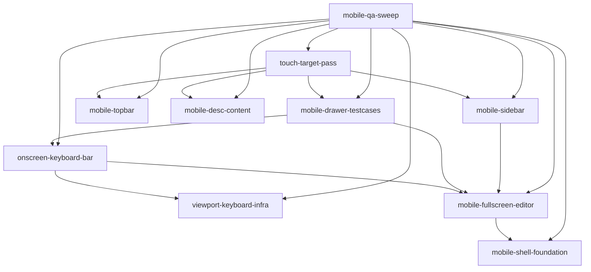

# Mobile Responsive UI — Roadmap

> Task: *all is working but there is large issue with UI - its imposible to use it in mobile , not responsive user friendly at all*

## Task & Analysis

**Objective:** Make the entire LeetLab web app responsive and genuinely usable on phones, including a mobile-first solve experience where writing and submitting code on a touchscreen works well.

**Success definition:** Every screen (problem list, problem page, code editor, progress/stats, provider management, settings, navigation shell) lays out and is fully usable at phone viewport widths (~320-430px) with zero horizontal scrolling; on mobile the code editor becomes full-screen with the problem description accessible via tabs/overlay; an on-screen keyboard bar keeps Run/Submit reachable while the OS keyboard is open; test-case input is usable via touch; no regressions on desktop layouts; existing build, lint, and test suites (referenced in prior work) stay green.

**Domain shape:** `technical` — The objective is purely presentation machinery — responsive layout, viewport handling, and editor touch UX — with no business entities, rules, or workflows a domain expert would recognize.

**Ubiquitous language:**

| Term | Meaning |
|---|---|
| `viewport` | The visible screen area on a phone; all mobile layout decisions key off the visual viewport (not the layout viewport) so the soft keyboard never hides controls. |
| `breakpoint` | A viewport-width threshold at which the app switches between the mobile layout and the desktop layout. |
| `full-screen editor` | The state on phones where the code editor occupies the entire viewport instead of a split pane with the problem description. |
| `description tabs/overlay` | The mechanism that collapses the problem statement into tabs or an overlay so the full-screen editor can claim the viewport. |
| `on-screen keyboard bar` | The persistent action bar that keeps Run/Submit reachable above the OS soft keyboard while typing code or test input. |
| `touch target` | The minimum tappable area (≈44px) every interactive control must meet so buttons are usable with a finger. |
| `horizontal overflow` | The bug state where content scrolls sideways on a phone; elimination of horizontal overflow on every screen is the primary acceptance check. |
| `drawer` | The bottom panel holding the Testcases/Result/Console tabs; on phones it must wrap output and keep test-case input touch-usable. (added at assembly — soft check) |
| `topbar` | The 56px header row with brand, progress segs, tsbadge and the +Generate/Providers/Export/Import buttons; on phones its per-problem segs must collapse and its actions stay reachable. (added at assembly — soft check) |
| `sidebar` | The problem navigator column; on phones it is reachable via the mobile overlay vocabulary with 44px problem items. (added at assembly — soft check) |

**Assumptions:**

- The app is a web application (React SPA per project context) so responsiveness is achievable with CSS/layout changes alone and requires no backend or API modification.
- The existing styling system is hand-written plain CSS in src/styles/globals.css plus src/index.css — no Tailwind or any CSS framework — so breakpoint-conditional layout is done with plain @media blocks, no new framework needed.
- A browser devtools/emulator phone viewport is an acceptable verification harness; real-device QA is not required for acceptance.
- The code editor in use is CodeMirror 6 (single EditorView, no minimap/toolbar/fixed panes); Monaco (@monaco-editor/react) is in package.json but unused and must not be wired up. Full-screen mobile editing is achieved via CSS height changes plus a small view-state flag, keeping CodeEditor.tsx and its extension assembly untouched.
- Reducing features on mobile (e.g. collapsing problem description into tabs) is acceptable as long as no capability is lost.
- Target device matrix (defensible default, per skill Step 0): phone widths 320-430px, current iOS Safari and Android Chrome, iPhone SE (320px) as the minimum width.

**Risks:**

- The OS soft keyboard overlapping the editor or hiding Run/Submit is the hardest failure mode; the layout must key off the visual viewport, not the layout viewport.
- Code-editor components ship with inherent horizontal scrolling and dense toolbars that actively resist mobile layout; the full-screen editor phase could balloon in effort.
- Existing fixed-width styles across five screen regions could make the change a broad, high-blast-radius diff with desktop-regression risk.
- No constraint was supplied on which mobile browsers/OS versions must be supported; without one, testing breadth is ambiguous (assumed default: current iOS Safari and Android Chrome at 320-430px).
- The task spans the entire app, so completion requires a per-screen audit; missing one screen would violate the stated FULL APP scope.

## Discovery Findings

| Area | Finding | File | Implication |
|---|---|---|---|
| Styling architecture | There is no Tailwind or any CSS framework. All app styling is hand-written plain CSS in a single file, src/styles/globals.css (~470 lines, CSS custom properties on :root), imported only by App.tsx. src/index.css (Vite template leftover) is separately imported by main.tsx and still supplies the load-bearing #root rule (width:100%; min-height:100svh; display:flex; flex-direction:column) plus an early :root block whose variables globals.css overrides. AGENTS.md explicitly notes src/App.css is an unused template leftover. | `src/styles/globals.css` | Plain CSS with @media blocks is the existing mechanism, so no new CSS framework is needed. Plan should be pure-CSS + small JSX additions. Be aware two global stylesheets are live; mobile rules belong in globals.css, and the #root 100svh/flex-column basis comes from index.css. |
| Existing responsive state | There is exactly one responsive block, @media (max-width:980px) at globals.css:464-471: it stacks .shell into a column, caps .sidebar at max-height:210px, sets .workspace to min-height:800px, fixes .desc-pane at flex:0 0 340px, hides .divider, and sets body overflow:auto. This is a tablet-oriented vertical-stack accommodation, not a phone layout: nothing hides/relocates the description, there is no full-screen editor, no tabs/overlay, no keyboard bar, and the stacked column plus fixed heights forces multi-screen vertical scrolling. | `src/styles/globals.css` | The mobile work is largely greenfield; this block is the existing partial solution to extend/replace. Desktop rules (the 980px block only overrides within the media query) are preserved by adding phone breakpoints below it, keeping desktop-regression risk localized to new override rules. |
| Horizontal overflow sources | Fixed minimum widths guarantee horizontal scroll at phone widths even after the column stack: .desc-pane{flex:0 0 44%;min-width:320px}, .editor-pane{flex:1;min-width:380px} (this class appears twice — the <section className="pane editor-pane"> in App.tsx and the inner 
 returned by EditorPane.tsx), .sidebar{flex:0 0 284px}, .drawer{flex:0 0 238px}, .editor-body{flex:0 0 240px;height:240px;max-height:240px}. On a 320-430px viewport the 380px min-width alone overflows. | `src/styles/globals.css` | Eliminating horizontal overflow requires overriding these min-width/flex-basis values at phone breakpoints. The dual .editor-pane class name means any override must cover both the section wrapper and inner div, and the fixed 240px editor height must be allowed to grow for a full-screen editor. |
| Code editor technology | The editor is CodeMirror 6 only — a single EditorView mounted into a .cm-host container, with extensions from @codemirror/state, view, lang-javascript, autocomplete, lint, language, and commands. @monaco-editor/react is in package.json but unused (AGENTS.md and src/ confirm). CodeMirror chrome here is just a line-number gutter and a .cm-scroller{overflow:auto}; there is no minimap, no toolbar, and no fixed panes to disable. | `src/components/CodeEditor.tsx` | The only mobile editor work is hiding the gutter (CSS on .cm-gutters or EditorView.theme), letting .editor-body/.cm-host grow, and confirming focus/keyboard behavior in a full-screen container. Monaco must not be wired up. |
| Editor component structure | CodeEditor.tsx is ~880 lines and zero-prop; it assembles a heavy extension stack (syntax+TS linters, three autocomplete sources, a usage-template popover that bridges to a React tooltip via a StateField/ViewPlugin, custom keymaps including indentWithTab and toggleComment). It reads/writes the zustand store directly. The .editor-body wrapper is fixed 240px tall in CSS. | `src/components/CodeEditor.tsx` | Full-screen mobile editing must be achieved by CSS height changes plus store/React state, not by reworking the extension assembly — touching extensionsFor risks the popover/lint/completion machinery and its tests. Keep CodeEditor untouched; drive the mobile full-screen phase through layout + a new view-state flag. |
| App shell composition | The whole app is a single screen. App.tsx renders Topbar, then .shell = Sidebar + .workspace = DescPane + static .divider + section.pane.editor-pane = EditorPane (editor-head, CodeEditor, editor-foot with Run/Submit) + Drawer (Testcases/Result/Console tabs), then StatusBar. There is no routing and no separate settings screen; 'progress' is the Topbar .segs progress bar and 'provider management' is a modal. | `src/App.tsx` | The 'five screen areas' map to: sidebar, description pane, editor+drawer, topbar/progress, and modals — all on one page. 'Full-screen editor on mobile' therefore means the entire .editor-pane (editor + drawer) claims the viewport and the description becomes the overlay/tab; the plan should scope per-region on this single composition rather than per-route. |
| Viewport / keyboard infra | There is no visualViewport listener, no resize/touch handling, and no dvh/dynamic-viewport units anywhere (only 100svh in index.css). Nothing tracks the OS soft keyboard, and Run/Submit live in .editor-foot at the bottom of the editor pane — a location the keyboard will cover. | `src/components/EditorPane.tsx` | The 'on-screen keyboard bar keyed off the visual viewport' requirement is entirely greenfield: the plan must introduce a visualViewport-based mechanism (CSS dvh units and/or a resize listener adjusting .editor-foot) that was previously assumed to exist. This is a distinct phase, not an incremental tweak. |
| Splitter / split ratio | The store defines split:0.44 and setSplit (store.ts:80,264) but no component calls setSplit and the .divider in App.tsx has no drag/pointer handlers — the desc/editor split is purely hardcoded CSS (flex:0 0 44%). The .divider is hidden in the 980px block anyway. | `src/components/App.tsx` | Do not plan a mobile solution that reuses a splitter: none exists beyond a dead store field. A mobile description-overlay/full-screen toggle needs its own new state; keep the flag in ephemeral React state (additive store fields with safe defaults would stay on leetlab.v2). |
| Modals | GenerateModal, ImportModal, and ManageProvidersModal all render via createPortal into document.body with fixed .modal-overlay{inset:0;padding:24px} and .modal{width:min(560px,100%);max-height:86vh;overflow-y:auto}. They are already width-constrained to the viewport, so they mostly work at phone widths; their sub-44px controls (.chip, .gen-btn, .modal-x 28px, .prow-btn) are the mobile deficit. | `src/components/GenerateModal.tsx` | Modal responsiveness is a lighter-touch sub-task: overlay/modal widths need little change; the work is touch-target sizing on form controls and action buttons. These can be a smaller, lower-risk phase than the shell/editor rework. |
| Topbar overflow hotspot | Topbar renders brand + spacer + .progress (one .segs segment per merged-bank problem, min-width:4px max-width:16px each) + tsbadge + four .gen-btn buttons (+Generate, Providers, Export, Import), in a 56px-high flex row with no wrap. At ~50+ problems and four buttons this row cannot fit in 320-430px and will overflow horizontally; the .gen-btn/.progress text is also sub-44px. | `src/components/Topbar.tsx` | The topbar is a dedicated overflow source needing its own treatment (collapse progress to a count, drop or iconify the four gen-buttons into an overflow menu, allow wrapping or horizontal-scroll-to-tap). It should be its own sub-task in the audit, not assumed covered by the generic column stack. |
| Problem description content | DescPane renders problem descriptions via dangerouslySetInnerHTML from problemBank HTML strings that include .ex monospace blocks and inline <code> with long values. globals.css gives .ex 12.5px monospace with no overflow-x/word-break, so long example lines can cause horizontal scroll inside the description pane on phones. | `src/components/DescPane.tsx` | The zero-horizontal-scroll acceptance check must cover the description pane's inner content, not just the app frame — the problemBank HTML needs word-break/overflow rules for .ex, code, and pre-like content at phone widths. |
| Touch-target sizing | Interactive controls are consistently small: .chip (font 10.5px, padding 4px 9px), .gen-btn, .ghost-btn (padding 6px 12px), .cpill (padding 5px 11px), .prow-btn, .modal-x (28px), .ptab (13px), .p-item (13px). None approach the ~44px minimum; there is no existing touch-target convention. | `src/styles/globals.css` | Touch-target work is broad and cross-cutting (sidebar list, chips, topbar buttons, tabs, case pills, footer buttons, form controls). Plan a dedicated per-control pass at phone breakpoints rather than assuming one shared primitive exists to change — there is no component library, so each class is edited directly. |
| Tests and verification | There are 22 vitest test files with ~325 it() cases; all are pure unit tests (the CodeEditor test composes EditorState without a DOM; nothing exercises layout, viewport, or rendered HTML). There is no Playwright/e2e infra and no CI config in the repo (AGENTS.md). | `src/components/CodeEditor.test.ts` | CSS/layout changes are invisible to the existing suite, so 'tests stay green' is nearly free for pure-CSS work, but also means there is NO automated guard against mobile regressions — the plan's per-screen audit and devtools/emulator verification is the only safety net, and any new mobile-view JS state should keep existing store-driven tests passing. No e2e harness exists to extend. |
| Mobile full-screen editor state | DescPane and EditorPane are always rendered side-by-side in App.tsx; no existing tab or mode merges them. DescPane itself has Description/Submissions tabs and Drawer has Testcases/Result/Console tabs, but nothing coordinates 'description vs editor' on a phone. | `src/App.tsx` | The full-screen-editor + description-tabs/overlay requirement needs new orchestration that does not exist: either CSS-only (desc-pane becomes an absolutely-positioned overlay, editor-pane full-width) or a small view-state toggle in App.tsx/React state. The plan must call this out as new behavior, and should reuse existing class vocabulary (.ptab tab styling, .pane-tabs) for the mobile description/editor switcher to keep the design language consistent. |

## Out of Scope (Deferred)

- Native mobile apps (React Native / Expo) — the task asks for the existing web UI to work on phones, not for a separate native app.
- PWA/offline or install-to-homescreen support — unrelated to responsiveness.
- Backend, API, or data-layer changes — this is a presentation-layer task.
- Bundle-size/performance optimization — a separate concern from layout usability.
- Redesigning the visual design language (colors, typography, brand) — only layout and usability are in scope.
- Desktop-layout redesign — desktop behavior must be preserved, not reinvented.
- Accessibility beyond touch-sized targets and no-horizontal-scroll (e.g. screen-reader audits) — not named in the task.
- Monaco editor mobile wiring — YAGNI gate 1: not asked for; @monaco-editor/react is unused and CodeMirror 6 is the only editor, per discovery.
- Mobile routing / browse-vs-solve view-state machine (react-router or a formal view-state machine) — YAGNI gates 1 and 2: not asked for and not needed now; the single-screen app needs only a small ephemeral flag.
- Shared touch-target component library / design-token system — YAGNI gates 3 and 4: no component library exists (discovery), direct class edits at the phone breakpoint are the mechanism; a shared primitive is speculative abstraction and ceremony.
- Generalized breakpoint/media-query hook library — YAGNI gate 3: one consumer today; plain @media blocks in globals.css already suffice.
- PWA / install-to-homescreen / offline support — YAGNI gate 1: out of scope per the task analysis.
- Native mobile app (React Native / Expo) — YAGNI gate 1: out of scope per the task analysis.
- Real-device device-farm QA — YAGNI gate 2: Chromium device-mode emulation is the accepted verification harness; defer unless a device-specific bug surfaces in the QA sweep.
- VisualViewport polyfill for legacy mobile browsers — YAGNI gate 2: the assumed default matrix is current iOS Safari and Android Chrome, which support the mechanism; add only if the target matrix expands to older browsers.

## Required Materials

| Name | Kind | Why needed | How to acquire |
|---|---|---|---|
| Target device and browser support matrix | knowledge | The success definition names viewport widths (320-430px) but no constraint was supplied on which phones, OS versions, or browsers must work; the default assumed matrix is 320-430px current iOS Safari and Android Chrome, iPhone SE (320px) as minimum width. | The orchestrator recorded a defensible default (320-430px, current iOS Safari + Android Chrome, iPhone SE minimum) per skill Step 0; the executor may confirm or widen this before the QA sweep. (Note: the viewport meta tag was verified present in index.html — no material needed for it.) |
| CodeMirror 6 touch/iOS editing capabilities | knowledge | The full-screen mobile editor reuses the existing CodeMirror 6 instance (CodeEditor.tsx) which must stay untouched; the plan needs CodeMirror 6's documented mobile/iOS Safari behavior (focus, virtual keyboard, touch selection) to decide whether pure CSS/layout work suffices or a mobile input/extension adjustment is required. | Search CodeMirror 6 docs and the codemirror GitHub issues for mobile/iOS Safari support and any required mobile handling; treat any documented limitation as a constraint on the editor phase. |
| Dynamic-viewport and keyboard capability support data | knowledge | The keyboard-bar and full-height mobile layout strategy keys off visual viewport handling (visualViewport API, dvh/svh units, the interactive-widget meta, env(safe-area-inset-*) insets). Choosing the mechanism and fallbacks requires the support matrix for the browsers in the target matrix. | Pull caniuse/MDN support data for dvh/svh units, the VisualViewport API, the interactive-widget=resizes-content meta, and safe-area insets, scoped to the browsers in the target matrix. |
| Chromium browser with device-mode emulation | tool | There is no e2e harness in the repo (per discovery) and CSS/layout changes are invisible to the existing unit suite, so a browser with device emulation (Chrome DevTools device mode, or headless screenshots at 320-430px) is the sole verification harness for the zero-horizontal-scroll and keyboard-bar acceptance checks. | Confirm a Chromium-based browser (Chrome or Edge) is installed on the dev Mac; if absent, install via 'brew install --cask google-chrome'. Use it to launch the app and audit each screen at phone widths. |

## Phases

### 0. Mobile shell layout foundation: phone-breakpoint column stack with zero horizontal overflow `(mobile-shell-foundation)`

- **Bounded context / subsystem:** App shell layout (Topbar + .shell + .workspace panes)
- **Layer:** `infrastructure` · **Blast radius:** medium
- **Goal:** Eliminate the fixed min-widths/flex-basis that force horizontal overflow at 320-430px and establish the phone breakpoint column stack for the single-screen app frame, without disturbing the desktop rules.
- **Inputs:**
  - src/styles/globals.css existing @media (max-width:980px) tablet block
  - Discovery: fixed min-widths .desc-pane (min-width:320px), .editor-pane (min-width:380px, both occurrences), .sidebar (flex:0 0 284px), .drawer (flex:0 0 238px), .editor-body (fixed 240px)
  - Target matrix: 320-430px, iOS Safari / Android Chrome, iPhone SE (320px) as minimum
- **Expected result:** A phone breakpoint @media block appended in globals.css below the existing 980px block that overrides .desc-pane/.editor-pane (both the section wrapper and the inner div)/.sidebar/.drawer min-widths and flex-basis so the shell stacks into a column with zero horizontal overflow at 320-430px, and frees .editor-body from its fixed 240px height; desktop layouts unchanged.
- **Depends on:** *none*

**Rubric:**

| Dimension | Min | Pass criteria | Failure examples |
|---|---|---|---|
| `zero-horizontal-overflow` — *Zero horizontal overflow of the modified frame regions at 320-430px* The caller's FULL APP acceptance criterion, verbatim: 'zero horizontal scroll anywhere' at 320-430px. This dimension scopes that invariant to the regions phase 0 actually modifies — the app shell frame (sidebar, desc-pane, editor+drawer and the column stack they form), which is exactly what the phase's scoped CSS block overrides (.sidebar/.desc-pane/.editor-pane/.drawer/.editor-body). The topbar and modals are dedicated overflow sources owned by later phases (mobile-topbar, order 5; modal touch-target work in touch-target-pass, order 8) and are verified by the final mobile-qa-sweep (order 9), so they are explicitly out of scope for this gate — the executor must be able to pass this dimension from phase 0's own deliverable without pulling topbar/modal work forward. | 9 | At viewport widths 320, 360, 390, and 430px (devtools emulation) on the solve screen, the shell-frame column stack (sidebar, desc-pane, editor+drawer) forces no horizontal overflow: the frame containers (.shell/.workspace) and each pane report scrollWidth <= clientWidth, and no horizontal scrollbar is present within the frame.; The check passes on both iOS Safari (WebKit) and Android Chrome (Blink) at 320px minimum — including iPhone SE (320px) as the floor.; Programmatic sweep scoped to phase 0's deliverable: for each region phase 0 modifies — sidebar, desc-pane, and editor+drawer — element.getBoundingClientRect().right <= window.innerWidth at each phone width. The topbar and modals are excluded here: they are dedicated overflow sources verified by their own phase gates (mobile-topbar, order 5; touch-target-pass, order 8) and the final mobile-qa-sweep (order 9).; Zero horizontal overflow of the frame holds both with the editor pane in a split and with the drawer open; no state within the regions phase 0 touches reintroduces sideways scroll. | The shell-frame column stack exceeds the viewport at 320px — a sideways scrollbar appears on iPhone SE because a pane (desc-pane, editor-pane, sidebar, or drawer) still forces its fixed min-width.; Overflow passes at 430px but reappears at 320px because a minimum-width element was only sized for larger phones.; The drawer protrudes past the right edge, forcing horizontal scrolling or clipped content within the frame. |
| `phone-column-stack` — *Phone breakpoint column stack* Below the phone breakpoint the single-screen app frame (.shell/.workspace panes) must stack into one full-width column — topbar, then sidebar, then desc/editor panes — instead of a side-by-side flex row, which is the layout mechanism that makes zero overflow achievable and keeps panes usable at full width. | 8 | At 320-430px, .shell/.workspace panes use column flow: each pane's top edge is >= the previous pane's bottom edge (vertically stacked), and each spans the full viewport width.; At 320px the sidebar and drawer are not laid out to the left of the editor as fixed-width companions; the frame is a single-column flow.; The stacking is produced by the new phone @media block alone — no component markup or inline styles were changed to force it. | At 320px the sidebar still renders left of the editor in a flex row, so the combined min-width exceeds the viewport and panes shrink to unusable slivers instead of stacking.; Panes sit in a row and merely compress, leaving 2px-wide columns rather than stacking vertically. |
| `no-fixed-sizing-at-phone` — *Known fixed min-widths/flex-basis neutralized at phone width* Every identified overflow culprit — .desc-pane min-width:320px, .editor-pane min-width:380px (both the section wrapper and the inner div), .sidebar flex:0 0 284px, .drawer flex:0 0 238px, and .editor-body's fixed 240px height — is overridden inside the phone breakpoint so panes can shrink and the editor-body is freed from its fixed height; each override must be scoped to the new phone block, not applied globally. | 8 | At 360px viewport, computed min-width of .desc-pane and .editor-pane (both occurrences) is below their desktop values (not 320px / 380px), so each can shrink to fit.; At 320px, computed flex-basis of .sidebar is not 284px and of .drawer is not 238px — neither reserves a width wider than the viewport.; At phone width, .editor-body computed height is not pinned to 240px; it reflows within the stacked column.; Each override lives inside the new phone @media block — removing the block restores the original computed values. |  .desc-pane still reports min-width:320px at 360px viewport, so the fixed min-width survived and the pane cannot shrink below it.;  .editor-body is still exactly 240px tall at 320px, leaving the editor a short fixed slab inside the stacked layout.; An override was applied unguarded (outside the media block), changing desktop behavior just to satisfy the phone check. |
| `desktop-tablet-unchanged` — *Desktop and tablet layouts unchanged* The phase promises 'without disturbing the desktop rules' (rollback safety): the new phone block must apply only at phone widths, and the pre-existing 980px tablet block plus the desktop rules must behave identically to before the change at >=481px. | 8 | The new block uses a phone-only max-width threshold (<= ~480px); nothing in it matches at 481px or above.; At 1024px and 1280px, computed min-width/flex-basis/height of .sidebar/.drawer/.desc-pane/.editor-pane/.editor-body are identical to the pre-change baseline.; At 600px (tablet), the pre-existing 980px tablet block still governs and the tablet rendering matches the pre-change layout.; A screenshot of the solve screen at 1280px is pixel-identical before and after the change. | The phone rules were written as max-width:980px, so a 768px tablet now gets the phone column stack and the tablet layout breaks.; A base .sidebar or .editor-pane rule was edited (not overridden) so desktop no longer matches the baseline.; The existing 980px tablet block was modified in place instead of appending the phone block below it. |
| `bounded-reversible-change` — *Bounded, reversible diff (rollback safety)* The entire phase lands as a single new @media block appended in src/styles/globals.css with no edits to existing rules and no component/TS changes, so the change is a small, reviewable unit that reverts by deleting one block. | 7 | git diff touches only src/styles/globals.css — no .tsx/.ts files, no other CSS files.; The new block is appended below the existing 980px block and is a new max-width phone block; no existing rule's property values were altered in place.; Removing the new phone block restores the pre-change desktop and tablet rendering byte-for-byte (pure revert). | The executor edited the 980px tablet block or a base .sidebar/.editor-pane rule, so 'revert the phone block' no longer restores old behavior.; A component gained a new className, inline style, or JS width calculation to force the layout, expanding blast radius beyond CSS.; The diff spans multiple CSS files or adds device-specific selectors, making the change harder to review and revert. |

**Healer hint:** The most likely failure is zero-overflow passing at 430px (or faked with overflow-x:hidden) but returning at 320px because one culprit — usually the inner .editor-pane div or the drawer — was missed, so instead of hiding the scroll, sweep for the element whose getBoundingClientRect().right exceeds 320 and override that specific min-width/flex-basis inside the phone block.

### 1. Visual viewport & soft-keyboard infrastructure `(viewport-keyboard-infra)`

- **Bounded context / subsystem:** Viewport/keyboard infrastructure
- **Layer:** `infrastructure` · **Blast radius:** medium
- **Goal:** Give the layout a mechanism keyed off the visual viewport (not the layout viewport) so the OS soft keyboard never hides controls.
- **Inputs:**
  - index.css #root basis (100svh, flex-column)
  - globals.css :root custom-property block
  - Discovery: no visualViewport listener, no dvh/dynamic-viewport units, no keyboard tracking exists
  - Default target matrix: current iOS Safari and Android Chrome
  - Dynamic-viewport (dvh/svh) and VisualViewport API + safe-area support data (external knowledge, per requiredMaterials)
- **Expected result:** A small module (e.g. src/lib/visualViewport.ts) that subscribes to window.visualViewport resize/scroll and writes CSS custom properties (visual-viewport height + keyboard offset) on :root, together with env(safe-area-inset-*) handling and dynamic-viewport units, choosing the mechanism per the target matrix; verified that opening the OS keyboard changes the exposed values.
- **Depends on:** *none*

**Rubric:**

| Dimension | Min | Pass criteria | Failure examples |
|---|---|---|---|
| `keyboard-offset-reflects-visual-viewport` — *Keyboard offset tracks the visual viewport* The module computes the keyboard offset from the visual viewport (layoutViewport.height − visualViewport.height, floored at 0) and exposes it as a :root custom property, so the on-screen keyboard bar can keep Run/Submit reachable above the OS keyboard — this is the phase's deliverable toward the supplied criterion 'an on-screen keyboard bar keeps Run/Submit reachable'. Using window.visualViewport (never window.innerHeight) is mandatory, and opening the keyboard must change the exposed value. | 8 | Opening the OS keyboard changes the exposed keyboard-offset custom property from 0 to a value within ±10px of the true keyboard occlusion height.; The offset is computed from window.visualViewport.height, not window.innerHeight (which does not shrink when the keyboard opens on iOS).; The offset is 0 (never negative) when no keyboard is open or when visualViewport.height ≥ layout-viewport height.; A unit test or documented manual check opens the keyboard and confirms the value changes (per expectedResult). | Offset var stays 0 or undefined while the keyboard is open.; Value is derived from window.innerHeight so it never changes when the keyboard opens on iOS Safari.; Offset goes negative when the keyboard closes. |
| `root-custom-properties` — *Exposed custom properties are set on :root* The module writes the visual-viewport height and the keyboard offset as CSS custom properties on :root (document.documentElement) with px units, so any consumer stylesheet can reference them live without knowing the module internals. | 7 | Both vars (e.g. --visual-viewport-height and --keyboard-offset) are written via document.documentElement.style.setProperty, with px units.; Var names are stable and discoverable — exported constants or documented in a comment — not ad-hoc strings invented at call sites.; Values update live (no re-render, no page reload) when visualViewport fires resize/scroll. | Properties are written to a stylesheet/class instead of the inline style of :root, so they do not recompute on keyboard open.; Var names differ between the module and the consuming CSS, so consumers read undefined values.; One of the two documented vars is missing. |
| `listener-lifecycle-idempotent` — *Listener lifecycle is idempotent and disposable* For infra repeatability, the module's wiring is idempotent and reversible: initializing twice does not stack listeners, and a destroy/dispose path removes them, so it can be safely re-run during layout experiments without leaking. | 7 | Both visualViewport 'resize' and 'scroll' events are subscribed.; Re-invoking init does not add duplicate listeners (idempotency guard or shared singleton instance).; A destroy()/dispose() function exists and removes the listeners; calling it leaves window.visualViewport with no module listeners. | Only 'resize' is wired; 'scroll' (needed for the keyboard bar and iOS URL-bar collapse) is missed.; Calling init twice doubles the number of updates per keyboard event.; No way to unsubscribe; HMR/layout experiments accumulate stale listeners. |
| `dynamic-viewport-units-and-safe-area` — *Root sizing uses dynamic-viewport units and safe-area insets* The layout basis is keyed to dynamic-viewport units (dvh/svh/lvh) and env(safe-area-inset-*) with fallbacks, so nothing is sized against the layout-viewport 100vh that caused the keyboard/URL-bar overlap this phase exists to remove. | 7 | #root (or the app basis) uses an svh or dvh value instead of 100vh.; env(safe-area-inset-top/bottom/left/right) is consumed with a fallback (e.g. env(..., 0px)) so non-notch browsers and Android degrade cleanly.; The dynamic-unit choice is deliberate per the target matrix (iOS Safari + Android Chrome), not mixed inconsistently across files. | 100vh still sizes the app basis, so the visual-viewport work is nullified.; env(safe-area-inset-bottom) is used without a fallback, collapsing the layout in browsers that lack the feature.; svh and dvh are mixed across files with no documented rationale. |
| `target-matrix-degradation` — *Degrades cleanly outside the target matrix* The mechanism is chosen per the target matrix: on browsers with visualViewport support it uses it; on browsers without it, it fails soft to dvh/svh and never throws or white-screens the app. | 7 | Feature-detects window.visualViewport (typeof guard) before subscribing.; With visualViewport mocked as undefined, init() does not throw and the app still renders.; A unit test covers the unsupported case (no visualViewport) asserting no listeners attach and no errors are raised. | Module calls window.visualViewport.addEventListener unconditionally and throws in browsers that lack it, breaking the app.; The fallback path still leaves controls overlapped by the keyboard with no console signal.; No test covers the no-visualViewport environment. |

**Healer hint:** The most likely failure is the offset being computed from window.innerHeight (or visualViewport never being feature-detected), so opening the keyboard never changes the exposed values on iOS — fix it by replacing innerHeight with the visualViewport heights and adding a unit test that fires a mocked visualViewport resize and asserts the :root custom property moves.

### 2. Mobile full-screen editor with description tabs/overlay `(mobile-fullscreen-editor)`

- **Bounded context / subsystem:** Solve screen (DescPane + .editor-pane composition)
- **Layer:** `application` · **Blast radius:** medium
- **Goal:** On phones, let the code editor claim the full viewport and move the problem description into a tabbed overlay, per the solve-on-mobile requirement.
- **Inputs:**
  - App.tsx composition (.workspace = DescPane + divider + .editor-pane)
  - globals.css pane classes and existing .ptab/.pane-tabs tab vocabulary
  - Discovery: no existing tab/mode merges DescPane and EditorPane; no live splitter (store split:0.44 is dead)
  - View-state guidance: ephemeral React state, CodeEditor.tsx and its extension assembly kept untouched
  - CodeMirror 6 mobile/iOS touch editing capabilities (external knowledge, per requiredMaterials)
- **Expected result:** At phone widths the .editor-pane (CodeEditor + Drawer) occupies the full visual viewport with the problem description reachable through a mobile tabs/overlay control built from the existing .ptab/.pane-tabs styling, driven by a small mobile view-state flag; CodeEditor.tsx and its extension assembly remain untouched.
- **Depends on:** `mobile-shell-foundation`

**Rubric:**

| Dimension | Min | Pass criteria | Failure examples |
|---|---|---|---|
| `full-viewport-editor` — *Editor claims full visual viewport on phones* At phone widths (320-430px) the .editor-pane (CodeEditor + Drawer) occupies the full visual viewport, not a split pane with the description, and this is the default phone layout with no splitter gesture required. | 8 | At 320px, 360px, and 430px the editor surface bounding box matches the visual viewport width and height (±2px) with no sibling layout column (DescPane, divider) taking space.; Full-screen state is keyed off the visual viewport, not the layout viewport: with the OS soft keyboard open the editor still fills the remaining visual viewport.; Full-screen is automatic at phone widths; no splitter drag or resize is needed to reach it.; Rotating portrait↔landscape keeps the full-screen state without a reload. | Editor remains a split pane beside a shrunken description at 390px.; Editor fills the layout viewport but its bottom controls sit below the fold once the soft keyboard opens.; Full-screen only appears after dragging a splitter. |
| `description-tabs-overlay` — *Description reachable via tabs/overlay* The problem description is collapsed into a tabs/overlay control styled with the existing .ptab/.pane-tabs vocabulary and can be opened and dismissed from the full-screen editor without disturbing the running editor instance. | 7 | At phone widths a tabs/overlay control using .ptab/.pane-tabs classes is present and opens the full problem description.; The description can be opened, scrolled end-to-end, and dismissed in ≤3 taps.; Opening and dismissing the description returns to the editor with no state loss, no recompile, and no editor remount (in-progress code preserved).; Exactly one of {editor full-screen, description open} is visible at a time at phone widths. | The description remains a permanent split pane at phone widths; no tabs/overlay exists.; Opening the description remounts CodeEditor and wipes the user's in-progress code.; A bespoke tab design was invented instead of reusing .ptab/.pane-tabs. |
| `oskb-action-bar` — *Run/Submit above soft keyboard (soft pre-check; hard verdict deferred)* Per the caller criterion that 'an on-screen keyboard bar keeps Run/Submit reachable', this dimension is a SOFT PRE-CHECK scoped to phase 2's deliverable (the full-screen editor layout): it verifies the layout readiness for the keyboard bar — that the .editor-foot action bar with Run/Submit sits at the bottom of the full-screen editor so onscreen-keyboard-bar (order 3) can pin it above the OS keyboard. The HARD VERDICT — Run/Submit staying visible and tappable above the OS soft keyboard anchored to the visual viewport — is explicitly deferred to onscreen-keyboard-bar (order 3), which owns the visual-viewport anchoring and gates it there; phase 2 must not implement that anchoring, as doing so would duplicate order 3's deliverable and break phase ordering. | 6 | The .editor-foot action bar with Run and Submit is present at the bottom of the full-screen editor layout with the keyboard closed, so it is the bottom-most element onscreen-keyboard-bar (order 3) can anchor above the keyboard.; With the keyboard closed, Run and Submit meet the ≈44px touch target and are tappable (layout-readiness check).; The soft pre-check records, but does not gate on, whether the bar stays reachable when the keyboard opens; the verdict on keyboard-open behavior belongs to onscreen-keyboard-bar (order 3) and the final mobile-qa-sweep (order 9).; Test-case input fields in the drawer are focusable on tap and meet the ≈44px touch target in the closed-keyboard state. | Run/Submit are absent from the full-screen editor bottom or are not tappable even with the keyboard closed — a genuine phase-2 deliverable failure.; The executor implements the visual-viewport keyboard anchoring inside phase 2 instead of deferring it to onscreen-keyboard-bar (order 3), duplicating the later phase's deliverable.; Test-case inputs can't be focused on touch or are smaller than 44px in the closed-keyboard state. |
| `no-horizontal-overflow` — *Zero horizontal overflow at phone widths* Per the caller criteria 'no horizontal scroll anywhere' and 'zero horizontal scroll anywhere' at 320-430px, the solve screen (description overlay, editor, drawer, tabs, action bar) has no horizontal scroll in any state, including while the keyboard is open. | 8 | At 320px, 360px, and 430px, the solve-screen regions this phase modifies — the .editor-pane (CodeEditor + Drawer), the description tabs/overlay, and the editor action bar — report scrollWidth <= clientWidth with no horizontal scrollbar within them, both with the description open and with the editor full-screen. The topbar and modals are dedicated document-level overflow sources owned by mobile-topbar (order 5) and touch-target-pass (order 8) and are verified by the final mobile-qa-sweep (order 9), so this gate is scoped to phase 2's own deliverable and does not require fixing topbar/modal overflow at this order.; No element extends past the visual viewport right edge on the editor, drawer, tabs/overlay, or action bar (element.getBoundingClientRect().right ≤ visual viewport width).; No horizontal scroll appears after typing, after opening the description, or after opening the drawer.; Overflow is absent both with the keyboard closed and with it open (visual-viewport check, not layout-viewport). | At 320px the drawer or action bar overflows the right edge, producing sideways scroll.; A long problem description forces horizontal scroll inside the overlay.; Overflow appears only after the soft keyboard opens because sizing used the layout viewport. |
| `desktop-regression-free` — *Desktop split layout unchanged* At widths at or above the desktop breakpoint the solve screen keeps the pre-existing split-pane layout and behavior, and no mobile-only code path leaks past the breakpoint. | 7 | At ≥ breakpoint widths the description pane and editor pane render as a split layout; the tabs/overlay full-screen mode is not forced.; No horizontal overflow is introduced at desktop widths by the mobile changes.; Existing desktop Run/Submit/tabs interactions behave exactly as before the phase. | At 1280px the description is collapsed behind a tab because the mobile path leaked past the breakpoint.; Desktop layout gains a horizontal scrollbar after the phase.; Desktop Run/Submit behavior changes because mobile gating touched shared logic. |
| `editor-assembly-untouched` — *CodeEditor and extension assembly untouched* CodeEditor.tsx and its extension assembly are byte-for-byte unchanged by this phase — full-screen/overlay behavior is added only via the Solve-screen composition and a small mobile view-state flag — so the editor's autocomplete wiring cannot regress. | 8 | git diff against the phase base shows zero changes to CodeEditor.tsx and to its extension assembly file(s).; No viewport listeners, resize logic, or new props/hooks were added inside CodeEditor.tsx.; Pre-existing CodeEditor tests pass unmodified. | git diff shows edits inside CodeEditor.tsx or its extension assembly (e.g., viewport handling added inside the editor).; A resize listener was added inside the editor instead of in the Solve-screen composition.; CodeEditor tests were modified or deleted to accommodate the change. |

**Healer hint:** The most likely miss is keying the full-screen flag or the bottom action bar off the layout viewport, so Run/Submit or the tabs/overlay overflow once the soft keyboard opens — key both to the visual viewport (visualViewport.height / window.innerHeight) and re-check scrollWidth ≤ innerWidth at 320px.

### 3. On-screen keyboard bar: Run/Submit reachable above the soft keyboard `(onscreen-keyboard-bar)`

- **Bounded context / subsystem:** Editor footer (.editor-foot)
- **Layer:** `interface` · **Blast radius:** small
- **Goal:** Keep the editor footer's Run/Submit actions tappable while the OS soft keyboard is open.
- **Inputs:**
  - viewport-keyboard-infra custom properties (visual-viewport keyboard offset)
  - .editor-foot markup with Run/Submit in EditorPane.tsx
  - Full-screen editor mobile layout from mobile-fullscreen-editor
- **Expected result:** The .editor-foot action bar stays pinned above the OS keyboard on phones (positioned via the visual-viewport keyboard offset / dynamic units), so Run/Submit remain tappable during code and test-case input.
- **Depends on:** `viewport-keyboard-infra`, `mobile-fullscreen-editor`

**Rubric:**

| Dimension | Min | Pass criteria | Failure examples |
|---|---|---|---|
| `keyboard-bar-reachable` — *Run/Submit stay tappable above the soft keyboard* While the OS soft keyboard is open, the .editor-foot action bar keeps Run/Submit reachable during both code and test-case input — derived verbatim from the caller acceptance criterion 'an on-screen keyboard bar keeps Run/Submit reachable'. | 9 | With the soft keyboard open in the code editor, Run and Submit are fully visible above the keyboard and hit-testable (a tap lands on the button, not on the editor or page behind it).; With the soft keyboard open in a test-case input field, the same holds: the bar is not pushed off-screen, covered, or cut off at 320-430px widths.; The bar never overlaps the keyboard or extends below the visual-viewport bottom edge at 320, 375, and 430px widths.; Functional check: tapping Run actually executes the code and tapping Submit actually submits — buttons are not merely painted on the bar. | Run/Submit are hidden behind the keyboard; tapping the region scrolls the page or focuses the editor instead of triggering the button.; The bar rides up only partway — the bottom row of buttons is clipped by the keyboard top.; Buttons are visible but dead because an invisible overlay between them and the finger intercepts taps. |
| `no-horizontal-overflow` — *No horizontal scroll anywhere with keyboard open* Showing the action bar while the keyboard is open introduces no horizontal overflow on any screen — the page and .editor-foot never scroll sideways at 320-430px, derived verbatim from the caller acceptance criterion 'no horizontal scroll anywhere'. | 8 | With the keyboard open, the editor-foot action bar (.editor-foot) and its descendants report scrollWidth <= clientWidth at 320px, 375px, and 430px viewports, with no horizontal scrollbar inside the bar. This gate is scoped to the bar region phase 3 owns; the topbar and modals are dedicated document-level overflow sources owned by mobile-topbar (order 5) and touch-target-pass (order 8) and verified by the final mobile-qa-sweep (order 9), so phase 3 does not assert a document-wide scrollWidth invariant it cannot pass from its own deliverable.; Neither body nor .editor-foot has a horizontal scrollbar, and no descendant of the bar forces content wider than the viewport (no overflow-x leakage).; Fixed/absolute children of the bar (badges, dropdowns) cannot widen the viewport or add horizontal pan.; Checked in both code-input and test-case-input keyboard states. | Users can swipe sideways while the keyboard is up — the page or the bar pans horizontally.; A wide Run/Submit pill or their labels force .editor-foot wider than 320px, producing a horizontal scrollbar.; An absolutely-positioned child of the bar overflows the viewport on the right edge. |
| `position-tracker-repeatability` — *Bar position derives from keyboard offset and is drift-free across cycles* The bar's top is bound to the viewport-keyboard-infra keyboard-offset custom property (visual-viewport keyboard offset / dynamic units) rather than a hardcoded constant, and repeated open/close, resize, and rotation cycles return it to a deterministic position with no cumulative drift or jitter. | 7 | The bar is positioned from the viewport-keyboard-infra keyboard-offset custom property or dynamic viewport units, not a magic px number; mutating/removing that custom property moves the bar, proving the binding.; Ten consecutive keyboard open/close cycles leave the bar's top edge within ±1px of its initial position (no accumulated drift).; Rotating portrait -> landscape -> portrait restores the bar without clipping or displacement.; Rapid viewport resizing (dev-tools device toolbar drag) does not cause the bar to lag, climb, sink, or animate away from its target position. | The bar's top drifts upward or downward across repeated open/close cycles (accumulated offset from the last known keyboard height).; The bar is pinned with a hardcoded pixel value and ignores the keyboard-offset custom property, so it lands at the wrong height on devices where the keyboard overlays the visual viewport.; The bar visibly jumps or jitters while the keyboard animates in, then settles somewhere wrong. |
| `touch-targets` — *Run/Submit meet the ≈44px touch target* While the keyboard is open, Run and Submit each expose a tappable hit area of at least 44x44 CSS px (or a hit-area expansion layer) so they remain usable with a finger — honoring the 'touch target' invariant from the ubiquitous language. | 7 | Each button's rendered hitbox (including padding/after-insertion hit-area layer) is >= 44x44 px at 320-430px widths with the keyboard open.; Adjacent buttons in the bar have non-overlapping hitboxes, so taps on one never register on the other.; Buttons meet WCAG 2.5.5 target-size expectations (44px) on phone widths. | Opening the keyboard forces the bar so compact that Run/Submit shrink to ~28px hit areas, causing frequent mis-taps.; Two buttons' hitboxes overlap so the larger one swallows the smaller's taps and the wrong action fires.; A bar-wide tap-catcher overrides individual button hitboxes, making precise Run vs Submit selection impossible. |
| `desktop-no-regression` — *Desktop footer layout unchanged (rollback safety)* The pinned-above-keyboard behavior is scoped to the phone layout at the mobile breakpoint; at desktop widths the .editor-foot keeps its prior layout and behavior, so this small-blast-radius phase introduces no regression that would force a rollback. | 6 | At the desktop breakpoint (and above), .editor-foot renders with the same position, spacing, and styling as before the phase — no pin-above-keyboard rules apply.; The keyboard-offset custom property is not consumed at desktop widths; resizing the desktop viewport does not move or nudge the footer.; No shared stylesheet rule on .editor-foot leaks a mobile transform, position, or unit into the desktop layout. | The desktop footer now hugs the viewport bottom awkwardly or loses its margin after the mobile change.; Resizing the desktop window nudges the footer unexpectedly because a mobile keyboard-offset rule fires at all widths.; A unit/transform added for the mobile bar leaks into desktop hover/focus states. |

**Healer hint:** Most likely failure is on a device where the soft keyboard overlays the visual viewport (iOS Safari / Android chrome-style): the bar gets pinned to the layout viewport or a hardcoded pixel instead of the viewport-keyboard-infra keyboard-offset custom property, so Run/Submit slide under the keyboard — bind .editor-foot's top to that custom property and retest with 'keyboard overlays content' enabled in the device emulator.

### 4. Mobile drawer & touch-friendly test-case input `(mobile-drawer-testcases)`

- **Bounded context / subsystem:** Drawer panel (Testcases/Result/Console tabs)
- **Layer:** `interface` · **Blast radius:** small
- **Goal:** Make the Drawer (Testcases/Result/Console tabs) usable on a touchscreen at phone widths, including touch-usable test-case input.
- **Inputs:**
  - Drawer component and .drawer CSS
  - Full-screen editor mobile layout
  - On-screen keyboard bar pattern from onscreen-keyboard-bar
  - Discovery: .drawer{flex:0 0 238px} is an overflow source
- **Expected result:** The Drawer at 320-430px has no horizontal overflow, its tab bar and test-case fields meet touch sizing, test-case input is editable and stays focused above the OS keyboard, and result/console output wraps within the pane.
- **Depends on:** `mobile-fullscreen-editor`, `onscreen-keyboard-bar`

**Rubric:**

| Dimension | Min | Pass criteria | Failure examples |
|---|---|---|---|
| `no-horizontal-overflow` — *Zero horizontal scroll in the Drawer at phone widths* Caller acceptance, verbatim: 'zero horizontal scroll anywhere' and 'no horizontal scroll anywhere.' At every phone width the Drawer must not force horizontal overflow — including the known source .drawer{flex:0 0 238px}. | 7 | At viewport widths 320, 360, and 430px (DevTools device emulation), the Drawer panel reports scrollWidth <= clientWidth with no horizontal scrollbar within it while the Testcases, Result, and Console tabs are each selected. This gate is scoped to the drawer region phase 4 owns; the topbar and modals are dedicated document-level overflow sources owned by mobile-topbar (order 5) and touch-target-pass (order 8) and verified by the final mobile-qa-sweep (order 9), so the executor can pass it from phase 4's own deliverable without pulling topbar/modal work forward.; No descendant of the drawer has a boundingClientRect whose right edge extends beyond the visual viewport's right edge.; The .drawer no longer declares a fixed 238px flex-basis that exceeds the viewport; its width is fluid or explicitly constrained at phone widths.; Opening and closing the OS keyboard introduces no new horizontal scrollbar in the drawer. | At 320px the Drawer panel reports scrollWidth > clientWidth, so the drawer's right edge is clipped or a sideways scrollbar appears inside the panel (document-level overflow from the topbar/modals is excluded here — owned by mobile-topbar order 5, touch-target-pass order 8, and mobile-qa-sweep order 9).; Selecting the Console tab reveals a horizontal scrollbar caused by a long unbroken output line.; The drawer still declares flex:0 0 238px and overflows the 320px viewport. |
| `touch-target-sizing` — *Tab bar and drawer controls meet the 44px touch-target minimum* Every interactive control in the Drawer — the Testcases/Result/Console tab buttons and any add/remove test-case or copy controls — must present a finger-sized touch target of at least 44×44px (visual size or padded hit area) with no overlapping hit areas, per the touch target definition. | 7 | Each drawer tab button renders a hit area at least 44px tall and 44px wide (visual box or padding on an inline element).; Tab labels are not truncated to a sub-44px interactive sliver; the full tab is tappable.; Adjacent touch targets' bounding boxes do not overlap, or are separated by at least 8px.; No drawer control relies on a hit area smaller than 44px that only works with a precision cursor. | The Testcases/Result/Console tab bar renders 36px tall, below the 44px floor.; An add-test-case button renders 24×24px with no padded hit area and is hard to hit with a finger.; Two tab hit areas overlap at 320px, causing mis-taps. |
| `keyboard-focus-visibility` — *Test-case field stays focused and visible above the OS keyboard* Caller acceptance includes 'test-case input is usable on touch.' On a phone, a focused test-case field must stay fully visible and editable above the OS soft keyboard (keyed to the visual viewport, not the layout viewport), with the on-screen keyboard bar keeping Run/Submit reachable. | 7 | Focusing any test-case field and opening the OS keyboard leaves the caret and full field visible above the keyboard without manual scrolling.; Focus does not blur when the keyboard bar mounts or when tapping between the field and the keyboard bar.; The on-screen keyboard bar (Run/Submit) remains tappable above the soft keyboard while typing in a test-case field.; Typing into the field stays functional for the whole keyboard session. | Opening the keyboard scrolls the focused test-case field out of view behind the soft keyboard.; Tapping the keyboard-bar Run button blurs the test-case input so entry cannot continue.; The visual viewport resizes such that the field and the keyboard bar cannot be seen together. |
| `output-wrapping` — *Result and Console output wraps inside the pane* Long, unbroken Result/Console content (stdout lines, stack traces, JSON blobs) must wrap within the pane at 320-430px instead of forcing horizontal scroll, preserving the no-overflow guarantee while output is displayed. | 7 | A console line of 300+ unbroken characters wraps within the pane at 320px rather than scrolling sideways.; Stack traces and JSON output do not extend past the pane's right edge.; pre/code blocks use word-break/overflow-wrap so no horizontal scrollbar appears inside the Result or Console tab.; Wrapped lines remain readable (no clipped or truncated characters) at 320px. | A long stdout line produces a horizontal scrollbar inside the Console tab at 320px.; A pretty-printed JSON object's long string keys push past the pane edge and clip off-screen.; overflow:hidden clips output so part of a result is unreadable. |
| `state-repeatability` — *Run → edit → re-run cycles lose no input, focus, or scroll position* Repeated Run/Submit, tab-switch, and drawer re-render cycles must be repeatable: typed test-case input, selected tab, and scroll position persist across cycles with no state reset — the interface-facing analogue of a repeatability invariant. | 7 | After running a test case, the typed input persists in the field, and editing and re-running works across at least 3 consecutive cycles without re-typing.; Switching Testcases → Result → Console → Testcases preserves the previously typed test-case text.; The selected tab is retained when the drawer re-renders after a Run.; Scroll position inside a long Result/Console pane is retained when returning to that tab. | Running a test clears the test-case input, forcing re-typing on every run.; Switching tabs remounts the drawer and resets test-case text to its initial state.; Each Run resets the pane scroll to the top, making long outputs unreadable. |

**Healer hint:** Most likely failure is the unchanged .drawer{flex:0 0 238px} still forcing horizontal overflow at 320px; the fastest fix is to replace the fixed flex-basis with a fluid basis plus min-width:0 on the drawer and its flex parents so the pane can shrink to the viewport.

### 5. Mobile topbar: progress collapse and action overflow `(mobile-topbar)`

- **Bounded context / subsystem:** Topbar (brand, progress segs, tsbadge, four gen-buttons)
- **Layer:** `interface` · **Blast radius:** small
- **Goal:** Make the Topbar row usable at 320-430px without horizontal overflow and keep +Generate/Providers/Export/Import reachable.
- **Inputs:**
  - Topbar.tsx (brand + spacer + .progress .segs + tsbadge + four .gen-btn buttons, 56px non-wrapping row)
  - Discovery: overflow hotspot at ~50+ problems; sub-44px .progress/.gen-btn
- **Expected result:** The Topbar lays out at 320-430px with zero horizontal overflow: the per-problem progress segs collapse to a compact count/bar, and the four action buttons remain reachable (iconified or in an overflow menu) with touch-sized targets.
- **Depends on:** *none*

**Rubric:**

| Dimension | Min | Pass criteria | Failure examples |
|---|---|---|---|
| `no-horizontal-overflow` — *Zero horizontal overflow at both breakpoint extremes* Derived from the acceptance criterion 'zero horizontal scroll anywhere': at 320px and 430px viewports, the Topbar's scrollWidth never exceeds its clientWidth, whether the account has 0 or 50+ solved problems. | 8 | At a 320px viewport with 0 problems solved, document.documentElement.scrollWidth equals clientWidth (no horizontal scrollbar, no side-scroll).; At a 320px viewport with 50+ problems solved, the same check passes — the wide .segs row no longer contributes page width.; At a 430px viewport with 50+ problems solved, the same check passes.; No Topbar descendant overflows its parent's right edge: the rightmost element's bounding box right edge is within the viewport. | Scrolling horizontally on a 320px phone reveals clipped content (the rightmost button or seg is cut off).; The page only grows a horizontal scrollbar when problem count reaches ~50, proving the segs row is still the width culprit.; Overflow is gone at 430px but recurs at 320px — the narrower extreme was never tested. |
| `progress-collapse` — *Progress segs collapse to a compact count/bar* At mobile widths the per-problem progress segs no longer render one segment per problem; they collapse to a compact count or bar, so the row stays within the viewport regardless of problem count. | 7 | At 320px, the DOM renders at most one compact progress representation (count text and/or a single bar), not N individual .seg elements.; The collapsed representation fits within the viewport at both 320px and 430px with 50+ problems.; The count/bar conveys the same information as the segs (solved vs total), e.g. '23/50' or a filled-ratio bar.; The collapse is gated on a viewport breakpoint so desktop width is unaffected. | 50+ individual segs still render at 320px, squished below 2px each or pushing the row out of bounds.; The segs are hidden entirely with no count/bar substitute, silently losing progress information.; The segs collapse is driven by a JS element-count check that re-expands on resize and causes layout thrash. |
| `action-reachability` — *+Generate / Providers / Export / Import stay reachable* All four action buttons remain reachable at 320-430px: none is dropped from the UI, and any that overflow are revealed via iconification or an overflow menu in at most one tap. | 8 | At 320px, all four actions (+Generate, Providers, Export, Import) are either visible in the row or reachable behind one overflow toggle.; No action is removed from or disabled in the DOM at mobile widths — the full set of four remains present.; Revealing any hidden action takes at most one tap, and the reveal control is itself a touch-sized target. | Export and Import are pushed off-screen at 320px and unreachable — no overflow menu exists.; The overflow menu exists but requires two taps or a hover gesture to open on a phone.; A generator button is conditionally hidden on small screens with no alternate path to reach it. |
| `touch-target-size` — *Touch targets meet the ~44px minimum* Every interactive Topbar control (each action button, the overflow toggle, and the progress element if it is interactive) has a computed hit area of at least 44px in both dimensions, per the touch-target ubiquitous language. | 7 | Each .gen-btn and the overflow-menu trigger returns getBoundingClientRect() width and height ≥ 44px at 320px.; Targets that are visually smaller than 44px still expose a ≥44px hit area (padding or a transparent wrapper).; Adjacent targets do not overlap: the hit areas of two neighbors never intersect. | Iconified buttons shrink to a ~32px hit area — tappable in devtools but mis-tappable on a finger.; Buttons sit directly adjacent with no gutter, so a tap between them triggers the wrong action.; The overflow toggle is a bare '⋯' glyph whose only hit box is its glyph-sized bounds. |
| `desktop-non-regression` — *No regression at desktop breakpoints (rollback-safe)* The mobile collapse must not leak upward: at desktop widths (≥ 1024px) the Topbar renders exactly as before — per-problem segs and full-text labeled action buttons — so a desktop regression means the fix rolls back cleanly behind the breakpoint. | 7 | At ≥1024px with 50+ problems, the full .segs row renders one seg per problem (no count/bar collapse).; At ≥1024px, all four action buttons render with their full labels (no iconification, no overflow menu).; Crossing the breakpoint in either direction re-renders without error and without introducing horizontal scroll. | At ≥1024px the count/bar and icon-only buttons still render, so desktop users lose labeled buttons and per-problem segs.; Resizing a desktop window across the breakpoint throws or leaves the Topbar in a half-collapsed state.; The mobile collapse is applied unconditionally rather than gated, so desktop inherits the mobile layout. |

**Healer hint:** Test at 320px with 50+ problems before anything else — if the row still overflows, the segs-to-count collapse was not the bottleneck; iconify or overflow-menu the four action buttons and re-measure.

### 6. Mobile problem-description content overflow `(mobile-desc-content)`

- **Bounded context / subsystem:** DescPane inner content (problemBank HTML)
- **Layer:** `infrastructure` · **Blast radius:** small
- **Goal:** Stop long .ex/code monospace content in problem descriptions from forcing horizontal scroll inside the description pane on phones.
- **Inputs:**
  - DescPane dangerouslySetInnerHTML rendering of problemBank HTML
  - globals.css .ex monospace and inline code rules (no overflow-x/word-break)
  - Discovery: long example lines can overflow the desc pane at phone widths
- **Expected result:** Phone-breakpoint word-break/overflow-wrap rules for .ex, code, and pre-like content inside the description pane eliminate horizontal overflow of description content at 320-430px.
- **Depends on:** *none*

**Rubric:**

| Dimension | Min | Pass criteria | Failure examples |
|---|---|---|---|
| `zero-horizontal-overflow` — *Zero horizontal scroll in the description pane at 320-430px* Caller criterion, verbatim: the app must have 'zero horizontal scroll anywhere' 'at 320-430px'. Scoped to this phase's deliverable, no problem-description content (paragraphs, .ex blocks, inline code, pre-like blocks) may produce a horizontal scrollbar at any viewport width in 320-430px, regardless of how long the example lines are. | 9 | At viewport widths 320, 360, 375, 390, and 430px, the description pane renders the longest .ex block in problemBank with no horizontal scrollbar inside the pane (desc-pane reports scrollWidth <= clientWidth) while the longest unbroken line is in view. Page-level overflow from the topbar/modals is excluded here — owned by mobile-topbar (order 5), touch-target-pass (order 8), and the final mobile-qa-sweep (order 9).; The desc-pane element reports scrollWidth <= clientWidth at all five widths.; No horizontal scrollbar appears when the pane is shown in its narrowest state (full-screen-editor description-tabs/overlay width). | A long unbroken monospace token (URL or long identifier) in an .ex block still pushes scrollWidth > clientWidth at 320px and a horizontal scrollbar appears.; A horizontal scrollbar reappears at 430px, the top of the phone range.; Content overflows only when the description is collapsed into tabs/overlay, not in the normal split-pane width. |
| `break-rule-reaches-elements` — *Break rules structurally match the rendered desc-pane DOM* The phone-scoped word-break/overflow-wrap rules must match the elements DescPane actually renders via dangerouslySetInnerHTML (problemBank HTML), so the fix works for any problem, not only the one used to demo it. | 8 | At 375px, getComputedStyle on an .ex block, an inline code element, and a pre-like block inside the description pane reports overflow-wrap: anywhere or break-word, never normal.; The match is structural: injecting a brand-new long .ex fixture (not in the original problemBank) into the pane is also broken, proving no content-specific patching.; Inline code inside a paragraph wraps too, not only block-level .ex/pre. | Computed overflow-wrap on the .ex element is still normal at 375px — the selector or media query never matched the rendered DOM.; Only the demo problem's content wraps; a freshly injected long code line still overflows (content-patched instead of structural).; Block-level .ex wraps but inline code in a paragraph still overflows. |
| `desktop-no-regression` — *Desktop description layout unchanged* The fix is gated to phone widths only: at and above the desktop breakpoint the description pane's computed text-breaking styles and resulting layout are identical to pre-phase, so the phase does not regress the desktop solve experience. | 7 | The added rules live inside a phone-only media query (max-width at the app's phone breakpoint); no un-gated .ex/code/pre rule was added outside it.; At 1280px, getComputedStyle on .ex/code/pre reports overflow-wrap: normal, and a screenshot comparison of a long-example problem shows identical line breaks to the pre-phase baseline.; Removing the phone media-query block in a scratch checkout restores the exact pre-phase rendering at all widths. | Break rules were applied globally (no media query), and a long .ex line now wraps mid-token on desktop, changing layout for all users.; A desktop screenshot diff of a long-example problem shows changed line breaks after this phase.; The phone breakpoint used here differs from the breakpoint the rest of the app toggles on, so the fix activates at a width where the editor is still in split-pane mode. |
| `content-preservation` — *Wrapping achieved by breaking, not by clipping* The caller's 'zero horizontal scroll anywhere' must be met by wrapping long lines, not by hiding overflow: the full text of every line in .ex/code/pre stays visible and selectable. A fix that merely suppresses the scrollbar technically passes the scroll check but corrupts the deliverable, so clipping/truncation is an explicit failure even when scrollWidth is clean. | 7 | An .ex block whose longest line is 200 chars at 320px renders every character of that line across wrapped lines (innerText length unchanged, no ellipsis).; The phase diff introduces no overflow-x: hidden, overflow: hidden, text-overflow: ellipsis, white-space: nowrap, or max-height clip on description content.; A user can select and copy the full text of a long code line across its wrap boundary. | The fix uses overflow-x: hidden on the pane, which removes the scrollbar but silently clips the tail of long code lines (text unreachable).; A long line renders with ellipsis truncation instead of wrapping to new lines.; Copying a long code line yields a truncated string. |
| `rollback-safe-css-only` — *Self-contained, CSS-only, revertable change* The phase delivers a repeatable, revertable infra change: only phone-scoped CSS rules are added to the description stylesheet; problemBank HTML and DescPane JSX are untouched; deleting the added block fully restores prior behavior with no residual state. | 6 | The diff touches only the stylesheet holding the desc-pane rules (e.g. globals.css); no change to DescPane.tsx or any problemBank/problem data file.; Deleting the added media-query block and reloading restores the exact pre-phase rendering at all widths.; Re-applying the block is deterministic — no runtime JS, build config, or persisted state participates in the fix. | DescPane.tsx was edited to inject wrapping markup, coupling the fix to React code so a CSS-only rollback cannot revert it.; The change bundles unrelated refactors of globals.css, so reverting is not a clean single-block revert.; Wrapping logic depends on per-problem content edits in problemBank data. |

**Healer hint:** The most likely fail is a long unbroken monospace token still overflowing at 320px because `overflow-wrap: break-word` will not break unbreakable strings — switch the phone media query to `overflow-wrap: anywhere` plus `word-break: break-word` on `.ex, code, pre` and re-run the 320px scrollWidth check.

### 7. Mobile problem navigator (sidebar) layout `(mobile-sidebar)`

- **Bounded context / subsystem:** Sidebar problem navigator
- **Layer:** `interface` · **Blast radius:** small
- **Goal:** Make the problem list usable on phones and reachable without conflicting with the full-screen solve view.
- **Inputs:**
  - .sidebar CSS and Sidebar markup
  - Full-screen editor mobile overlay pattern from mobile-fullscreen-editor
  - Discovery: .sidebar{flex:0 0 284px} overflows; .p-item text is 13px; the existing 980px block only stacks it at max-height 210px
- **Expected result:** The sidebar at 320-430px has a phone layout that is reachable and scrollable with zero horizontal overflow and tappable problem items, coexisting with the full-screen editor and description overlay on mobile and reusing the existing overlay/tab vocabulary.
- **Depends on:** `mobile-fullscreen-editor`

**Rubric:**

| Dimension | Min | Pass criteria | Failure examples |
|---|---|---|---|
| `sidebar-zero-horizontal-overflow` — *Zero horizontal overflow at 320-430px* Per the acceptance criterion — 'zero horizontal scroll anywhere' — the sidebar region must lay out on phones at 320-430px without any horizontal scrollbar on the page or inside the sidebar container; the legacy fixed width must not force content wider than the visual viewport. | 9 | At each of {320, 360, 375, 390, 414, 430}px, the sidebar element reports scrollWidth <= clientWidth (no horizontal scrollbar inside the sidebar container). Page-level overflow from the topbar/modals is excluded here — owned by mobile-topbar (order 5), touch-target-pass (order 8), and the final mobile-qa-sweep (order 9).; The sidebar element's content box fits the viewport: `sidebarEl.scrollWidth <= sidebarEl.clientWidth`.; The legacy `flex: 0 0 284px` width (plus padding/margins) is reduced or padding dropped under the mobile breakpoint so it fits inside 320px.; No descendant (problem title, badge, list scrollbar) is wider than the sidebar's content box at any width in the range. | A horizontal scrollbar appears on the page at 320px because the sidebar still resolves to 284px plus padding.; The sidebar fits at 320px but overflows at 375px or 414px, proving the fix is tuned to a single width rather than the whole range.; Long problem titles or status badges extend past the right edge and are clipped or scroll sideways inside the list. |
| `mobile-list-fully-scrollable` — *Full list vertically reachable on mobile* Every problem item is reachable on a phone: the list scrolls vertically inside a container bounded to the available viewport, and the old hardcoded stacking cap (max-height: 210px) no longer truncates the list or leaks page scroll. | 7 | With a list longer than one screen, every item is reachable by vertical scrolling within the sidebar container.; The list's height is viewport-derived (available height / 100dvh minus chrome), not a hardcoded `max-height: 210px`.; Scrolling the list is contained to the list — it does not scroll the page or the editor behind it.; The final list item scrolls fully into view with no clipped, unreachable tail. | The list still caps at 210px on a phone, cutting off problems with no way to scroll further.; Scrolling the list scrolls the whole page, so browsing problems drags the full-screen editor out of position.; The last problem is unreachable because the container's height is still a hardcoded constant. |
| `problem-item-touch-target` — *44px tappable problem items* Every interactive problem item in the sidebar meets the ≈44px touch-target minimum (per the ubiquitous-language definition) so items are reliably tappable with a finger on a phone, and activation requires no hover. | 7 | Each interactive `.p-item` row has a computed height of at least 44px (or an equivalent 44x44px hit area) on the mobile layout.; Tap targets do not overlap: tapping at the edge of an item activates that item, not its neighbor.; Items activate on touch/click without a hover-only affordance; a finger tap selects/opens the problem.; The tappable area extends beyond the 13px `.p-item` text to fill the full 44px row, not just the glyphs. | Problem rows remain ~20px tall (13px text plus padding), so adjacent items are hit together and mis-selection is common.; Tapping a problem requires a precise fingertip because the hit area equals the text width only. |
| `desktop-layout-regression-free` — *Desktop sidebar unchanged (rollback-safe)* The mobile work is rollback-safe for the untouched desktop layer (blast radius: small): at and above the existing breakpoint the sidebar keeps the legacy always-visible 284px column and the desktop solve layout is unchanged, with all new rules gated behind the mobile breakpoint. | 7 | At >=980px the sidebar is still the always-on 284px column (matches pre-phase geometry), not collapsed into a drawer.; No new horizontal scroll appears at desktop widths: `scrollWidth === clientWidth` holds at 1280px after the change.; The new layout applies only inside the mobile media-query block; no mobile-only class/styles leak into desktop rendering.; The desktop editor and desc-pane computed geometry at 1280px matches the pre-phase baseline. | A mobile `max-width` or flexible rule fires at 1000px, collapsing or reflowing the sidebar on a laptop.; A hamburger/drawer toggle appears on desktop, or the 284px column becomes an overlay on wide screens. |
| `sidebar-drawer-reuse-no-shift` — *Sidebar reuses overlay vocabulary with zero layout shift* On mobile the sidebar is reached through the same overlay/drawer mechanism the full-screen-editor phase established for the description overlay — closed by default, opened by explicit action, with zero layout shift on open/close so it never reflows or permanently reshapes the full-screen editor. | 7 | The mobile sidebar is invoked via the shared overlay/drawer component/class used by the description overlay, not a new bespoke mechanism.; The sidebar is closed by default on phone load; opening it requires an explicit user action.; Opening and closing the drawer produces zero layout shift beneath it: no editor reflow, width change, or scroll reset.; Closing the drawer restores the editor to its exact prior full-screen state. | The sidebar is implemented with a new ad-hoc overlay that looks and behaves differently from the description overlay, creating two conflicting mobile patterns.; Opening the sidebar pushes the editor aside (flex sibling reshuffle), reflowing the solve view and losing the user's scroll position. |

**Healer hint:** The most likely failure is that the legacy `flex: 0 0 284px` and `max-height: 210px` values survive under the mobile breakpoint, leaving the sidebar overflowing at 320px and truncating the list — fix by gating those values behind the breakpoint and giving the list a viewport-derived height with `overflow-y: auto`.

### 8. Phone touch-target pass: every interactive control at least 44px `(touch-target-pass)`

- **Bounded context / subsystem:** Cross-cutting control sizing across all regions
- **Layer:** `cross-cutting` · **Blast radius:** medium
- **Goal:** Ensure all interactive controls meet the ~44px touch-target minimum at phone breakpoints so buttons are usable with a finger.
- **Inputs:**
  - globals.css control classes (.chip, .gen-btn, .ghost-btn, .cpill, .ptab, .prow-btn, .modal-x 28px, .p-item, editor-foot buttons, modal form controls)
  - Discovery: no existing touch-target convention, no component library to change a shared primitive
  - Region layouts from the prior mobile phases
- **Expected result:** A phone-breakpoint CSS pass raising every interactive control (topbar buttons, sidebar items, desc tabs, drawer/case pills, editor footer, and modal form controls/close buttons) to at least 44px touch targets with adequate tap spacing, without disturbing desktop sizes.
- **Depends on:** `mobile-topbar`, `mobile-drawer-testcases`, `mobile-sidebar`, `mobile-desc-content`

**Rubric:**

| Dimension | Min | Pass criteria | Failure examples |
|---|---|---|---|
| `min-44px-hit-area` — *Every control ≥44px hit area at phone widths* At phone viewports (320-430px), every interactive control exposes a real tappable hit area of at least 44x44px — matching the phase's ~44px touch-target requirement and the caller's demand that the app be 'usable on phones'. The enlarged area must come from box-sizing (min-height/min-width/padding), not font-size alone, and must be measurable on the actual element via getBoundingClientRect(), not just the visual. | 8 | At 320px and 375px, getBoundingClientRect() on every interactive element (topbar buttons, sidebar items, desc tabs, drawer/case pills, editor footer buttons, modal form controls and close buttons) returns width >= 44 and height >= 44.; Any control whose visual box stays under 44px has an explicit expanded hit area (pseudo-element, transparent wrapper, or background-clip) that yields a >= 44px measured box.; Control classes enumerated in the phase inputs (.chip, .gen-btn, .ghost-btn, .cpill, .ptab, .prow-btn, .p-item, .modal-x, editor-foot buttons, modal form controls) each carry a phone-scoped sizing rule (min-height/min-width/padding) reaching 44px.; Enlargement comes from box box-sizing only — no width-increasing padding on inline elements that would distort layout. | Run button bumped to 40px tall because only font-size or padding-inline was increased, leaving the computed height at 40px.; .modal-x close button still measured at 28px at 320px width.; A 44px min-height rule exists but the actual box is clipped to 36px by a parent, line-height, or overflow. |
| `tap-spacing` — *Adequate spacing between adjacent targets* Adjacent interactive controls must be separated by >= 8px so a fingertip aiming at one control cannot land on or brush its neighbor — this guards the caller's 'usable on phones' criterion against fat-finger misfires. Spacing is the edge-to-edge gap between the bounding boxes of adjacent controls at phone widths. | 7 | At 320-430px, the edge-to-edge gap between any two adjacent interactive controls (consecutive pills, desc tabs, toolbar buttons, drawer rows) is >= 8px.; No two interactive controls' bounding boxes overlap or touch at any phone width.; 44px-diameter finger circles centered on adjacent controls' hit areas do not intersect. | Consecutive .cpill chips sit flush with no margin, so one 44px finger circle covers two chips.; Desc tabs collapse into a tight strip with ~4px gaps between tab labels.; Topbar icon buttons touch edge-to-edge with no gutter between them. |
| `editor-form-touch-usability` — *Run/Submit and test-case input usable on touch* Derived verbatim from the caller's FULL SOLVE acceptance criterion — 'test-case input is usable on touch' and 'an on-screen keyboard bar keeps Run/Submit reachable' — this dimension requires the editor footer's Run/Submit controls and the test-case input to be >= 44px touch targets on phones, and to stay reachable above the OS soft keyboard while typing. | 7 | The editor footer's Run and Submit buttons measure >= 44px tall at 320-430px width.; The test-case input has a >= 44px touch surface and tapping it focuses it without the soft keyboard obscuring it (checked against the visual viewport, not the layout viewport).; Modal form controls (text inputs, selects, submit buttons) used on phones meet >= 44px touch targets.; With the soft keyboard open at 320-430px, Run/Submit remain visible above the keyboard bar rather than scrolling underneath it. | Submit button is 36px tall and drops below the fold the moment the keyboard opens.; Test-case textarea is sized only via font-size, giving a <44px focusable strip.; Modal select inputs are ~40px tall on phones. |
| `no-horizontal-overflow-regression` — *No horizontal overflow introduced by the pass* The caller's primary acceptance check is 'zero horizontal scroll anywhere' at 320-430px, and enlarging touch targets is exactly the change most likely to re-introduce horizontal overflow — so this pass must keep document.scrollingElement.scrollWidth == clientWidth at the 320px floor with no element overflowing the viewport. | 7 | At 320px width, document.scrollingElement.scrollWidth equals clientWidth on every app screen/region (topbar, sidebar, desc-pane, editor+drawer, modals).; Element scan finds no element whose right edge exceeds the viewport (offsetLeft + offsetWidth > innerWidth) at 320-430px.; Enlarged controls wrap or stack rather than widening the layout when a row of targets grows past the available width. | Bumping .prow-btn min-height pushes a row wider than 320px, producing a horizontal scrollbar.; A 44px min-width on a topbar button makes the bar overflow at 320px.; Modal close-button padding widens the modal past the viewport. |
| `desktop-no-regression` — *Desktop sizes untouched* All sizing changes are scoped to phone breakpoints only — the phase's expectedResult explicitly requires 'without disturbing desktop sizes' — so the change must be rollback-safe: desktop (>= the defined breakpoint) control metrics are unchanged, and reverting the phone media-query block restores the exact prior state. | 7 | git diff of the CSS shows size changes only inside phone breakpoint media queries (@media (max-width: ...)); no desktop-size declaration edited outside them.; At >= the desktop breakpoint (e.g. 1024px), measured control boxes match the pre-pass values exactly (compare before/after screenshots or computed styles).; Reverting the phone media-query block (or the commit) fully restores prior behavior with no stray overrides, `!important` leaks, or base-rule edits left behind. | A min-height: 44px rule is applied unconditionally, resizing desktop chips and toolbar buttons.; The pass edits base (non-media) sizing rules for .gen-btn, leaking the phone sizing to desktop.; An `!important` sizing override escapes the media query and shifts desktop layout. |

**Healer hint:** The pass most often fails by styling the visual box (font-size / padding-inline) instead of the real hit box and by editing base rules outside the phone media query — fix by adding min-height/min-width (or a pseudo-element hit area) only inside the phone breakpoint, then re-measuring getBoundingClientRect() at 375px and 320px for >= 44px with no horizontal overflow.

### 9. Mobile QA sweep & desktop regression check `(mobile-qa-sweep)`

- **Bounded context / subsystem:** Cross-cutting verification
- **Layer:** `cross-cutting` · **Blast radius:** small
- **Goal:** Verify the full-app mobile acceptance criteria across the target matrix and confirm no desktop, build, lint, or test regressions.
- **Inputs:**
  - Chromium device-mode emulator (no e2e harness exists per discovery; CSS is invisible to the ~325-case vitest unit suite)
  - Target matrix: 320/360/430px, iPhone SE minimum
  - Full single-screen app plus the build, lint, and vitest suites
- **Expected result:** A per-screen audit at 320-430px (Chromium device mode) confirming zero horizontal overflow on every region, the full-screen editor with description overlay working, Run/Submit reachable above the OS keyboard, touch-usable test-case input, at least 44px touch targets, desktop layouts unchanged, and build + lint + the full vitest suite green.
- **Depends on:** `mobile-shell-foundation`, `viewport-keyboard-infra`, `mobile-fullscreen-editor`, `onscreen-keyboard-bar`, `mobile-drawer-testcases`, `mobile-topbar`, `mobile-desc-content`, `mobile-sidebar`, `touch-target-pass`

**Rubric:**

| Dimension | Min | Pass criteria | Failure examples |
|---|---|---|---|
| `evidence-based-audit` — *Audit claims are measured, not asserted* Because no e2e harness exists and the ~325-case vitest suite cannot see CSS, the audit is the only verification — so every claim in it must be traceable to a reproducible measurement from the Chromium device-mode emulator, not an unverifiable 'looks fine' assertion. | 7 | Each screen/region row names the emulator and the exact device-mode width(s) it was checked at (320, 360, 430, or the ≥breakpoint desktop width).; Horizontal-overflow conclusions cite a measured scrollWidth vs visualViewport.width comparison rather than a visual guess.; Keyboard-related claims (Run/Submit reachable, viewport keyed to the visual viewport) cite that they were checked with the OS soft keyboard open in device mode.; A pass/fail verdict is recorded per matrix cell so a reader can re-run the described step and reproduce the same verdict. | The audit states 'all screens fine on mobile' without listing per-region widths or any measurement.; Overflow is declared absent from eyeballing a screenshot with no scroll-width measurement recorded.; Run/Submit-above-keyboard is claimed without ever opening the soft keyboard in the emulator. |
| `matrix-coverage-completeness` — *Full app × width matrix covered* The target matrix is 320/360/430px plus desktop; the audit must cover every region of the single-screen app (topbar, sidebar, desc-pane, editor+drawer, modals) at each phone width, because a missing cell means an unverified screen. | 7 | Each of topbar, sidebar, desc-pane, editor+drawer, and every modal type appears at 320px, 360px, and 430px.; A desktop width above the mobile breakpoint is also represented so the desktop-regression dimension can be checked.; No region×width cell is marked N/A or skipped; every cell carries a verdict. | Modals are only tested at a single width.; The sidebar is checked at 360px but not at 320px (the iPhone SE minimum).; The editor+drawer region is documented only in full-screen mode, never in any split or desktop state. |
| `zero-horizontal-overflow` — *Zero horizontal scroll anywhere* Per the acceptance criteria, at 320-430px there must be no horizontal scroll anywhere on any screen or region; the audit must prove this for every matrix cell by measurement against the visual viewport. | 7 | No screen or region shows a horizontal scrollbar or a scrollWidth exceeding the visual viewport width at 320px, 360px, or 430px.; Long content (code, test JSON, problem description) wraps or scrolls vertically only; no element forces the page wider than the viewport.; The check is keyed to the visual viewport, so the result holds even while the soft keyboard is up. | Sideways scrolling appears on the problem description at 320px.; The code editor or test-case drawer extends past the right edge, letting the page scroll horizontally.; A modal overflows horizontally at 430px. |
| `full-solve-verified` — *Full-screen mobile solve experience works* Per the acceptance criteria, on phones the editor must be full-screen with the problem description as tabs/overlay, the on-screen keyboard bar must keep Run/Submit reachable above the OS keyboard, and test-case input must be usable on touch — the audit must demonstrate each as a working interaction, not just presence of the elements. | 7 | At phone widths the editor occupies the full viewport and the description is reachable via tabs or an overlay.; Opening the description overlay and returning to the editor preserves editor content.; With the OS keyboard open, Run/Submit stay visible and tappable in the on-screen keyboard bar.; Test-case input can be tapped, focused, and edited on touch, with the keyboard bar staying available while entering test input. | Description tabs exist but tapping them does not reveal the problem text.; Run/Submit slide behind the soft keyboard while typing code.; Test-case fields cannot be focused by touch, or the keyboard covers them.; Switching to the description and back discards or corrupts the editor content. |
| `touch-target-conformance` — *Touch targets meet ≈44px minimum* Every interactive control must meet the ≈44px minimum tap area so it is usable with a finger; the audit must inventory interactive controls and confirm each meets the minimum by actual tap-area measurement or documented spacing/padding that yields it. | 7 | The audit lists the interactive controls per region (Run/Submit, tab toggles, close/overlay, drawer handles, topbar buttons, modal controls).; Each listed control's tappable area is ≥44px in both dimensions (or meets the phase's documented minimum, e.g. 40px with sufficient spacing).; Controls in the touch-only phone layout are the ones checked; desktop-only hover controls are excluded or flagged as such. | A Run button that is 32px tall with no documented compensating hitbox.; Tightly packed topbar icon buttons under 44px with no documented spacing.; A description-overlay close button that is hard to hit on a 320px screen. |
| `desktop-and-suite-regression` — *No desktop, build, lint, or test regression* The mobile work must not regress desktop layouts or the engineering gates; the audit must show desktop layouts at ≥breakpoint width are unchanged versus the pre-mobile baseline and that build, lint, and the full vitest suite are green. | 7 | Desktop layout at ≥breakpoint width is compared against the pre-mobile baseline and shows no unintended layout changes.; The build (tsc) exits 0 with no type errors.; Lint exits 0 with no new violations.; The full vitest suite passes with the same green case count as the pre-phase baseline. | Mobile breakpoints also collapse the desktop layout above the breakpoint.; The build fails with type errors after the mobile CSS changes.; Lint reports new violations, or vitest shows failing or reduced passing cases. |

**Healer hint:** The audit most often fails by declaring overflow from eyeballed screenshots instead of measuring — re-run the 320/360/430 matrix and record a measured scrollWidth-vs-visualViewport comparison plus a screenshot per region cell.

## Dependency map

## Success Criteria

- Every screen (problem list, problem page, code editor, progress/stats, provider management, settings, navigation shell) lays out and is fully usable at phone viewport widths (~320-430px) with zero horizontal scrolling; on mobile the code editor becomes full-screen with the problem description accessible via tabs/overlay; an on-screen keyboard bar keeps Run/Submit reachable while the OS keyboard is open; test-case input is usable via touch; no regressions on desktop layouts; existing build, lint, and test suites (referenced in prior work) stay green.
- mobile-shell-foundation: A phone breakpoint @media block appended in globals.css below the existing 980px block that overrides .desc-pane/.editor-pane (both the section wrapper and the inner div)/.sidebar/.drawer min-widths and flex-basis so the shell stacks into a column with zero horizontal overflow at 320-430px, and frees .editor-body from its fixed 240px height; desktop layouts unchanged.
- viewport-keyboard-infra: A small module (e.g. src/lib/visualViewport.ts) that subscribes to window.visualViewport resize/scroll and writes CSS custom properties (visual-viewport height + keyboard offset) on :root, together with env(safe-area-inset-*) handling and dynamic-viewport units, choosing the mechanism per the target matrix; verified that opening the OS keyboard changes the exposed values.
- mobile-fullscreen-editor: At phone widths the .editor-pane (CodeEditor + Drawer) occupies the full visual viewport with the problem description reachable through a mobile tabs/overlay control built from the existing .ptab/.pane-tabs styling, driven by a small mobile view-state flag; CodeEditor.tsx and its extension assembly remain untouched.
- onscreen-keyboard-bar: The .editor-foot action bar stays pinned above the OS keyboard on phones (positioned via the visual-viewport keyboard offset / dynamic units), so Run/Submit remain tappable during code and test-case input.
- mobile-drawer-testcases: The Drawer at 320-430px has no horizontal overflow, its tab bar and test-case fields meet touch sizing, test-case input is editable and stays focused above the OS keyboard, and result/console output wraps within the pane.
- mobile-topbar: The Topbar lays out at 320-430px with zero horizontal overflow: the per-problem progress segs collapse to a compact count/bar, and the four action buttons remain reachable (iconified or in an overflow menu) with touch-sized targets.
- mobile-desc-content: Phone-breakpoint word-break/overflow-wrap rules for .ex, code, and pre-like content inside the description pane eliminate horizontal overflow of description content at 320-430px.
- mobile-sidebar: The sidebar at 320-430px has a phone layout that is reachable and scrollable with zero horizontal overflow and tappable problem items, coexisting with the full-screen editor and description overlay on mobile and reusing the existing overlay/tab vocabulary.
- touch-target-pass: A phone-breakpoint CSS pass raising every interactive control (topbar buttons, sidebar items, desc tabs, drawer/case pills, editor footer, and modal form controls/close buttons) to at least 44px touch targets with adequate tap spacing, without disturbing desktop sizes.
- mobile-qa-sweep: A per-screen audit at 320-430px (Chromium device mode) confirming zero horizontal overflow on every region, the full-screen editor with description overlay working, Run/Submit reachable above the OS keyboard, touch-usable test-case input, at least 44px touch targets, desktop layouts unchanged, and build + lint + the full vitest suite green.
## Quality Gate

- **Path:** Full · **Domain shape:** `technical` · **Discovery:** ran (14 findings grounded in the repo) · **Materials stage:** ran (4 materials)
- **Gate iterations:** 3
  - **Iteration 1** — Critic: 1 major (`testable-rubrics`): phase 0's zero-overflow gate swept topbar/modals it does not touch; phase 2's keyboard-above-keyboard gate duplicated `onscreen-keyboard-bar`'s deliverable. Healed.
  - **Iteration 2** — Critic: same defect class survived in three document-wide `scrollWidth` gates at orders 2/3/4 (before `mobile-topbar` at order 5 fixes the topbar). Healed to element-scoped gates.
  - **Iteration 3** — Critic: **PASS** — all 10 dimensions ≥ minScore, no blockers, no majors. `domain-shape-fit` confirmed `technical` (9/10) on every pass.
- **Blockers raised → adversarially verified:** 0 → 0
- **Majors healed:** 1 dimension (`testable-rubrics`), healed across two iterations.
- **Orchestrator mechanical fixes (no LLM):** added `drawer`/`topbar`/`sidebar` to ubiquitous language (soft check); dropped the viewport-meta material (verified present in `index.html`); wired two knowledge materials into consuming phase inputs; scoped three residual document-wide overflow gates (drawer failure example, desc-pane, sidebar) to their owning elements.
- **Accepted debt (minors, not healed):**
  - `valid-dependencies` — optional `viewport-keyboard-infra` → `phases[2].dependsOn` edge for documentation completeness (masked by phase order; not load-bearing).
  - `grounded-in-discovery` — optional phone-scoped `.cm-gutters` gutter-hiding rule in the full-screen editor (polish; not a scope change).
- **Final verdict:** PASSED. The roadmap is structurally sound (dependency/layer checks mechanized) and survived three grounded semantic reviews. Passing this gate is not a formal proof the architecture is correct — it means the plan is consistent with the repo as discovered and every rubric dimension is checkable from its own phase's deliverable.

**Honest limits:** CSS/layout changes are invisible to the ~325-case vitest unit suite and there is no e2e harness, so the QA sweep (order 9, Chromium device-mode) is the only automated guard against mobile regression — the roadmap leans on it deliberately. The keyboard-bar strategy (visual viewport / dvh) depends on the assumed target matrix (current iOS Safari + Android Chrome at 320–430px); widening that matrix may require revisiting `viewport-keyboard-infra`.
