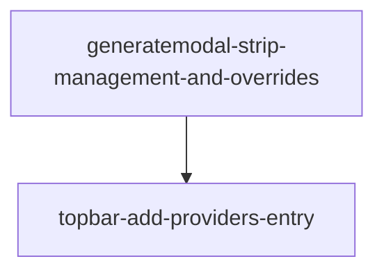

# Roadmap — Separate Providers Management from Generation Flow

## Task & Analysis

**Objective.** Refactor the UI so provider management is a top-level peer of the generation flow: a Topbar 'Providers' entry opens `ManageProvidersModal` directly, and `GenerateModal` becomes pure generation (provider select + API key + generate) with no nested management UI or per-session model/baseUrl overrides.

**Success definition.** All five caller-supplied acceptance criteria are satisfied: Topbar has a dedicated 'Providers' entry that opens `ManageProvidersModal`; `GenerateModal` contains no `ManageProvidersModal` import, no nested-modal state, and no 'Manage providers' link/button; `GenerateModal`'s form has no editable model-name or base-URL inputs (those come only from the selected provider definition); `GenerateModal` retains provider select, API key field, and the existing generate/result/error/review/accept flow; and `providerRegistry.ts`, `apiKeys.ts`, and `providerAdapters.ts` are byte-unchanged (UI composition only).

**domainShape:** `technical` — the task is a UI composition refactor (moving modal ownership between React components, stripping form fields), with no domain entities, rules, or workflows modeled.

### Ubiquitous language

| Term | Meaning |
|---|---|
| **Providers** | Top-level peer concept in the UI representing the registry of LLM provider definitions (model + base URL + adapters) that the user manages independently of any single generation session. |
| **Generation flow** | The end-to-end act of producing a problem from a chosen provider using a (possibly per-session) API key, including the result/error/review/accept steps inside `GenerateModal`. |
| **ManageProvidersModal** | The existing self-contained CRUD modal that lists, creates, updates, and deletes provider definitions in the registry; the sole entry point for provider management after this refactor. |
| **GenerateModal** | The existing modal for the generation flow; after this refactor it is pure generation with provider select + API key + generate/result/review/accept and no nested management UI. |
| **Provider definition** | The registry-stored record (name, model, base URL, adapter) that becomes the single source of truth for model and base URL at generation time, replacing per-session overrides. |
| **Per-session overrides** | The currently editable model-name and base-URL inputs inside `GenerateModal` that this refactor removes in favor of always reading from the selected provider definition. |
| **Topbar** | The app's top navigation bar that owns the open/close flags for top-level modals (Generate, Providers, Export, Import) and from which Providers is launched as a peer entry. |
| **Peer separation** | The architectural relationship where Providers and Generate are siblings in the Topbar with independent modal state, replacing the prior nested-modal relationship inside `GenerateModal`. |

### Assumptions

- "Per-session model/baseUrl overrides" means the two editable inputs currently rendered by `GenerateModal` (model name and base URL), not some other hidden override surface — removing them entirely matches the user's intent that "provider definition only" is the source of truth.
- The Topbar already owns modal-open state (`generateOpen`, `importOpen`); adding a third peer flag (`providersOpen`) follows the existing pattern without introducing a global modal manager.
- `ManageProvidersModal` is already self-contained and stateless w.r.t. `GenerateModal`'s form state, so it can be opened independently without prop wiring changes.
- API key handling in `GenerateModal` (read on submit, not persisted to provider definition) is preserved as-is per criteria 5; the separation work does not touch key lifecycle.
- Provider definitions in `localStorage` remain the single source of truth for model and base URL at generation time — the form just stops asking the user to retype them.
- The app is 100% client-side, so "separation" is purely a UI/state-ownership concern; no backend or auth surface is touched.

### Risks

- Criteria 3 (removing editable model/baseUrl inputs from `GenerateModal`) is a deliberate UX regression for any user who depended on overriding a saved provider — this is the user's stated intent but worth flagging as a behavioral change visible to end users.
- If the Topbar reuses a single modal-slot pattern or there is an existing modal stack, adding `providersOpen` as a sibling of `generateOpen`/`importOpen` could introduce state-coupling bugs — the analysis does not see a global modal manager, so the safest assumption is three independent flags, but this needs verification.
- `GenerateModal` currently derives its initial provider from `manageIntent`/nested state; removing that path must be matched by a default provider selection (first registry entry or persisted last-used) so the form is never empty on open.
- If `providerRegistry.ts` is consumed by `GenerateModal` in a way that depends on the now-removed override inputs (e.g., reading model/baseUrl from local form state instead of the registry entry), the refactor must rewire those reads or generation will silently send stale values.
- Criteria 5 forbids touching `apiKeys.ts`, but the per-session API key field still lives in `GenerateModal` — if the key read path ever coupled to the removed override inputs, key submission could break; this needs explicit check.
- The Topbar's button layout/label set ('+ Generate', '⇩ Export', '⇧ Import') is established; adding 'Providers' must not break the existing button row's responsive behavior or visual rhythm.

## Discovery Findings

| Area | Finding | File path | Implication |
|---|---|---|---|
| Test surface / GenerateModal & Topbar coupling | No test file imports from `GenerateModal`, `Topbar`, or `ManageProvidersModal`. There are zero `.test.tsx` files in the project. | `src/components/CodeEditor.test.ts` | No existing tests break when `GenerateModal`'s form fields and 'Manage providers' link are removed. The plan does not need a 'update existing tests' phase. |
| Topbar CSS / styling hints | All three existing Topbar entries share `.gen-btn` class. Topbar layout is `display:flex; gap:16px`. Existing button order: Generate → Export → Import. | `src/components/Topbar.tsx` | The new 'Providers' entry should reuse `.gen-btn` for visual parity and follow the existing emoji-prefix convention. |
| Modal architecture / independent peers | There is no modal-stack manager. `Topbar.tsx` is the sole owner of modal open/close state with one `useState` per peer. Escape-key race disappears automatically once `GenerateModal` no longer embeds the management modal. | `src/components/Topbar.tsx` | Adding 'Providers' is a literal copy-paste of the existing pattern. No refactor of modal orchestration is needed. |
| Cross-references to `ManageProvidersModal` and form fields | `ManageProvidersModal` is imported only from `GenerateModal.tsx:30` and rendered via two `createPortal` blocks. The form-field ids `gen-model`, `gen-baseurl`, and the 'Manage providers…' link text are referenced ONLY in `GenerateModal.tsx`. | `src/components/GenerateModal.tsx` | The blast radius is contained to one file (`GenerateModal.tsx`) for the removal, plus the new entry in `Topbar.tsx`. |
| Provider data sourcing after removing per-session overrides | `GenerateModal.tsx` already calls `listProviders()` per render and derives `selected = providers.find(...) ?? providers[0] ?? null`. `runGeneration` already reads `selected.modelName`/`baseUrl` as fallbacks. | `src/components/GenerateModal.tsx` | The `model` and `baseUrl` `useState` slots can be deleted entirely; `runGeneration` re-resolves the latest model/baseUrl from the registry at click time. This also fixes a latent bug where stale `useState` values were sent if a provider was edited while the modal was open. |
| localStorage persistence in `GenerateModal` | `GenerateModal` does NOT write to localStorage. The only persistence touchpoint is via `setPendingGenerated`, which the store deliberately excludes from `partialize`. The `provider` `useState` is not persisted across reloads. | `src/components/GenerateModal.tsx` | No persistence concern for this refactor. The `provider` selection-id `useState` should be kept; the `model`/`baseUrl` `useState` slots are pure duplicates and lose no state when removed. |
| Empty-state handling in `GenerateModal` | `GenerateModal.tsx:168-227` renders a dedicated empty-state branch when the registry has zero providers, with its own 'Add an LLM provider' button firing `setManageIntent('create')`. This branch is the only consumer of `manageIntent` state. | `src/components/GenerateModal.tsx` | After the refactor the empty state must NOT call `setManageIntent` (which is being deleted); an empty `<select>` + disabled Generate button is the new design. |
| Adjust-block complexity that simplifies on removal | `GenerateModal.tsx:113-166` has a render-time resync block re-prefilling `keyInput`, resyncing `model`/`baseUrl`, and clearing stale duplicate feedback. | `src/components/GenerateModal.tsx` | Plan a follow-on simplification of the adjust-block in the same phase that removes the state — keeping a smaller block that still does the prefill + stale-clear work but no longer touches model/baseUrl state. |

## Out of Scope

- **Modifying `providerRegistry.ts`, `apiKeys.ts`, or `providerAdapters.ts`** — criteria 5 freezes these modules; only UI composition changes.
- **Changing the wire-format adapters or how providers are defined at the data level** — the registry shape stays the same.
- **Introducing a global modal manager or router-based modal stack** — three independent Topbar-owned flags is sufficient and avoids speculative architecture.
- **Adding provider-level features** (default model selection per provider, key rotation, import/export of provider sets) — the separation is a UI move, not a feature expansion.
- **Migration of existing localStorage data** — provider definitions and keys stay in their existing keys (`leetlab.providers`, `leetlab.apiKeys`).
- **Backend, auth, or persistence-layer changes** — the app is client-side and the registry already persists via localStorage.
- **UI tests for the new Topbar 'Providers' entry** — no existing UI-test harness for modals.
- **Documentation/marketing copy for the new Topbar entry** — out of scope unless explicitly requested.

## Phases

### Phase 0 — `topbar-add-providers-entry` (order 0)

**Bounded context:** Topbar modal-orchestration peer (UI chrome / modal launcher)
**Layer:** interface
**Blast radius:** small
**Depends on:** —

**Goal.** Introduce a Topbar-level 'Providers' button that opens `ManageProvidersModal` as a third peer modal alongside Generate and Import, without altering `ManageProvidersModal` itself.

**Inputs.**
- `src/components/Topbar.tsx` (existing `generateOpen` / `importOpen` peer pattern)
- `src/components/ManageProvidersModal.tsx` (read-only consumer)
- `src/styles/globals.css` `.gen-btn` class (reused verbatim)
- Discovery finding: no modal-stack manager exists; per-render `createPortal` pattern is fine

**Expected result.** Topbar renders a new `.gen-btn` labeled 'Providers' alongside Generate/Export/Import; clicking it sets a local `providersOpen` flag and renders `<ManageProvidersModal open={providersOpen} onClose={...} />` as a third peer; existing `generateOpen`/`importOpen` flags untouched.

**Compensation.** Revert `Topbar.tsx`: remove the Providers button element, the `providersOpen` `useState`, and the `ManageProvidersModal` render block. No external effect (UI-only).

**Rubric.**

| Dimension | Min score | Description |
|---|---|---|
| `providers-entry-opens-managemodal` | 8 | Topbar 'Providers' entry opens `ManageProvidersModal` directly — `.gen-btn` button, local `providersOpen` flag, `ManageProvidersModal` mounted as JSX sibling of Generate/Import. |
| `managemodal-not-inside-generate-modal` | 7 | `ManageProvidersModal` mounts at Topbar level (sibling, not child); `git diff` confirms only `Topbar.tsx` changed. |
| `generate-modal-not-touched-this-phase` | 7 | `GenerateModal.tsx` is not modified in this phase — scope discipline; removal of model/baseUrl inputs belongs to phase 1. |
| `registry-and-key-modules-byte-unchanged` | 8 | `providerRegistry.ts`, `apiKeys.ts`, `providerAdapters.ts` byte-unchanged; Providers button reads provider definitions through the existing registry module. |

**healerHint:** If the Providers button renders but `ManageProvidersModal` opens inside the existing Generate modal instead of as a peer, remove any import of `ManageProvidersModal` from `GenerateModal.tsx`, add a local `useState` (`providersOpen`) to `Topbar.tsx` mirroring `generateOpen`/`importOpen`, and move the `<ManageProvidersModal />` mount to the same JSX sibling level as the Generate and Import modals.

---

### Phase 1 — `generatemodal-strip-management-and-overrides` (order 1)

**Bounded context:** GenerateModal generation form (per-session compose-step UI)
**Layer:** interface
**Blast radius:** small
**Depends on:** `topbar-add-providers-entry`

**Goal.** Reduce `GenerateModal` to pure generation (provider select + API key + generate/result/review/accept) by removing the nested `ManageProvidersModal` surface, the 'Manage providers' link, the per-session model/baseUrl inputs/state, and the Escape coordination that only existed to mediate the nested modal.

**Inputs.**
- `src/components/GenerateModal.tsx` (only file edited)
- `src/infrastructure/providerRegistry.ts` (byte-unchanged; consumed for `listProviders()` and a `getProvider(selectedId)` read at submit time — `getProvider` already exists at line 157)
- Discovery finding: form-field ids `gen-model` / `gen-baseurl` have no external consumers
- Discovery finding: `GenerateModal` has no localStorage writes; removing `useState` loses no persisted state
- Discovery finding: empty registry currently routes through `setManageIntent('create')` which is being deleted — empty registry is handled by an empty `<select>` + disabled Generate button

**Expected result.** `GenerateModal` contains zero references to `ManageProvidersModal` (no import, no `createPortal` render, no `manageIntent` state); no 'Manage providers…' link/button; no model-name or base-URL `<input>` elements and no model/baseUrl `useState`; `runGeneration` resolves the latest model/baseUrl from the registry at click time; the adjust-block shrinks to prefill `keyInput` and clear stale duplicate feedback only; provider select + API key input + generate/result/error/review/accept flow preserved.

**Compensation.** Revert `GenerateModal.tsx` to reintroduce the `ManageProvidersModal` import, the two `createPortal` renders, `manageIntent` state, the model/baseUrl `useState` slots, the two `<input>` elements, the 'Manage providers…' link, and the Escape coordination. No external effect (UI composition only; `providerRegistry`/`apiKeys`/`providerAdapters` untouched per criterion 5).

**Rubric.**

| Dimension | Min score | Description |
|---|---|---|
| `no-nested-management-ui` | 10 | No nested management UI inside `GenerateModal` — zero `ManageProvidersModal` references, zero `manageIntent`, zero 'Manage providers' link, no orphaned Escape handler. |
| `no-per-session-overrides` | 10 | No editable model-name or base-URL inputs in `GenerateModal`; no `useState` slots for model/baseUrl. |
| `generation-flow-preserved` | 10 | Generation flow (provider select + API key + generate/result/review/accept) remains functional; empty registry handled by empty `<select>` + disabled Generate, not `setManageIntent('create')`. |
| `registry-modules-byte-unchanged` | 10 | `providerRegistry.ts`, `apiKeys.ts`, `providerAdapters.ts` byte-unchanged (inverse-failure guard for criterion 5). |
| `registry-is-source-of-truth` | 10 | Provider definition is the single source of truth at generation time — `getProvider(selectedId)` is called inside the click handler, not from closed-over state. |

**healerHint:** Most likely failure is leftover dead tokens from the old form (a `ManageProvidersModal` import, a 'Manage providers…' link, or model/baseUrl `useState` slots) — fastest fix is to grep `GenerateModal.tsx` for `ManageProvidersModal`, `manageIntent`, `gen-model`, `gen-baseurl`, `setModel`, `setBaseUrl`, and delete every match plus its now-orphaned JSX, then re-grep to confirm zero hits.

## Dependency Map

## Success Criteria

- Refactor task objective satisfied: provider management is a top-level peer of the generation flow (Topbar 'Providers' entry + pure-generation `GenerateModal`).
- All five caller-supplied acceptance criteria are satisfied (per `analysis.successDefinition`).
- `topbar-add-providers-entry`: Topbar renders a dedicated 'Providers' button that opens `ManageProvidersModal` as a third peer alongside Generate and Import, with no edits to `GenerateModal.tsx`.
- `generatemodal-strip-management-and-overrides`: `GenerateModal` contains zero references to `ManageProvidersModal`, no 'Manage providers' link, no model/baseUrl inputs; `runGeneration` resolves model/baseUrl from the registry at click time; provider select + API key + generate/result/review/accept flow preserved; `providerRegistry`/`apiKeys`/`providerAdapters` byte-unchanged.

## Quality Gate

**Path taken:** Lite (single subsystem, ≲3 phases, no migration).
**Discovery:** Ran — 8 findings grounded in actual repo state.
**Iterations run:** 1 (critic → blocker-verify not triggered, no blockers found → gate passed).
**Issues raised → verified (blockers only) → healed:** 18 issues raised; all passed critic; 0 blockers; 0 majors; 1 minor (accepted debt).
**Accepted debt:** `generatemodal-strip-management-and-overrides/registry-is-source-of-truth` scored 8/10 by critic on a minScore-10 dimension due to a wording ambiguity about whether `getProvider` was a "new" call or a pre-existing function. Resolved by code reality: `getProvider(id)` already exists in `providerRegistry.ts:157`, so the phase input is now annotated to make that explicit. Not worth a heal round-trip for a 2-point wording nit.
**Final verdict:** **PASSED** — roadmap is structurally sound and has survived one grounded semantic review.
