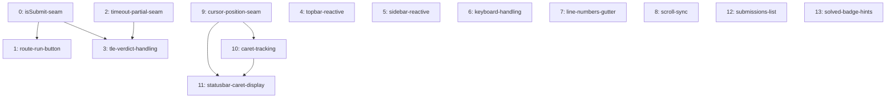

# src/ vs prototype — refactor roadmap

## Audit Scope

- **Target:** `src/` — the React/TypeScript reimplementation of the LeetCode-style practice app (~1445 lines), compared against `prototype/local-leetcode.html` (~1613 lines, the original working single-file version).
- **Focus:** `general-debt`, `prototype-parity`
- **Constraints:** none

## Audit Findings

| id | location | violationType | evidence (abridged) | severity | lastTouched |
|---|---|---|---|---|---|
| run-submit-same-handler | EditorPane.tsx | Regression vs Prototype | Run/Submit share one handler; addSubmission/markSolved fire unconditionally on every Run | high | 2026-08-09 |
| non-reactive-store-reads | Topbar.tsx, Sidebar.tsx | general-debt | `getState()` snapshot reads instead of reactive selectors | medium | 2026-08-09 |
| triple-nested-editor-pane | App.tsx, EditorPane.tsx, CodeEditor.tsx | general-debt | Class `editor-pane` applied 3× in a direct-ancestor chain | medium | 2026-08-09 |
| missing-editor-keyboard-handling | CodeEditor.tsx | Regression vs Prototype | No onKeyDown at all — no Tab-indent, Enter auto-indent, Ctrl+/ | high | 2026-08-09 |
| missing-line-numbers-cursor-status | CodeEditor.tsx, StatusBar.tsx | Regression vs Prototype | Gutter permanently empty, no scroll-sync, cursor position hardcoded | medium | 2026-08-09 |
| missing-submissions-history-ui | DescPane.tsx | Regression vs Prototype | Submissions tab hardcoded to "No submissions yet" despite persisted data | high | 2026-08-09 |
| missing-solved-badge-and-hints | DescPane.tsx | Regression vs Prototype | No ACCEPTED badge, no hints section, despite data existing | medium | 2026-08-09 |
| missing-editor-toolbar-actions | EditorPane.tsx | Regression vs Prototype | Copy/Reset buttons absent | medium | 2026-08-09 |
| missing-global-shortcuts-and-splitter-resize | App.tsx, EditorPane.tsx | Regression vs Prototype | No keyboard shortcuts, static (non-draggable) divider | medium | 2026-08-09 |
| missing-toast-and-confetti | EditorPane.tsx | Regression vs Prototype | Blocking `alert()` instead of toasts; no confetti | low | 2026-08-09 |
| tle-drops-run-results | EditorPane.tsx, useRunCode.ts | Regression vs Prototype | Timeout -> generic alert, no per-case TLE marks/verdict/submission | medium | 2026-08-09 |
| delete-button-always-enabled-for-builtin-cases | Drawer.tsx | Regression vs Prototype | Delete button shown even for builtin cases (store silently no-ops) | low | 2026-08-09 |
| topbar-segment-count-hardcoded | Topbar.tsx | Feature Drift | Hardcoded `length: 6` instead of one segment per real problem | low | 2026-08-09 |

**Notable improvement over the prototype** (not a finding): the domain/infrastructure split (`Problem.ts`, `TestCase.ts`, `problemBank.ts`, `sandbox.worker.ts`, `store.ts`, `tsCompiler.ts`) is a real architectural gain over the prototype's single 1600-line inline `<script>`. The regressions found here are behavioral gaps introduced during the port, not evidence the port's structure is worse.

## YAGNI Triage

7 of 13 findings approved (just over half — flagged against the pipeline's own caution threshold, but every approved reason cites concrete data/functional impact tied to the stated `prototype-parity` focus, not just "this looks wrong").

| finding | decision | reason |
|---|---|---|
| run-submit-same-handler | **approved** | Corrupts progress data; directly blocks prototype-parity on a core workflow |
| non-reactive-store-reads | **approved** | Guaranteed-stale reads on the main progress indicator; concrete user-facing bug |
| triple-nested-editor-pane | deferred | Cosmetic CSS debt, no confirmed breakage, no bug history |
| missing-editor-keyboard-handling | **approved** | Core, constantly-used editing affordance; major usability regression |
| missing-line-numbers-cursor-status | **approved** | Baseline code-editor UI; visible, constant regression |
| missing-submissions-history-ui | **approved** | Store already persists the data; UI throws it away — high-impact parity gap |
| missing-solved-badge-and-hints | **approved** | Core problem-solving content already in data, unrendered |
| missing-editor-toolbar-actions | deferred | Convenience actions with easy manual workarounds |
| missing-global-shortcuts-and-splitter-resize | deferred | Power-user polish; buttons still reachable |
| missing-toast-and-confetti | deferred | Purely cosmetic, explicitly low severity |
| tle-drops-run-results | **approved** | Misleading/incomplete feedback in the primary run/submit journey |
| delete-button-always-enabled-for-builtin-cases | deferred | No data loss (store no-ops); cosmetic affordance mismatch |
| topbar-segment-count-hardcoded | deferred | Latent risk only, no evidence of actual divergence yet |

## Phases

All phases carry `blastRadius: small`. Layers are `interface` / `application` / `infrastructure` (no `domain` layer applies to this app).

| order | id | strategy | layer | dependsOn | addresses |
|---|---|---|---|---|---|
| 0 | editorpane-isSubmit-seam | introduce-seam | interface | — | run-submit-same-handler |
| 1 | editorpane-route-run-button | branch-by-abstraction | interface | editorpane-isSubmit-seam | run-submit-same-handler |
| 2 | useruncode-timeout-partial-seam | introduce-seam | application | — | tle-drops-run-results |
| 3 | editorpane-tle-verdict-handling | branch-by-abstraction | interface | editorpane-isSubmit-seam, useruncode-timeout-partial-seam | tle-drops-run-results |
| 4 | topbar-reactive-solved-count | other | interface | — | non-reactive-store-reads |
| 5 | sidebar-reactive-solved-flag | other | interface | — | non-reactive-store-reads |
| 6 | codeeditor-keyboard-handling | other (additive) | interface | — | missing-editor-keyboard-handling |
| 7 | codeeditor-line-numbers-gutter | other (additive) | interface | — | missing-line-numbers-cursor-status |
| 8 | codeeditor-scroll-sync | other (additive) | interface | — | missing-line-numbers-cursor-status |
| 9 | store-cursor-position-seam | introduce-seam | infrastructure | — | missing-line-numbers-cursor-status |
| 10 | codeeditor-caret-tracking | branch-by-abstraction | interface | store-cursor-position-seam | missing-line-numbers-cursor-status |
| 11 | statusbar-caret-display | branch-by-abstraction | interface | store-cursor-position-seam, codeeditor-caret-tracking | missing-line-numbers-cursor-status |
| 12 | descpane-submissions-list | other (mechanical) | interface | — | missing-submissions-history-ui |
| 13 | descpane-solved-badge-and-hints | other (additive) | interface | — | missing-solved-badge-and-hints |

Each phase's `rollbackPlan` is a `git revert` of its own commit (phase 0 additionally notes: revert dependent phases first, since 1 and 3 depend on it — see Quality Gate below). Full per-phase `inputs`, `expectedResult`, rubric dimensions, and `healerHint` are in the JSON twin — key highlights:

- **Phase 7/8 split**: the original single "line numbers + scroll sync" phase was split during healing because its `expectedResult` quietly bundled two deliverables under one approved finding — each now ships as an independently reviewable, independently revertible commit.
- **Phase 12 caveat**: Stage 3 (decomposition) surfaced, unprompted, that `DescPane`'s tab buttons (`#tabDesc`/`#tabSubs`) appear to have no `onClick` handlers at all — meaning the Submissions tab may never become reachable by clicking, regardless of this fix. That was **never an approved finding** (Stage 1's audit never surfaced it), so no phase fixes it; phase 12's rubric was reworded to verify via devtools/state inspection rather than a real click-through, and the gap is tracked in Deferred below.

## Dependency Map

## Success Criteria

- Every approved finding is addressed by at least one phase
- **run-submit-same-handler**: Run Code no longer records a submission or marks a problem solved; only Submit does
- **non-reactive-store-reads**: Topbar and Sidebar solved indicators update live without requiring an unrelated re-render
- **missing-editor-keyboard-handling**: Tab/Enter/Ctrl+/ behave as in the prototype
- **missing-line-numbers-cursor-status**: line-number gutter is populated, scroll stays synced, and StatusBar shows live caret position
- **missing-submissions-history-ui**: verifiable via code/devtools inspection that the Submissions tab renders real persisted data — end-to-end click-through verification is not possible because tab-switching is a known, separately-deferred gap
- **missing-solved-badge-and-hints**: description pane shows an ACCEPTED badge and hints when applicable
- **tle-drops-run-results**: sandbox timeouts produce per-case TLE marks, a verdict chip, and (on Submit only) a recorded submission

## Deferred

- **triple-nested-editor-pane** — cosmetic CSS layout debt, no confirmed breakage, deferred
- **missing-editor-toolbar-actions** — copy/reset convenience buttons, easy manual workaround, deferred
- **missing-global-shortcuts-and-splitter-resize** — power-user polish, not blocking, deferred
- **missing-toast-and-confetti** — cosmetic notification/celebration polish, deferred
- **delete-button-always-enabled-for-builtin-cases** — no data loss (store already no-ops), cosmetic UI mismatch, deferred
- **topbar-segment-count-hardcoded** — latent desync risk only, no evidence of actual divergence yet, deferred
- **DescPane tab-switching appears entirely unwired** — surfaced by Stage 3 during decomposition, never an approved finding (Stage 1 never audited it), so no phase fixes it. If real, it undercuts the practical UI-reachability of phases 12 and 13 until fixed separately — recommend a follow-up audit pass that formally triages this.
- **rollback-safety judgment call (accepted debt)** — the critic initially raised phase 0's rollback plan as a blocker (reverting it in isolation while phases 1/3 remain applied would break the build). Adversarial verification **refuted** this and downgraded it to minor: the `dependsOn` graph already encodes the correct "roll the whole downstream chain back together" order, which the rubric's own text accepts as sufficient. Phase 0's rollback text was still clarified for readability.

## Quality Gate

- **Path taken:** full (Stage 1 returned 14 findings, well above the lite-path threshold of ~5)
- **Iterations:** 1
- **Critic issues raised:** 8 (1 initially flagged blocker, 3 major, 4 passing/minor)
- **Blocker verification:** 1 blocker sent to adversarial verification → **REFUTED**, downgraded to minor/accepted debt (rollback-safety on phase 0 — dependency graph already made the chain-rollback order safe)
- **Majors healed:** 3
  1. **scope-discipline** — phase 7 (line-numbers + scroll-sync) bundled two deliverables under one approved finding → split into `codeeditor-line-numbers-gutter` and `codeeditor-scroll-sync`
  2. **rollback-and-regression-rubrics** — `descpane-submissions-list`'s rubric was unexecutable via the UI because the Submissions tab is unreachable → reworded to verify via devtools/state inspection
  3. **success-coverage** — the corresponding success criterion implicitly assumed a clickable tab → reworded to state its devtools-verifiable scope explicitly
- **Accepted debt:** 1 (the refuted rollback-safety judgment call, now documented in the phase's rollback text and in Deferred)
- **Final verdict: PASSED** — roadmap is structurally safe to execute in the stated phase order after 1 healing iteration.
