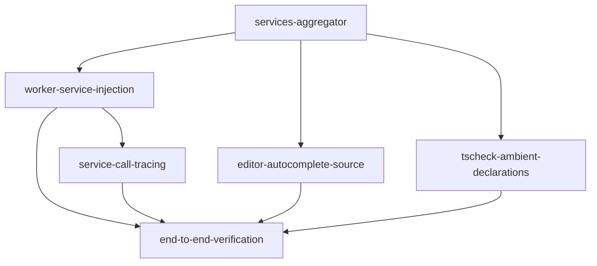

# Wire src/services into the sandbox editor — roadmap

## Task & Analysis

**Objective:** Wire all five in-browser backend-emulation services under `src/services` (Redis,
PostgreSQL, RabbitMQ, Kafka, BullMQ) into the CodeMirror problem-solution editor so they are callable
from within sandboxed solution code, surfaced in autocomplete, and traced through structured log
entries into the existing sandbox console/log stream.

**Success definition:** For every service Discovery found ready (all five, Kafka and BullMQ via their
default AsyncLock-based paths, SharedArrayBuffer-dependent exports excluded): a global handle is
reachable inside `sandbox.worker.ts`'s Function execution; typing the identifier + `.` in
`CodeEditor.tsx` surfaces real completions; every call emits a `{l,t}` trace entry into the existing
console/log stream; a representative solution using each service executes correctly end-to-end in the
real worker sandbox; any service Discovery finds blocked has an explicit stated disposition.

**Domain shape:** `technical` — wiring pre-built infrastructure emulations into an editor's autocomplete
and a sandboxed execution/tracing pipeline is developer-tooling/runtime machinery, not a business domain
of orders, users, or workflows a domain expert would recognize. (Confirmed independently at the Stage 5
gate by re-reading the phases' actual content, not just trusting this label.)

### Ubiquitous / subsystem language

| Term | Meaning |
|---|---|
| `sandbox.worker.ts` | The Web Worker that executes user solution code via `new Function(...)` and produces the `{l,t}` log stream |
| `scopeCompletionSource` | The CodeMirror/@codemirror/autocomplete mechanism used to surface JS-scope-aware completions |
| service handle | The global identifier (e.g. `redis`, `queue`) injected into the sandbox execution scope |
| structured trace entry | A `{l, t}` log-shaped record emitted per service call into the existing stream |
| `LastRunCase` | The mechanism surfacing console/log output of the most recent run in the Run panel |
| cross-origin isolation (COOP/COEP) | Browser headers required for SharedArrayBuffer/Atomics — blocks Kafka's `Mutex` and BullMQ's `MutexLock` |
| in-memory emulation | A self-contained, dependency-free TS reimplementation of a backend component running entirely in-browser |
| services aggregator | The single new module that is the source of truth for the 5 service handles' names/constructors |

### Assumptions

- The five services' existing public classes/methods are the intended API surface to expose — no new
  business-facing API is being designed in this pass.
- Autocomplete integration extends the existing `@codemirror/autocomplete` + `scopeCompletionSource`
  mechanism, not a new completion engine.
- Global handles are injected fresh per sandbox run; cross-run persistence is out of scope.
- "Full observability" is fully satisfied by structured trace entries into the existing console/log
  stream — no metrics/dashboards/persisted trace storage.
- Kafka's SharedArrayBuffer/Atomics `Mutex` is a known, pre-confirmed blocker for that one export;
  Discovery confirmed the default Kafka path (`AsyncLock`) needs no SharedArrayBuffer at all.

### Risks

- `new Function(...)`-based sandbox has no module system — services must be exposed as pre-bound
  globals, not importable modules.
- BullMQ's barrel re-exports `MutexLock`, which — like Kafka's `Mutex` — depends on
  SharedArrayBuffer/Atomics and therefore COOP/COEP headers the app doesn't set; a blind re-export would
  silently reintroduce the same dependency the plan excludes for Kafka.
- Autocomplete generated from live TS types risks drift if a service's public/internal members aren't
  cleanly separated.
- Routing every service call through the existing `{l,t}` stream could flood the Run panel unless
  tracing is scoped to public API boundaries.
- These are from-scratch emulations (MVCC engine, Atomics mutex, AsyncLock broker) — latent correctness
  bugs may only surface once real solution code exercises them.
- Unbounded tracing (no cap on payload size/call volume) risks flooding the log stream under a tight
  loop.
- Four services independently export an `AsyncLock` symbol — aggregating them risks a name collision
  unless imports are deliberately aliased.

## Discovery Findings

| Area | Finding | File | Implication |
|---|---|---|---|
| CodeEditor extension wiring | `javascriptLanguage.data.of({ autocomplete: scopeCompletionSource(globalThis) })` already wired; `globalThis` is the main-thread window, not the worker | `src/components/CodeEditor.tsx` | New completion source must be an additional facet entry, not a replacement; main-thread and worker scope are two separate problems |
| Sandbox execution mechanism | Code runs via `new Function('console','module','exports','require','process', code)`; no hook for extra globals | `src/infrastructure/sandbox.worker.ts` | Adding a services global means editing both the Function signature and its call-site argument in sync; `require()`'s throw must stay untouched |
| Worker bundling of src/services | Vite's `?worker` import bundles the worker's full module graph | `src/infrastructure/sandbox.worker.ts` | Plain ESM imports from `src/services` work with no custom bundler step |
| Redis service statefulness | Each SandboxWorker is fresh and terminated per run; RedisEmulation's BroadcastChannel-based state does not persist across runs | `src/services/redis-service/redis.service.ts` | Fresh-instance-per-run is the explicit default; no persistence strategy needed |
| Kafka SharedArrayBuffer is opt-in only | Default Kafka path (`Broker`/`Topic`/`Consumer`/`InMemoryOffsetStorage` via `AsyncLock`) needs no SAB; only `Mutex`/`SharedMemoryOffsetStorage` do. Same SAB pattern duplicated in BullMQ's `MutexLock` | `src/services/kafka-service/kafka.service.ts` | Kafka does not need deferral — wire its default path only; exclude both Kafka's and BullMQ's SAB-dependent exports by name |
| PostgreSQL/RabbitMQ portability | Both use only `Promise`/`Map`/`Set`/`crypto.randomUUID` — zero Node-only APIs | `src/services/postgresql-service/postgresql.service.ts` | Safe to import into the Worker as-is |
| BullMQ barrel inconsistency | BullMQ is the only service with an existing barrel (`index.ts`); the other four have no barrel and must be imported from concrete paths | `src/services/BullMQ/index.ts` | A new aggregator module is required as shared foundation; BullMQ's barrel must be re-exported selectively (not `export *`) to keep `MutexLock` excluded |
| Example files are reference-only | Each service has an `*.example.ts`/`*.sample.ts` file, none wired into build/test; BullMQ's uses top-level `await` | `src/services/BullMQ/bullmq.exmaple.ts` | Treat as documentation only; do not import/execute in production wiring |
| No ambient `.d.ts` mechanism for TS-mode linting | `tsCheck.ts`/`tsCompiler.ts` run a real TS language service with a single virtual file `input.ts`, no mechanism to inject ambient declarations | `src/infrastructure/tsCheck.ts` | Extending the host to serve a synthetic ambient `.d.ts` is a separate integration point from `scopeCompletionSource` |
| Log/trace conduit shape | Log entries are exactly `{ l: string; t: string }` through the existing console/postMessage pipeline; no structured/object-log support | `src/infrastructure/store.ts` | Trace entries must reuse the exact existing conduit, not a new `WorkerMsg` variant |
| No `@services` path alias | `tsconfig.app.json`/`vite.config.ts` define `@`, `@domain`, `@infra`, `@components` but not `@services` | `vite.config.ts` | Optional convenience only; relative imports work and are lower-risk — deferred |
| No backend, no COOP/COEP config anywhere | Pure static Vite+React SPA, no server framework, no header-injection config anywhere | `package.json` | Confirms SAB-dependent variants (Kafka's `Mutex`/`SharedMemoryOffsetStorage`, BullMQ's `MutexLock`) are correctly excluded rather than attempted |

## Out of Scope

- A dedicated observability UI panel — tracing goes into the existing console stream only (repo owner's
  clarification).
- Persisting service state across separate problem runs or browser sessions.
- Solving Kafka's/BullMQ's COOP/COEP requirement via app-wide HTTP header changes — an app-level infra
  decision with side effects beyond this task; the default AsyncLock-based paths avoid needing it.
- Adding new backend services beyond the five already present.
- Rewriting or redesigning the services' internal architecture beyond what's needed to expose/trace
  their public API.
- Auth/authorization for the services — client-only app, no such concern.
- Exhaustive automated tests for each emulation engine's internal correctness (e.g. full MVCC
  transaction-isolation suite).
- A `@services` path alias — relative imports already work and are lower-risk for a naming convenience
  only.
- Cross-run/cross-session persistence or an RPC strategy for service state.
- A new `WorkerMsg` variant / structured-log message type — the existing `{l,t}` conduit is sufficient.
- Wiring or executing the `*.example.ts`/`*.sample.ts` reference files.

## Phases

### 0. `services-aggregator` — Introduce a sandbox service-bindings aggregator

- **Bounded context / subsystem:** sandbox service bindings — **Layer:** infrastructure — **Blast radius:** small
- **Goal:** Create a single new module that is the one source of truth for the 5 service handles and
  their exposed names, importing each service's public API from concrete file paths and re-exporting
  BullMQ's barrel members selectively, explicitly excluding both Kafka's and BullMQ's
  SharedArrayBuffer-dependent exports (`Mutex`/`SharedMemoryOffsetStorage`, `MutexLock`).
- **Inputs:** `redis.service.ts`, `postgresql.service.ts`, `RabbitMQ.service.ts`,
  `kafka.service.ts` (AsyncLock path only), `BullMQ/index.ts` (selective re-export, excluding `MutexLock`)
- **Expected result:** A new module (`src/services/sandbox-bindings.ts`) exporting a factory that
  constructs a fresh instance of each of the 5 services plus a name→constructor map, with SAB-dependent
  exports omitted and commented as excluded by design; no `AsyncLock` symbol collision across the 4
  services that independently export one.
- **Depends on:** —

| Rubric dimension | minScore |
|---|---|
| no-export-name-collisions | 8 |
| exact-five-service-inventory | 8 |
| shared-array-buffer-exports-excluded | 9 |
| bullmq-barrel-fidelity | 7 |
| factory-yields-fresh-isolated-instances | 7 |

**Healer hint:** The most likely failure is the four-way `AsyncLock` export collision or a blind
`export *` on the BullMQ barrel silently leaking `MutexLock` back in — fix by aliasing each service's
internal lock import and using a selective named re-export for BullMQ.

---

### 1. `worker-service-injection` — Inject fresh per-run service handles into sandbox.worker.ts

- **Bounded context / subsystem:** sandbox execution — **Layer:** infrastructure — **Blast radius:** medium
- **Goal:** Wire the aggregator into `sandbox.worker.ts`'s Function-based execution so each of the 5
  service handles is a named global available to user solution code, instantiated fresh per worker run,
  without altering `require()`'s existing throw behavior.
- **Inputs:** `sandbox.worker.ts`, output of `services-aggregator`
- **Expected result:** `new Function('console','module','exports','require','process','redis','pg','rabbitmq','kafka','queue', code)`
  (naming illustrative) with matching call-site arguments, each a freshly constructed instance created
  at the top of the `onmessage` handler for every run; `require()` semantics unchanged.
- **Depends on:** `services-aggregator`

| Rubric dimension | minScore |
|---|---|
| handles-present-and-live | 8 |
| no-cross-run-persistence | 8 |
| require-behavior-unchanged | 9 |

**Healer hint:** The most likely failure is instances built at module top-level (or memoized) instead of
freshly inside `self.onmessage`, causing state to leak across runs.

> *Gate note: this phase's rubric originally also required full `{l,t}` call-tracing, which was actually
> `service-call-tracing`'s job one phase later — a `major` finding caught by the critic. The healer
> removed that dimension; the phase now scores only on what it can itself deliver.*

---

### 2. `service-call-tracing` — Emit structured {l,t} trace entries for every service call

- **Bounded context / subsystem:** sandbox execution — **Layer:** infrastructure — **Blast radius:** medium
- **Goal:** Wrap each service instance's public methods so every call produces a formatted log line
  pushed through the existing `cns`/`mkLog` console pipeline, matching the exact `{l,t}` shape — no new
  `WorkerMsg` variant.
- **Inputs:** `sandbox.worker.ts` (mkLog/cns), fresh service instances from `worker-service-injection`
- **Expected result:** Every call to a service handle produces a formatted trace string (e.g.
  `[redis] SET foo bar -> OK`) delivered as an `{l,t}` entry into the same stream `useRunCode.ts`/`store.ts`
  already consume.
- **Depends on:** `worker-service-injection`

| Rubric dimension | minScore |
|---|---|
| call-produces-trace-entry | 8 |
| trace-format-fidelity | 7 |
| error-path-traced | 6 |
| non-invasive-wrapping | 7 |

**Healer hint:** Most likely failure is partial wrapping — only 1-2 of the five services actually get
instrumented — fix with a single generic wrap-all-public-methods helper applied uniformly at
construction time.

---

### 3. `editor-autocomplete-source` — Surface service handle names/members in CodeEditor autocomplete

- **Bounded context / subsystem:** editor interface — **Layer:** interface — **Blast radius:** small
- **Goal:** Add a second completion source, composed alongside the existing `scopeCompletionSource(globalThis)`
  entry, offering the 5 service handle identifiers and their real member names/signatures, sourced from
  the same aggregator module the worker uses so names never drift.
- **Inputs:** `CodeEditor.tsx`, output of `services-aggregator` (names/shape), CodeMirror
  CompletionSource composition semantics
- **Expected result:** Typing `redis.` (etc.) surfaces real completions for that service's public
  methods; existing scope-based completions for other identifiers remain unaffected.
- **Depends on:** `services-aggregator`

| Rubric dimension | minScore |
|---|---|
| all-five-handles-complete | 8 |
| name-drift-safety | 8 |
| existing-scope-completion-unaffected | 7 |
| signature-and-doc-fidelity | 6 |

**Healer hint:** Most likely failure is registering the new source as a lone replacement (or
`override: true`) instead of composing it alongside `scopeCompletionSource(globalThis)` in the same
array.

---

### 4. `tscheck-ambient-declarations` — Serve ambient .d.ts declarations for the 5 service globals

- **Bounded context / subsystem:** editor interface / TS linting — **Layer:** interface — **Blast radius:** small
- **Goal:** Extend `tsCheck.ts`/`tsCompiler.ts`'s virtual TS language service host to additionally serve
  a synthetic ambient declaration file for the 5 service globals, so solution code referencing them
  doesn't show false "Cannot find name" diagnostics.
- **Inputs:** `tsCheck.ts`, `tsCompiler.ts`, output of `services-aggregator` (types)
- **Expected result:** A virtual ambient `.d.ts` file registered alongside the existing `input.ts` in
  the TS language-service host, eliminating false diagnostics for the 5 service identifiers.
- **Depends on:** `services-aggregator`

| Rubric dimension | minScore |
|---|---|
| ambient-file-fully-wired-into-host | 8 |
| globals-visible-in-global-scope-not-module-scope | 8 |
| five-globals-typed-not-widened-to-any | 7 |
| degrades-safely-if-ambient-source-unavailable | 7 |

**Healer hint:** Most likely failure is a partial wire-up — the ambient file is added to
`getScriptSnapshot` but forgotten in `getScriptFileNames`/`fileExists`/`readFile`, so it never loads.

---

### 5. `end-to-end-verification` — Verify a representative multi-service solution end-to-end

- **Bounded context / subsystem:** sandbox execution / editor interface — **Layer:** cross-cutting — **Blast radius:** small
- **Goal:** Write and run, manually in the actual app, a sample solution using each of the 5 service
  handles, confirming worker execution succeeds, trace entries appear correctly in the Run panel,
  and autocomplete/TS-linting both behave as wired.
- **Inputs:** outputs of `worker-service-injection`, `service-call-tracing`, `editor-autocomplete-source`,
  `tscheck-ambient-declarations`
- **Expected result:** A documented manual verification pass confirming worker success, `{l,t}` trace
  entries for all 5 services in `LastRunCase`, real autocomplete for all 5 handles, and clean TS
  diagnostics; any residual gap explicitly stated.
- **Depends on:** `worker-service-injection`, `service-call-tracing`, `editor-autocomplete-source`,
  `tscheck-ambient-declarations`

| Rubric dimension | minScore |
|---|---|
| worker-execution-succeeds | 8 |
| trace-entries-in-run-panel | 8 |
| autocomplete-surfaces-all-handles | 7 |
| ts-diagnostics-clean | 7 |
| gaps-explicitly-documented | 7 |

**Healer hint:** Most likely failure is trace entries reaching devtools but not the actual `{l,t}`
LastRunCase stream, or a SharedArrayBuffer-dependent export having leaked through the aggregator for
one service.

## Dependency map

## Success Criteria

- For every service Discovery found ready (all five, Kafka and BullMQ via their default
  AsyncLock-based paths, SharedArrayBuffer-dependent exports excluded): a global handle is reachable
  inside `sandbox.worker.ts`'s Function execution.
- `services-aggregator`: a single new module is the source of truth for the 5 service handles'
  names/constructors, with no export-name collisions and both Kafka's and BullMQ's SAB-dependent
  exports explicitly excluded.
- `worker-service-injection`: sandbox.worker.ts's Function call exposes all 5 service handles as fresh,
  non-persisted globals per run, with `require()`'s throw behavior unchanged.
- `service-call-tracing`: every call on a service handle emits a correctly formatted `{l,t}` trace entry
  through the existing console pipeline, including on failure paths.
- `editor-autocomplete-source`: typing any of the 5 handle identifiers + `.` surfaces real,
  aggregator-sourced completions, without breaking existing scope-based completions.
- `tscheck-ambient-declarations`: TS-mode linting recognizes all 5 service globals with real (non-any)
  types and produces no false "Cannot find name" diagnostics.
- `end-to-end-verification`: a representative multi-service solution executes correctly in the real
  worker sandbox with all four prior phases' guarantees demonstrated together, and any residual gap is
  explicitly documented rather than silently dropped.

## Quality Gate

- **Path taken:** Full (existing-system extension, 6 phases, cross-cutting observability concern).
- **Discovery:** Ran — Explore agent read `CodeEditor.tsx`, `sandbox.worker.ts`, all 5 service
  entrypoints, `tsCheck.ts`/`tsCompiler.ts`, `store.ts`, path aliases, and confirmed no backend/COOP-COEP
  config exists anywhere in the repo.
- **Iterations run:** 2 (1 critic pass → 1 heal → 1 confirmation critic pass).
- **Issues raised:** 1 (`testable-rubrics`, severity `major`) out of 10 rubric dimensions scored; no
  `blocker`-severity issues, so no adversarial verification round was needed.
- **Healed:** `testable-rubrics` — removed a rubric dimension from `worker-service-injection` that
  required tracing infrastructure `service-call-tracing` alone was responsible for building one phase
  later; confirmed fixed on re-check with no collateral damage to the other 5 phases.
- **Accepted debt:** None — no surviving minor issues.
- **Final verdict:** Gate passed.

Passing this gate means the roadmap is structurally sound and has survived one grounded semantic
review — it is not a formal proof the aggregator's implementation will compile cleanly or that CodeMirror's
`languageData.autocomplete` facet composes exactly as assumed; `editor-autocomplete-source` phase 3
explicitly lists CodeMirror's composition semantics as a required material to confirm during execution.
