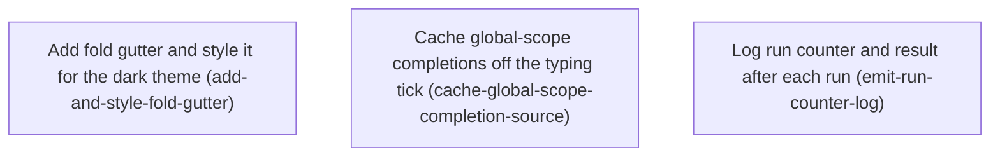

# Horizon 1 — Editor folding, autocomplete, and run logging

_Project: editor-folding-autocomplete-run-logging · Planning Horizon 1 of a chain · generated 2026-08-30_

---

## 🎯 What are we trying to achieve?

Make three small quality-of-life fixes to the in-browser code editor (built on CodeMirror 6):

1. **Code folding** — let you collapse and expand blocks, functions, and object literals with a click in a new "fold" column, for both JavaScript and TypeScript.
2. **Faster autocomplete** — typing quickly currently stutters because the suggestion engine re-scans the whole browser global object on every keystroke; make it compute that list once and reuse it.
3. **Automatic run logging** — after every code run, print `console.log(`${counter}`, result)` to the browser console so you can see, at a glance, which run number you're on and what it produced.

**Done means:** all three work in a local dev build, `npm run build` (typecheck + bundle) still passes, and nothing existing in the editor breaks. Verification is by hand — new automated tests are optional.

## 🧠 Why does this change need to happen?

- The editor has **no way to collapse code**, so long solutions are hard to scroll through.
- One of the three autocomplete "suggestion sources" does an **expensive synchronous scan on every keystroke**, which makes fast typing lag in a large file. The other two sources are already cheap or already run in the background — only this one needs fixing.
- There is **no run history visible anywhere** — you can't tell from the console how many times you've run or what each run returned.

A previously listed 4th item ("TS / linter not working when deployed") was investigated and is a **false alarm** — it works fine. It is permanently out of scope.

## At a glance

| | |
|---|---|
| **Phases** | 3 (all independent — can be done in any order) |
| **Complexity** | Low — each phase is small, additive, and touches exactly one file |
| **Main risk** | Caching the completion source without a correct `validFor` still leaves CodeMirror re-querying every keystroke, so typing still stutters |
| **Quality / perf target** | Prototype: fast typing no longer stutters (no formal benchmark); `tsc -b` + `vite build` green |
| **Testing focus** | Manual smoke checks in a dev build; "exactly once" and "no regression" checks per phase |

---

## Order of work

The three phases are independent — none depends on another — so they can be tackled in any order or in parallel.

1. **Add fold gutter and style it for the dark theme** — nothing depends on it; can start immediately.
2. **Cache global-scope completions off the typing tick** — nothing depends on it; can start immediately.
3. **Log run counter and result after each run** — nothing depends on it; can start immediately.

---

## Phase 1 — Add fold gutter and style it for the dark theme

Technical ID: `add-and-style-fold-gutter` · Context: CodeMirror editor config · Layer: interface · Blast radius: small

**Goal** — The editor shows a clickable fold column that collapses/expands foldable ranges (blocks, function bodies, object literals) in both JS and TS modes, via gutter click and fold keybindings, and the fold toggles plus the collapsed "…" placeholder are legible against the editor's dark theme.

**Why** — CodeMirror's language package already knows how to detect foldable regions from the JS/TS grammar; the editor just never turned the feature on. Because the editor uses a hand-written dark colour theme, CodeMirror's default fold markers and placeholder would be near-invisible without matching CSS, so enabling and styling folding is one small change in one file.

**Changes**
- Import `codeFolding`, `foldGutter`, `foldKeymap` from `@codemirror/language`.
- Add `codeFolding()` and `foldGutter()` to the `extensionsFor(lang)` array, near the other gutter extensions.
- Merge `...foldKeymap` into the existing single `keymap.of([...])` list.
- In the `editorTheme` object, add `.cm-foldGutter .cm-gutterElement` rules (toggle colour, cursor, hover) consistent with the existing `.cm-gutters` / `.cm-activeLineGutter` colours, and a `.cm-foldPlaceholder` rule (background, border, text colour, padding).
- Manually verify in a dev build: JS and TS starter templates show fold toggles; clicking collapses/restores a function or block; toggles and placeholder are readable at rest and on hover.

**Files / areas** — `src/components/CodeEditor.tsx`

**How to verify**
- **Fold extensions present** — `codeFolding` and `foldGutter` imported from `@codemirror/language`; both called in `extensionsFor(lang)` for JS *and* TS; `foldKeymap` spread into the existing `keymap.of([...])`; `npm run build` passes.
- **Folding works at runtime** — a fold marker appears next to multi-line functions/objects; clicking collapses to a placeholder and clicking again restores byte-identical text; works in TS mode too; the fold keybinding folds/unfolds the block at the cursor.
- **Dark-theme styles** — `editorTheme` has `.cm-foldGutter` and `.cm-foldPlaceholder` selectors; the placeholder sets a colour and a background/border distinct from the editor background; markers and placeholder are visibly legible; removing the rules makes them hard to see.
- **Fits existing structure** — added inside the same `extensionsFor(lang)` function and the single `keymap.of([...])`; theme rules added as keys in the existing `editorTheme` object; diff touches only `CodeEditor.tsx` and is additive.
- **No regressions** — line-number gutter still aligns; existing keybindings (indent, comment toggle, undo/redo) still fire; JS↔TS switch doesn't throw; editor value binding still updates the store; `npm test` passes or a manual smoke shows no console errors.

**Done when** — `extensionsFor(lang)` includes `codeFolding()` + `foldGutter()` with `foldKeymap` in the keymap, and `editorTheme` has `.cm-foldGutter` / `.cm-foldPlaceholder` rules, so the editor folds/unfolds ranges legibly in JS and TS — and every check above passes its bar.

**Depends on** — nothing — can start immediately.

**Rollback** — Remove the `codeFolding()`/`foldGutter()` entries, the `...foldKeymap` spread, and the added theme rules from `CodeEditor.tsx`; no persisted state to clean up.

Reference — full rubric

| Dimension | Rule | Pass bar (minScore) | Failure example |
|---|---|---|---|
| fold-extensions-wired-in | Fold + fold-gutter extensions and fold keymap present, from `@codemirror/language` | 8 | `foldGutter()` added only for JS; `codeFolding()` imported but never added |
| fold-behavior-observable | Clicking a toggle collapses and restores the range at runtime, JS and TS | 7 | Markers show but clicking does nothing; unfold leaves a stray character |
| dark-theme-fold-styles | Explicit `editorTheme` rules render fold UI with contrast on the dark bg | 7 | Placeholder is default black text on dark background |
| consistent-with-existing-editor-structure | Reuses `extensionsFor(lang)`, the single keymap, and the `editorTheme` object | 7 | A new `buildFoldingExtensions()` helper or a second theme layer |
| no-regressions-in-editor | Existing gutters, keymaps, language switch, value flow still work | 8 | `foldKeymap` shadows an existing binding; line numbers misalign |

**healerHint:** foldGutter() is likely wired into only one language branch (or added after the language extension so TS shows no markers) — add `codeFolding()` + `foldGutter()` once in the shared part of `extensionsFor(lang)` so both JS and TS inherit it.

---

## Phase 2 — Cache global-scope completions off the typing tick

Technical ID: `cache-global-scope-completion-source` · Context: completion pipeline · Layer: application · Blast radius: small

**Goal** — The "scope" completion source stops walking the live `globalThis` object graph synchronously on every keystroke; instead it serves candidates from a list computed once, so fast typing in a large document is not blocked by completion work.

**Why** — A "completion source" is a function CodeMirror calls to get dropdown suggestions. One of the three registered sources, `scopeCompletionSource(globalThis)`, enumerates every property of the browser global object and its nested objects on each call with no caching, and this runs on the "typing tick" — the keystroke cycle that must stay fast. The other two sources are already cheap or already asynchronous. A Web Worker for TypeScript completions would be large and is out of scope; caching is the prototype-appropriate fix.

**Changes**
- Wrap `scopeCompletionSource(globalThis)` so the expensive candidate list is computed at most once (lazily on first use, or on an idle timer) and reused across keystrokes for the session.
- Return a `CompletionResult` with an appropriate `validFor` regexp so CodeMirror filters the cached list locally while the user keeps typing an identifier instead of re-querying.
- Keep honouring `context.aborted` and returning `null` when there is no word to complete — matching the existing sources' contract.
- Manually verify: pausing after typing an identifier prefix still shows global/scope completions; rapid typing in a large solution no longer stutters.

**Files / areas** — `src/infrastructure/editorCompletions.ts`

**How to verify**
- **Computed once, not per keystroke** — a module-level variable holds the cached list/result, assigned once behind an `if (cache == null)` guard; the raw `scopeCompletionSource(globalThis)` walk runs only inside that guard; a temporary `console.count` in the guard logs once while typing 20+ characters, not once per keystroke.
- **`validFor` covers identifier typing** — the result has a `validFor` RegExp matching identifier chars (e.g. `/^[\w$]*$/`); `from` is the start of the current word, not `context.pos`; typing 3 more identifier chars without pausing filters the dropdown live and doesn't re-enter the source.
- **Abort / no-word handling** — returns `null` when there's no word and `context.explicit` is false; has an explicit `if (context.aborted) return null`; no dropdown in an empty document; typing punctuation closes the dropdown.
- **Coexists with existing wiring** — the memoized source replaces the old scope source at the same position in `editorCompletionSources`; no second `autocompletion(...)` added; the sandbox-service and TS built-in sources still register and still work; `activateOnTypingDelay` unchanged.
- **No candidate regression** — `Array`, `Object`, `Promise`, `console` still appear for their prefixes; list length is close to the raw source's output; selecting an option inserts the same text; option `type`/`boost` metadata preserved.

**Done when** — `editorCompletions.ts` registers a memoized replacement for the raw `scopeCompletionSource(globalThis)` that computes the global-scope list once and serves it via `validFor` — and every check above passes its bar.

**Depends on** — nothing — can start immediately.

**Rollback** — Restore the direct `javascriptLanguage.data.of({ autocomplete: scopeCompletionSource(globalThis) })` registration and delete the wrapper.

Reference — full rubric

| Dimension | Rule | Pass bar (minScore) | Failure example |
|---|---|---|---|
| memoized-computation-not-per-keystroke | globalThis-derived list computed at most once, reused after | 8 | Exported source still calls `scopeCompletionSource(globalThis)(context)` each call |
| valid-for-result-reuse | Result has a `validFor` matching a contiguous identifier | 7 | Result omits `validFor`, so CodeMirror re-queries every keystroke |
| abort-and-no-word-handling | Returns `null` for no word / aborted context | 7 | Always returns the cached result regardless of cursor position |
| coexists-with-existing-completion-wiring | Wired into the same sources list; other sources preserved | 8 | Fresh `autocompletion({override:[...]})` drops the other sources |
| no-regression-in-candidate-quality | Same global identifiers still surface | 7 | `Object.keys(globalThis)` used directly, losing nested members |

**healerHint:** results are likely memoized but the `CompletionResult` has no (or too-broad) `validFor`, so CodeMirror still re-invokes the source every keystroke — return `{ from: word.from, options, validFor: /^[\w$]*$/ }` with `from` at the identifier start.

---

## Phase 3 — Log run counter and result after each run

Technical ID: `emit-run-counter-log` · Context: run dispatch · Layer: interface · Blast radius: small

**Goal** — Every code execution dispatched from `EditorPane.handleRun` (Run and Submit; success, timeout, and sandbox compile-error paths) emits exactly one `console.log(`${counter}`, result)`, where `counter` is a per-session integer starting at 1 incrementing once per dispatched run, and `result` is that run's LastRun summary.

**Why** — There's currently no way to see from the console how many runs happened this session or what each produced. Runs aborted *before* execution (pre-run TypeScript compile error, no valid testcases, editor busy) must not log or increment. "Run" covers both the Run and Submit buttons; the counter is in-memory only and resets on page reload.

**Changes**
- Add a module-level `let runCounter = 0` in `EditorPane.tsx` (not component state or a ref — survives re-renders and StrictMode remounts).
- Add a helper `logRun(result)` doing `runCounter += 1; console.log(`${runCounter}`, result);`.
- Call `logRun` with the same LastRun summary object at each of the three post-dispatch `setLastRun` sites: success (D), timeout catch (E), sandbox compile-error catch (F).
- Do **not** call it on the early-return paths: busy (A), pre-run TS compile error (B), no valid testcases (C), generic catch/alert (G).
- Manually verify: Run then Submit logs `1` then `2` with the result object; a wrong-answer run still logs and increments; a pre-run TS compile error does not.

**Files / areas** — `src/components/EditorPane.tsx`

**How to verify**
- **Exactly one log per dispatched run** — every `console.log` in `EditorPane.tsx` is inside `logRun`; first arg is a string template of the counter, second is the result object; one Run click → one new log line; one Submit click → one more (total 2).
- **Counter monotonic per-session** — `let runCounter = 0` at module scope (not `useState`/`useRef`); increments before logging so the first value is `1`; Run/Submit/Run/Submit/Run logs `1,2,3,4,5`; a wrong-answer run still advances; resets to `1` only on hard reload.
- **All three post-dispatch branches** — success, timeout, and sandbox-compile paths each have an adjacent `logRun` with that branch's summary; forcing a timeout logs one line reflecting timeout status; a sandbox syntax error logs one line reflecting sandbox compile-error status.
- **No log on pre-run aborts** — busy (A), pre-run TS compile (B), no testcases (C), generic catch (G) have no `logRun`/`console.log`; double-clicking Run (second hits the busy guard) produces one line; a pre-run compile error produces no line and doesn't advance the counter.
- **No double logging under StrictMode** — `logRun` is called from the event-handler / async dispatch flow, not a `useEffect`/`useMemo`/render body; one Run click → one line under StrictMode; mount/unmount without running produces no lines.

**Done when** — `handleRun` calls a module-level-counter-backed `logRun(result)` at exactly the three post-dispatch `setLastRun` sites, emitting one `console.log(`${counter}`, result)` per run — and every check above passes its bar.

**Depends on** — nothing — can start immediately.

**Rollback** — Delete the module-level `runCounter`, the `logRun` helper, and its three call sites in `EditorPane.tsx`.

Reference — full rubric

| Dimension | Rule | Pass bar (minScore) | Failure example |
|---|---|---|---|
| exactly-once-log-per-dispatched-run | One `console.log(`${counter}`, result)` per dispatched run | 8 | `logRun` at the `setLastRun` site *and* in a shared `finally` → two lines |
| counter-monotonic-per-session | Module-level int, starts at 1, +1 per dispatched run | 8 | Counter in `useState`, resets on re-render/remount |
| all-three-post-dispatch-branches-covered | Success, timeout, sandbox-compile each log their summary | 7 | `logRun` added only to the success branch |
| no-log-on-pre-run-aborts | Busy / pre-run compile / no-testcases / generic catch don't log | 8 | `logRun` at the top of `handleRun` before the guards |
| strictmode-no-double-log | One log per run even under StrictMode double-invoke | 7 | `logRun` inside `useEffect(..., [lastRun])` → fires twice |

**healerHint:** the likely failure is double/spurious logging from wiring `logRun` to a `useEffect` on `lastRun` — move the call to sit directly beside each of the three post-dispatch `setLastRun` calls inside `handleRun` and remove any effect-based logging.

---

## Discovery Findings

| Area | Finding | File | Implication |
|---|---|---|---|
| Editor config | `extensionsFor(lang)` is a hand-picked flat extension array (no basicSetup, no Compartment); language switch does a full `StateEffect.reconfigure` | `src/components/CodeEditor.tsx` | New fold/completion extensions go straight into `extensionsFor()` and apply on mount + switch |
| Folding | No fold code in `src`; `@codemirror/language@6.12.4` exports `codeFolding`/`foldGutter`/`foldKeymap`; `lang-javascript` supplies foldable ranges for JS and TS | — | Item 1 is pure additive; no parser, no dependency bump |
| Editor theme | `editorTheme` has custom `.cm-gutters` styling but no `.cm-foldGutter`/`.cm-foldPlaceholder` rules | `src/components/CodeEditor.tsx` | Fold markers need explicit dark-theme CSS or they render low-contrast |
| Reconfigure | Language switch rebuilds the whole extension list; no Compartment | `src/components/CodeEditor.tsx` | Fold state is lost on language switch (acceptable at this bar) |
| Autocomplete | Of 3 completion sources, only `scopeCompletionSource(globalThis)` is synchronous and heavy; `sandboxServiceCompletions` is cheap, `builtInTsCompletion` is already async | `src/infrastructure/editorCompletions.ts` | The lag fix targets the scope source alone; no worker needed |
| Run dispatch | `handleRun` branches A–G; only D (success), E (timeout), F (sandbox compile) are post-dispatch | `src/components/EditorPane.tsx` | Per-run log goes at the 3 `setLastRun` sites for D/E/F only |
| Run dispatch | `handleRun` is invoked only by button `onClick`, never in an effect | `src/components/EditorPane.tsx` | A module-level `runCounter` is StrictMode-safe; a `useRef` would reset on remount |
| `useRunCode.run()` | Returns `{ results, logs }`; rejects `{type:'timeout'|'compile'|'sandbox_error', ...}`; already forwards sandbox user `console.log` to the browser console | `src/hooks/useRunCode.ts` | The item-3 host-metadata log is distinct from that forwarding and must not be confused with it |
| Workers | Only worker is `sandbox.worker.ts`, imported via `?worker` with `worker:{format:'es'}` | `src/hooks/useRunCode.ts`, `vite.config.ts` | Established pattern exists if a later horizon needs a completion worker |

## Out of Scope (deferred)

- **"TS / linter not working when deployed"** — user confirmed false alarm, permanently excluded.
- **Wiring `@codemirror/lint` diagnostics / a linter into the editor** — installed but not one of these three items.
- **Changing the TS compile step or the sandbox run pipeline** beyond adding the log — the run mechanism itself isn't changing.
- **Persisting fold state, editor preferences, or the run counter** to `localStorage` / the store — prototype scope is in-memory only.
- **A visible in-app run-counter / run-history UI** — item 3 is browser-console only.
- **Piping sandbox user-code `console.log` into a custom console panel** — out of scope.
- **A formal autocomplete latency benchmark / profiling harness** — light manual verification only.
- **New automated test suites** for any of the three items — user marked tests optional.
- **Broader editor features** (minimap, bracket-pair colorization, search panel, multi-cursor config).
- **Refactoring `CodeEditor.tsx`'s ~881-line structure** beyond what these changes need.
- **Changing completion content / ranking or adding new sources** — only the execution model is optimized.
- **Upgrading CodeMirror or related packages.**
- **Moving the TypeScript LanguageService completion source into a Web Worker** — discovery shows it's already async; a worker port (CDN TS compiler, VFS, worker-side completion details) exceeds the prototype bar. Held for a later horizon (see the Planning Brief).
- **A Compartment / pluggable completion-backend abstraction in `CodeEditor.tsx`** — reconfigure already rebuilds the extension list and there's one backend.

## Required Materials

| Name | Kind | Why needed | How to acquire |
|---|---|---|---|
| CodeMirror 6 code-folding API reference (`@codemirror/language`) | knowledge | Exact composition of `codeFolding()`/`foldGutter()`, `foldKeymap` bindings, and the `.cm-foldGutter`/`.cm-foldPlaceholder`/`.cm-gutterElement` class names for theming | codemirror.net/docs/ref/#language.codeFolding + codemirror.net/examples/folding; cross-check `node_modules/@codemirror/language@6.12.4` `.d.ts` |
| CodeMirror 6 autocomplete completion-source contract (`@codemirror/autocomplete`) | knowledge | Rules for returning a `CompletionResult`, `validFor`, honouring `context.aborted`, and interaction with `activateOnTypingDelay` — needed to cache the scope source without breaking the dropdown | codemirror.net/docs/ref/#autocomplete + codemirror.net/examples/autocompletion; verify `node_modules/@codemirror/autocomplete@6.20.3` |

## Success Criteria

1. In a local dev build, folding, autocomplete responsiveness, and the per-run console log all work as described in the success definition, and `npm run build` (`tsc -b` + `vite build`) still passes.
2. **Add fold gutter and style it for the dark theme:** `extensionsFor(lang)` includes `codeFolding()` + `foldGutter()` with `foldKeymap` in the keymap, and `editorTheme` contains `.cm-foldGutter` and `.cm-foldPlaceholder` rules, so the editor folds/unfolds ranges legibly in JS and TS modes.
3. **Cache global-scope completions off the typing tick:** `editorCompletions.ts` registers a memoized replacement for the raw `scopeCompletionSource(globalThis)` that computes the global-scope list once and serves it via `validFor`.
4. **Log run counter and result after each run:** `handleRun` calls a module-level-counter-backed `logRun(result)` at exactly the three post-dispatch `setLastRun` sites, emitting one `console.log(`${counter}`, result)` per run.

## Alignment Preview

Two advisory concerns were raised at the preview checkpoint:
- **Phase count** — enabling folding and styling it for the dark theme were originally two phases touching only `CodeEditor.tsx`. **The user chose to merge them into one phase**, giving this 3-phase horizon.
- **Autocomplete scope** — the fix only caches the one slow suggestion source, with no Web Worker and no change to the other two sources. **The user confirmed this narrower fix is what they want**; discovery supports it as the actual lag cause.

The user accepted the (merged) decomposition on the first checkpoint — no redirect rounds.

## Quality Gate

- **Path:** Full (3 items, one involving completion-pipeline plumbing — over the lite 3-phase-ceiling threshold at decomposition time).
- **Iterations:** 1. Critic passed on iteration 0 — all 10 rubric dimensions `pass: true`, every score 8–9 (≥ minScore), all remaining notes severity `minor`.
- **Blocker verification:** none needed (0 blocker-severity issues).
- **Healing:** none.
- **Accepted debt:** none. Two cosmetic critic suggestions recorded but not actioned: `boundedContext` values are ubiquitous-language pairs rather than plain subsystem names; no functional impact.
- **Verdict:** PASS.

## Full analysis

**Domain shape:** technical — the task is CodeMirror extension wiring, a completion computation pipeline, and a console diagnostic, with no business entities, rules, or workflows.

**Ubiquitous language**

| Term | Meaning |
|---|---|
| fold gutter | The CodeMirror gutter column showing fold/unfold toggles next to foldable ranges |
| foldable range | A syntactic region (block, function body, object literal) the language package marks collapsible |
| completion source | A function CodeMirror calls to get dropdown suggestions for the cursor context; today: scope, sandbox-service, TS built-in |
| typing tick | The synchronous keystroke event cycle that must stay unblocked |
| completion worker / offloaded computation | The mechanism (cache, debounce, deferral, worker) that moves completion work off the typing tick |
| activateOnTypingDelay | The `autocompletion()` option (currently 350ms) controlling the pause before the dropdown opens |
| run | One execution of the user's code dispatched by `EditorPane.handleRun` to a fresh sandbox worker |
| run counter | A monotonically increasing per-session integer (from 1) identifying the current run number |
| run result | The run's outcome value logged as the second `console.log` argument — the LastRun summary |

**Assumptions**
- `result` = the run's aggregated outcome in `handleRun` (the LastRun summary); exact shape is the implementer's choice.
- The run counter is per-session / in-memory (module-level, resets on reload).
- The counter increments once per `handleRun` invocation that actually dispatches to the sandbox worker; the log fires once per such run including WA / TLE / sandbox compile error; pre-dispatch aborts don't log.
- `@codemirror/language` supplies fold primitives and the JS package provides foldable ranges — no new parser.
- Fold state need not persist between sessions or mounts.
- "Optimize autocomplete" is satisfied by removing the synchronous per-keystroke cost; no formal benchmark required.
- The single `EditorView` architecture is kept; changes are additive extensions plus a completion-source wrapper.
- `console.log` uses a template literal for the counter exactly as specified.
- Existing completion content/quality is preserved as closely as practical.

**Risks**
- Moving the TS completion source into a Web Worker would be large (CDN TS compiler, VFS, completion-detail calls worker-side) — a scope-creep trap, hence deferred.
- If the real lag source turns out not to be `scopeCompletionSource(globalThis)`, the fix must target the actual source.
- A wrapped async/cached completion source with a wrong `validFor` can break the dropdown, stickiness, or cause flicker.
- `foldGutter` without matching theme CSS renders poorly on the dark theme.
- Getting the single correct insertion point for the run log across `handleRun`'s branches risks double-logging or missed paths.
- A counter in React state could reset on remount or double-fire under StrictMode — a module-level counter avoids this but must be chosen deliberately.
- `?worker` bundling that works in `vite dev` but 404s in the hashed surge.sh build would pass local checks yet break deployment.
- Interpreting `result` differently than intended could require rework.
