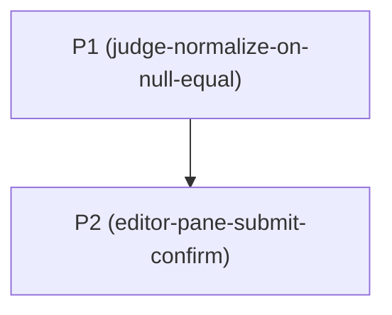

# Horizon 2 — Judge undefined vs null + Submit confirmation

**Project:** editor-folding-autocomplete-run-logging · **Horizon:** 2 of N · **Path:** Lite

---

## 🎯 What are we trying to achieve?

Fix two bugs the user reported against the leetlab judge/editor flow:

1. Solutions that visibly match the expected output in the result panel still get graded as failing when their return values contain `undefined` — because the runtime comparison in the sandbox worker does not match the way the on-screen output renders `undefined` positions as `null` via `JSON.stringify`. The canonical example is `Promise.allSettled`-style solutions whose `d.value` for a rejected promise is `undefined`, yielding `[undefined, 4, undefined]`; the expected text is `[null, 4, null]`.
2. The Submit button never asks for confirmation, so a non-passing run submits silently with no deliberate `submit anyway` step.

When this horizon is done, the worker grades the user's `Promise.allSettled` solution correctly and Submit on a failing run is a chosen action.

## 🧠 Why does this change need to happen?

The worker (`src/infrastructure/sandbox.worker.ts`) has one equality helper (`deepEq`) used for both run paths. The fn-mode path passes the user's return value straight to `deepEq` without normalization; the class-mode path (`runClass`, line 356) already normalizes `undefined`-returning method calls to `null`. The displayed output (`safeOut`) renders `undefined`-in-array as `null` (because `JSON.stringify` does that), so what the user sees in the panel and what the worker compares against are not the same thing. Discovered during testing of the user's `resilientDouble(nums)` exercise.

The Submit UX gap is a separate, deliberate request: the user wants a non-passing submission to be a choice rather than a click-bang.

## At a glance

- **Phases:** 2
- **Complexity:** Low — two narrow bug fixes in the worker and the editor, no architectural change
- **Main risk:** an over-broad normalization that flips a legitimate `4` vs `null` wrong-answer into `pass: true` — guarded by an explicit `edge-cases-preserved` rubric dimension on P1
- **Quality bar:** `prototype` (matches the project vision and horizon 1)
- **Testing focus:** worker-driven normalization tests (P1) + branch-state-hygiene for the Submit confirmation (P2). No new dependencies.

---

## Order of work

```
Phase 1 ── Fix judge undefined-vs-null comparison
   │
   ▼
Phase 2 ── Ask before submitting a run that failed cases
```

The two fixes are independent code-wise (worker vs editor), but P1 logically precedes P2 — once the runner grades fairly, the Submit prompt is what users hit when they still don't pass. Either fix alone ships independently.



---

## Phase 1 — Make the runner treat undefined positions as null

**Technical ID:** `judge-normalize-on-null-equal` · judge · infrastructure · small

### Goal
Stop the runner from failing solutions whose values JSON-normalize to the expected output.

### Why
`runFn` passes the user's return value straight to `deepEq` without normalization, while the same module's `safeOut` renders `undefined`-in-array as `null`. So `[undefined, 4, undefined]` (a `Promise.allSettled` solution) is reported as `pass: false` against `expected = [null, 4, null]`, even though the result panel shows the matching text. `runClass` already normalizes `undefined → null` at line 356, so fn-mode is the only gap.

### Changes
- Add a small `normalizeUndefinedForJson` helper near `deepEq` (~line 56 of `sandbox.worker.ts`) that recursively walks arrays and plain objects and converts each `undefined` slot/key value to `null`, matching `JSON.stringify` exactly.
- In `runFn` (~line 269), apply the helper to `out` only — not to `c.expected` — right before `deepEq`. Leave the `safeOut(out)` call below untouched so displayed `output` keeps showing the literal `undefined`.
- Do not touch `runClass` — line 356 already handles method-return `undefined`.
- Add a new test file `src/infrastructure/sandboxDeepEq.test.ts` modeled on `sandboxE2E.test.ts`'s onmessage-capture pattern; cover (a) the user's `[undefined, 4, undefined]` vs `[null, 4, null]` case, (b) `4` vs `null` still fails, (c) `[NaN]` vs `[NaN]` still passes.

### Files / areas
- `src/infrastructure/sandbox.worker.ts`
- `src/infrastructure/sandboxDeepEq.test.ts` (new)
- `src/infrastructure/sandboxE2E.test.ts` (precedent — read, do not modify)

### How to verify
- **Normalization matches `JSON.stringify` shape** — A worker-driven test sends `fn returning [undefined, 4, undefined]` against `expected = [null, 4, null]` and the captured `case` message reports `pass: true`; the trace line still shows the literal `-> undefined`; helper is never applied to `c.expected`.
- **Blast radius limited to `runFn`** — Existing `safeOut` trace assertions in `sandboxE2E.test.ts` (specifically the `'-> undefined'` literals at lines 192, 196, 197, 200) still pass unchanged; the helper is referenced exactly once.
- **Edge cases preserved (primitives, NaN, sparse, instances)** — Worker-driven test asserts `pass: false` for `out = 4` vs `expected = null`; `pass: true` for `out = [NaN]` vs `expected = [NaN]`; sparse roots `[1, ,3]` are not silently filled with `null`.
- **Worker test drives real pipeline** — New `sandboxDeepEq.test.ts` posts a synthetic RunMsg via the `self.onmessage` capture pattern used by `sandboxE2E.test.ts` (no isolated helper import).
- **No regression in existing suite or build** — `vitest run`, `tsc -b`, and `vite build` stay green; no existing test is `.skip()`ped.

### Done when
Every check under *How to verify* passes its bar, and `npm test` plus `tsc -b && vite build` are green.

### Depends on
Nothing — can start immediately.

### Rollback
None — change is self-contained in `sandbox.worker.ts` plus the new test file. Reverting either file restores prior behaviour.

### Reference (rubric)

| Dim | ruleStatement | passCriteria | failureExamples |
|---|---|---|---|
| `normalization-matches-json-stringify` | Helper replaces `undefined` with `null` only in array/plain-object slots, applied to `out` only. | Worker test: `[undefined,4,undefined]` vs `[null,4,null]` → `pass:true`; `safeOut` still shows literal `-> undefined`. | Helper skips object slots; helper normalizes both sides; helper mutates `out` in place. |
| `blast-radius-limited-to-runFn` | Only `runFn` is touched; `runClass`, `safeOut` untouched. | `sandboxE2E.test.ts` trace assertions unchanged; helper referenced once. | Helper applied in `runClass` too; helper passed into `safeOut`; helper re-exported for unrelated code. |
| `edge-cases-preserved` | Top-level primitives, NaN, sparse roots, instances untouched. | `4` vs `null` → `pass:false`; `[NaN]` vs `[NaN]` → `pass:true`; sparse roots unchanged. | Root-level normalization; JSON round-trip implementation; recursion into class instances. |
| `worker-test-drives-real-pipeline` | Test posts a RunMsg through the worker, not a direct helper import. | At least three worker-driven cases covered. | Imports `deepEq`/helper in isolation; omits kept-failing cases; stubs `self.onmessage`. |
| `no-existing-regression` | `vitest run`, `tsc -b`, `vite build` green; no `.skip`. | All existing tests pass unmodified; both build steps exit 0. | Deletes trace assertions to silence breakage; softens pass:false tests; uses `// @ts-ignore`. |

`healerHint`: Re-read `sandbox.worker.ts` lines ~22, ~269, ~356, ~386. Wire the helper into exactly one site — between `out` and `deepEq(out, c.expected)` in `runFn` — and never into `safeOut` or `c.expected`. Restrict recursion to `Array.isArray` and a plain-object prototype check. Verify with `npm test` plus `tsc -b && vite build`.

---

## Phase 2 — Ask before submitting a run that failed cases

**Technical ID:** `editor-pane-submit-confirm` · editor-ui · interface · small

### Goal
Make Submit on a failing run a deliberate choice.

### Why
Today, the Submit button in `EditorPane.tsx` always calls `handleRun(true)` directly. When the last run's verdict is anything other than `Accepted` (`Wrong Answer`, `Time Limit Exceeded`, `Compile Error`, `No Expected Cases`), the submission lands silently with no deliberate `submit anyway` step. The user has explicitly asked for a confirmation prompt. The pattern is small enough to live inline — no new modal portal primitive.

### Changes
- Add local component state `const [pendingSubmit, setPendingSubmit] = useState(false)` next to the existing `busy` / `fmtBusy` hooks.
- Change the Submit `onClick` (around line 314) to first read the current verdict: `const last = useAppStore.getState().lastRuns?.[currentSlug]`. If `last` is null/undefined or `last.verdict === 'Accepted'`, call `handleRun(true)` as today. Otherwise call `setPendingSubmit(true)`.
- Render a small inline confirmation block immediately under the editor-foot toolbar when `pendingSubmit` is true, showing pass/total counts (`Passed {last.passed} / {last.total}`, falling back to `0 / 0` when not yet available) with two real `<button type="button">` elements: `Cancel` (clears `pendingSubmit`, no submit) and `Submit anyway` (calls `handleRun(true)` then clears `pendingSubmit` in the same tick). Mirror the inline pattern from `src/components/ManageProvidersModal.tsx:89` — local useState, no portal, no overlay.
- Clear `pendingSubmit` when `currentSlug` changes (useEffect) and when a new run completes (in `handleRun`'s `finally`).
- Manual smoke-test note in the phase report covers: Submit after Wrong-Answer opens the block; Submit Anyway invokes `handleRun(true)`; Cancel closes without submitting; problem switches clear the state; Accepted run never opens the block. Do NOT introduce `@testing-library/react` for this horizon (the dep is not in `package.json` today).

### Files / areas
- `src/components/EditorPane.tsx`
- `src/components/ManageProvidersModal.tsx` (precedent — read, do not modify)
- `src/infrastructure/store.ts` (read-only — verdict selector is unchanged)

### How to verify
- **Submit-click branch logic** — Submit on `verdict === 'Accepted'` calls `handleRun(true)` directly with no block; Submit on any of `{Wrong Answer, Time Limit Exceeded, Compile Error, No Expected Cases}` sets `pendingSubmit = true`; verdict is read via `useAppStore.getState().lastRuns?.[currentSlug]?.verdict` inside the onClick.
- **Block content and button wiring** — Block renders `Passed {passed} / {total}` and two real `<button type="button">` elements; Cancel never invokes `handleRun`; Submit anyway invokes it and clears `pendingSubmit` in the same tick; Submit anyway while busy is guarded.
- **State hygiene** — `pendingSubmit` resets on `currentSlug` change (via `useEffect` with `currentSlug` in the deps) and on `handleRun`'s `finally`; block is not visible on the new problem's first render after a problem switch.
- **Style consistency with the inline-confirm precedent** — Block lives inline in `EditorPane.tsx` (no `createPortal`, no overlay div, no new component file); reuses editor-foot button classNames; no new CSS file imported; no `react-dom/createPortal` import.
- **Build and test gates, no scope creep** — `tsc -b`, `vite build`, and `vitest run` stay green; no `@testing-library/react` added; no shared type in `infrastructure/store.ts` is edited.

### Done when
Every check under *How to verify* passes its bar, `tsc -b && vite build && vitest run` are green, and the manual smoke checklist above is signed off in the phase report.

### Depends on
Nothing — can start immediately. The fixes are independent; in practice the runner fix (Phase 1) is a sensible prerequisite for testing this, but it does not block the code change.

### Rollback
None — change is local to `EditorPane.tsx`. Reverting the file restores prior behaviour.

### Reference (rubric)

| Dim | ruleStatement | passCriteria | failureExamples |
|---|---|---|---|
| `branch-correctness` | Three-way branch from `lastRuns[currentSlug]?.verdict` is exhaustive. | Accepted → direct submit; any other verdict → block; no lastRun uses the documented safe default. | Stale-closure capture of `verdict`; only special-cases `Wrong Answer`; treats `null lastRuns` as no confirmation needed. |
| `block-content-and-wiring` | Block shows pass/total with both buttons wired correctly. | `Passed X / Y` renders; Cancel only clears; Submit anyway runs `handleRun(true)` and clears; both are real `<button type="button">`. | Missing pass/total; Cancel wired to `handleRun(true)` (typo); forgets to clear after submit; `<div onClick>` instead of `<button>`. |
| `state-hygiene` | Block doesn't leak across problems or runs. | Resets on `currentSlug` change and in `handleRun`'s `finally`; problem switch mid-confirmation never submits. | Resets only on click; clears only on happy path; missing `currentSlug` in `useEffect` deps; clears only when this user opened it. |
| `style-consistency` | Mirrors the inline-confirm precedent, no new portal/modal primitive. | Block in `EditorPane.tsx`, no `createPortal`, no overlay div, no new component file. | `createPortal` + overlay div "for consistency with `ImportModal`"; new `ConfirmDialog.tsx`; bespoke CSS file. |
| `build-and-test-gates` | Build/tests stay green; no `@testing-library/react`. | `tsc -b`, `vite build`, `vitest run` green; no skipped tests; no `LastRun` type edits. | Adds `@testing-library/react` to write one click test; mutates `LastRun`; skips an existing test to silence it. |

`healerHint`: Read the verdict via `useAppStore.getState().lastRuns?.[currentSlug]?.verdict` inside the Submit `onClick`. Mirror `ManageProvidersModal.tsx:89`'s local `useState` + two-stage button pattern. Render `Passed {passed} / {total}` in the block. Clear `pendingSubmit` in a `useEffect` on `currentSlug` AND in `handleRun`'s `finally`. Do NOT add `@testing-library/react`. Run `tsc -b && vite build && vitest run` after the change.

---

## Discovery Findings

| Area | Finding | File | Implication |
|---|---|---|---|
| judge | Single runtime helper `deepEq` in `sandbox.worker.ts` lines 28-55; called from `runFn` line 269 and `runClass` line 386. | `src/infrastructure/sandbox.worker.ts` | One normalization step before `deepEq` in `runFn` fixes the user's case without touching class-mode (which already normalizes at line 356). |
| judge | No stringify-based fallback exists; `JSON.stringify` is used only inside `safeOut` (line 22) for diagnostic rendering. | `src/infrastructure/sandbox.worker.ts` | Discrepancy between "what you see" and "what passes" is real and reproducible. |
| tests | `sandboxAmbient.test.ts` covers the ambient `.d.ts` host fixture; `sandboxE2E.test.ts` loads the worker directly, captures `postMessage`, and invokes `self.onmessage` with a synthetic `MessageEvent`. | `src/infrastructure/sandboxAmbient.test.ts`, `src/infrastructure/sandboxE2E.test.ts` | The user can run real worker code in tests without a browser worker — the precedent for the new `sandboxDeepEq.test.ts`. |
| tests | No test covers `src/components/EditorPane.tsx` (`btn-submit`, `"Submit"` → zero hits across `src/**.test.*`). | (none) | Submit UI has zero coverage today; adding a DOM test for P2 would require `@testing-library/react` as a new devDep, which the phase explicitly avoids. |
| ui | Submit button is at `EditorPane.tsx` lines 312-319, calls `onClick={() => handleRun(true)}`; no existing confirmation/modal in this file. | `src/components/EditorPane.tsx` | Confirmation is built from scratch, not a rewrite. |
| ui | `ManageProvidersModal.tsx:89` uses a local `useState` + two-stage inline button for delete confirmation (no portal, no overlay). | `src/components/ManageProvidersModal.tsx` | Mirror this pattern for the inline confirmation block; do not introduce the heavier `ImportModal` shell. |
| store | `EditorPane` only WRITES to `lastRuns` and constructs verdict strings; it does NOT read verdict back. `Drawer.tsx:16` reads via selector; `DescPane` reads submission-history verdicts. | `src/components/EditorPane.tsx`, `src/components/Drawer.tsx:16`, `src/infrastructure/store.ts` | Read `verdict` via `useAppStore.getState().lastRuns?.[currentSlug]?.verdict` inside the click handler — no new selector needed. |
| tests | No existing test compares `undefined` vs `null` in equivalent positions; the only deepEq-adjacent assertions in `sandboxE2E.test.ts` check literal `'-> undefined'` strings in `safeOut` traces (display-only). | `src/infrastructure/sandboxE2E.test.ts` | Adding a worker-driven `[undefined,4,undefined]` vs `[null,4,null]` case has no existing test that would now fail spuriously. |

## Out of Scope

- A broader rewrite of the judge to a richer expectation grammar (matcher-by-matcher, custom comparators per problem, snapshot tests).
- Persisting submissions to a server; current localStorage-based `addSubmission` is unchanged.
- Adding a generic modal/portal primitive or refactoring existing modals (`GenerateModal`, `ImportModal`, `Drawer`) — the new dialog stays local in `EditorPane`.
- Surfacing the verdict table in a deeper result panel; existing verdict pills/marks are untouched.
- Re-running the fold or autocomplete work from horizon 1; no `Discoveries.md` entry on those topics mentions any regression.
- Coverage of every rejection-shape corner case (objects with undefined keys, sparse arrays as roots, `Promise` object identity) — only the demonstrated case (`fn`-return `undefined`-in-array) needs to pass.
- Adding `@testing-library/react` as a devDep just to write a single EditorPane click test (YAGNI — a manual smoke-test note covers it for this horizon).

## Success Criteria

1. The runner stops failing solutions whose values JSON-normalize to the expected output (the user's `[undefined, 4, undefined]` vs `[null, 4, null]` case now passes).
2. The Submit button asks before submitting a run whose most-recent verdict is not `Accepted`, with a clear pass/total count and explicit `Cancel` / `Submit anyway` buttons; the block clears when the problem changes; an `Accepted` run submits directly.
3. **P1 — Make the runner treat undefined positions as null.** A worker-driven test posts a RunMsg whose fn returns `[undefined, 4, undefined]` against `expected = [null, 4, null]` and the captured `case` message reports `pass: true`; primitives like `4` vs `null` still fail; `[NaN]` vs `[NaN]` still passes.
4. **P2 — Ask before submitting a run that failed cases.** Clicking Submit when `lastRuns[currentSlug]?.verdict` is anything other than `Accepted` opens the inline block with `Passed X / Y` and two action buttons; `Cancel` closes the block without invoking `handleRun(true)`; `Submit anyway` invokes `handleRun(true)` and closes the block; an `Accepted` (or absent) verdict submits directly; the block clears on problem switch.

## Quality Gate

- **Path:** Lite · code-local, technical shape, 2 phases
- **Iterations:** 1 (gate passed clean on iteration 0)
- **Critic:** pass, score 8/9 across all 7 rubric dimensions, 0 issues raised
- **Verify (blockers only):** not invoked (no `blocker` issues)
- **Healer:** not invoked (no surviving failing issues)
- **Accepted debt:** none
- **Final verdict:** PASS

## Full analysis

**Domain shape:** `technical` — both changes are local to the worker judge comparison (`sandbox.worker.ts`) and the editor submit handler (`EditorPane.tsx`); no business entities, rules, or workflows are introduced. This continues the `technical` shape established in horizon 1's vision.

**Ubiquitous language**

| Term | Definition |
|---|---|
| judge | the sandbox web worker + comparison logic that runs a problem's test cases against user code |
| case | one element of `Problem.tests` — a single input/expected pair (or call/expected for class mode) |
| verdict | the top-level status of a run: `Accepted` (all passed), `Wrong Answer` / `No Expected Cases` / `Time Limit Exceeded` / `Compile Error` |
| case mark | the per-case pill label: `pass` / `fail` / `err` / `tle` |
| deepEq | the worker-side recursive equality function used to grade each case |
| safeOut | the `JSON.stringify`-based wrapper used to render user outputs into the result panel |
| submit confirmation | a small inline modal that asks the user to confirm `Submit` when the last run's verdict is not `Accepted` |

**Assumptions** (full list, also see `state.md` horizon 1's vision):

- Scope is exactly the two named bugs and their tests — not a broader rewrite of the judge or the Submit flow.
- Quality bar stays `prototype` (matches horizon 1's vision and existing test coverage).
- `undefined` vs `null` mismatch is the only reported comparison bug; the JSON-displayed-vs-compared gap is the minimal fix target. NaN, BigInt, and key-ordering edge cases are out of scope unless a test actually fails after the fix.
- The confirmation dialog fires only when `verdict !== 'Accepted'`; passing runs submit directly without a prompt (matches the user's "submit problematic cases" wording).
- The dialog is short and lives inline in `EditorPane.tsx` — no need for a generic modal primitive or portal infrastructure for one screen.
- No new dependencies; no API contract changes for the store.
- Class-mode already normalizes `undefined → null` at line 356; the fn-mode comparison is the actual gap, so the fix only covers `runFn`.
- Existing direct `deepEq` semantics are intentional for cases where the answer is a plain primitive (e.g. `4` vs `null` should still fail).

**Risks** (full list):

- **Over-broad normalization breaks legitimate failures.** Treating `undefined === null` globally could let `return undefined` accidentally pass a problem that expected `null`. Mitigation: normalize only on the comparison side (preserve the original `out` for the displayed `output` field), and limit the rule to array members / object values where JSON does the same collapse — not bare top-level returns.
- **Submission UX regression — silent failure when verdict is failing.** If the confirmation dialog errors out, a user would lose the ability to submit a non-`Accepted` run entirely. Mitigation: the Submit button still calls `handleRun(true)` on confirm; the dialog is a guard, not a gate.
- **NaN handling regression.** Current `deepEq` has explicit NaN handling; a naive switch to JSON comparison would drop it. Mitigation: keep `deepEq` as the inner comparator and add a pre-normalization step that converts `undefined` to `null` recursively in array slots and object values before `deepEq` runs.
- **Marker state leaks across problems.** The confirmation dialog must read `verdict` from the *current* problem's last run, not module state. Reuse `useAppStore.getState().lastRuns[currentSlug]` rather than a local variable.
